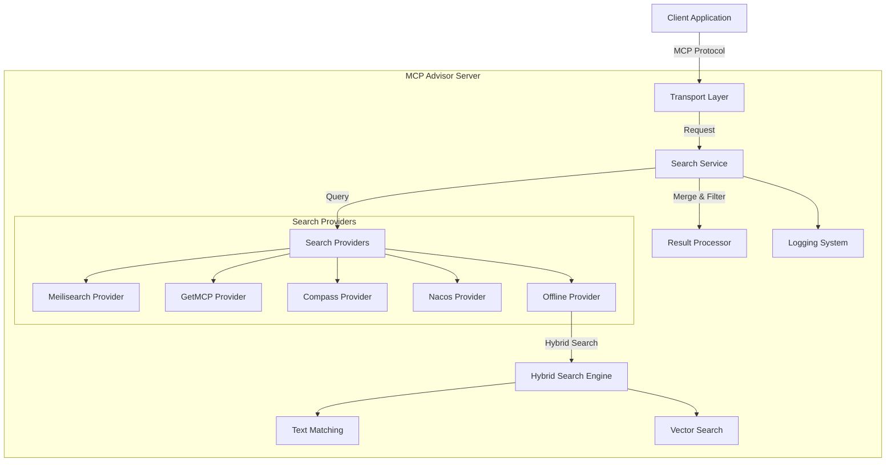
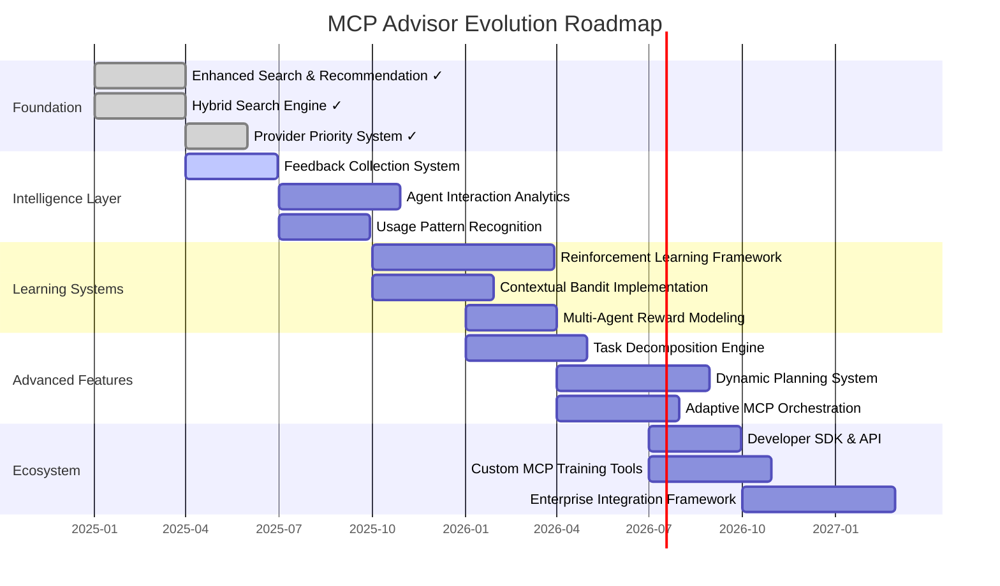

# MCP Advisor

[](https://modelcontextprotocol.org)
[](https://www.npmjs.com/package/@xiaohui-wang/mcpadvisor)
[](https://opensource.org/licenses/MIT) [![DeepWiki](https://img.shields.io/badge/DeepWiki-istarwyh%2Fmcpadvisor-blue.svg?logo=data:image/png;base64,iVBORw0KGgoAAAANSUhEUgAAACwAAAAyCAYAAAAnWDnqAAAAAXNSR0IArs4c6QAAA05JREFUaEPtmUtyEzEQhtWTQyQLHNak2AB7ZnyXZMEjXMGeK/AIi+QuHrMnbChYY7MIh8g01fJoopFb0uhhEqqcbWTp06/uv1saEDv4O3n3dV60RfP947Mm9/SQc0ICFQgzfc4CYZoTPAswgSJCCUJUnAAoRHOAUOcATwbmVLWdGoH//PB8mnKqScAhsD0kYP3j/Yt5LPQe2KvcXmGvRHcDnpxfL2zOYJ1mFwrryWTz0advv1Ut4CJgf5uhDuDj5eUcAUoahrdY/56ebRWeraTjMt/00Sh3UDtjgHtQNHwcRGOC98BJEAEymycmYcWwOprTgcB6VZ5JK5TAJ+fXGLBm3FDAmn6oPPjR4rKCAoJCal2eAiQp2x0vxTPB3ALO2CRkwmDy5WohzBDwSEFKRwPbknEggCPB/imwrycgxX2NzoMCHhPkDwqYMr9tRcP5qNrMZHkVnOjRMWwLCcr8ohBVb1OMjxLwGCvjTikrsBOiA6fNyCrm8V1rP93iVPpwaE+gO0SsWmPiXB+jikdf6SizrT5qKasx5j8ABbHpFTx+vFXp9EnYQmLx02h1QTTrl6eDqxLnGjporxl3NL3agEvXdT0WmEost648sQOYAeJS9Q7bfUVoMGnjo4AZdUMQku50McDcMWcBPvr0SzbTAFDfvJqwLzgxwATnCgnp4wDl6Aa+Ax283gghmj+vj7feE2KBBRMW3FzOpLOADl0Isb5587h/U4gGvkt5v60Z1VLG8BhYjbzRwyQZemwAd6cCR5/XFWLYZRIMpX39AR0tjaGGiGzLVyhse5C9RKC6ai42ppWPKiBagOvaYk8lO7DajerabOZP46Lby5wKjw1HCRx7p9sVMOWGzb/vA1hwiWc6jm3MvQDTogQkiqIhJV0nBQBTU+3okKCFDy9WwferkHjtxib7t3xIUQtHxnIwtx4mpg26/HfwVNVDb4oI9RHmx5WGelRVlrtiw43zboCLaxv46AZeB3IlTkwouebTr1y2NjSpHz68WNFjHvupy3q8TFn3Hos2IAk4Ju5dCo8B3wP7VPr/FGaKiG+T+v+TQqIrOqMTL1VdWV1DdmcbO8KXBz6esmYWYKPwDL5b5FA1a0hwapHiom0r/cKaoqr+27/XcrS5UwSMbQAAAABJRU5ErkJggg==)](https://deepwiki.com/istarwyh/mcpadvisor) [](https://insiders.vscode.dev/redirect/mcp/install?name=mcpadvisor&inputs=%5B%5D&config=%7B%22command%22%3A%22npx%22%2C%22args%22%3A%5B%22-y%22%2C%22%40xiaohui-wang%2Fmcpadvisor%22%5D%7D) [](https://smithery.ai/server/@istarwyh/mcpadvisor)
<!-- DeepWiki badge generated by https://deepwiki.ryoppippi.com/ --> 

[](https://mseep.ai/app/a6ebedc6-e004-46f0-b7ec-e692a17ee7aa)
[](https://lobehub.com/mcp/istarwyh-mcpadvisor)


<a href="https://glama.ai/mcp/servers/@istarwyh/mcpadvisor">
  
</a>


[English](./README.md) | [简体中文](./README_zh.md) 

## Introduction

MCP Advisor is a discovery and recommendation service that helps AI assistants explore Model Context Protocol (MCP) servers using natural language queries. It makes it easier for users to find and leverage MCP tools suitable for specific tasks.

## User Stories

1. **Discover & Recommend MCP Servers**
   - As an AI agent developer, I want to quickly find the right MCP servers for a specific task using natural-language queries.
   - Example prompt: `"Find MCP servers for insurance risk analysis"`

2. **Install & Configure MCP Servers**
   - As a regular user who discovers a useful MCP server, I want to install and start using it as quickly as possible.
   - Example prompt: `"Install this MCP: https://github.com/Deepractice/PromptX"`

   
### Demo

https://github.com/user-attachments/assets/7a536315-e316-4978-8e5a-e8f417169eb1

### Usage

Once configured, the Nacos provider will be automatically enabled and used when searching for MCP servers. You can query it using natural language, for example:

```
Find MCP servers for insurance risk analysis
```

Or more specifically:

```
Search for MCP servers with natural language processing capabilities
```

## Documentation Navigation

- [Installation Guide](docs/INSTALLATION.md) - Detailed installation and configuration instructions
- [User Guide](docs/USER_GUIDE.md) - How to use MCP Advisor
- [Architecture Documentation](docs/ARCHITECTURE.md) - System architecture details
- [Technical Details](docs/TECHNICAL_DETAILS.md) - Advanced technical features
- [Testing Guide](docs/TESTING.md) - Comprehensive testing documentation
- [Troubleshooting](docs/TROUBLESHOOTING.md) - Common issues and solutions
- [Search Providers](docs/SEARCH_PROVIDERS.md) - Search provider details
- [Roadmap](ROADMAP.md) - Future development plans
- [Developer Guide](docs/DEVELOPER_GUIDE.md) - Development environment setup and code contribution
- [Best Practices](docs/BEST_PRACTICES.md) - Coding standards and best practices for contributors

## Quick Start

### Installation

The fastest way is to integrate MCP Advisor through MCP configuration:

```json
{
  "mcpServers": {
    "mcpadvisor": {
      "command": "npx",
      "args": ["-y", "@xiaohui-wang/mcpadvisor"]
    }
  }
}
```

Add this configuration to your AI assistant's MCP settings file:

- MacOS/Linux: `~/Library/Application Support/Claude/claude_desktop_config.json`
- Windows: `%AppData%\Claude\claude_desktop_config.json`

### Installing via Smithery

To install Advisor for Claude Desktop automatically via [Smithery](https://smithery.ai/server/@istarwyh/mcpadvisor):

```bash
npx -y @smithery/cli install @istarwyh/mcpadvisor --client claude
```

For more installation methods, see the [Installation Guide](docs/INSTALLATION.md).

## Developer Guide

### Architecture Overview

MCP Advisor adopts a modular architecture with clean separation of concerns and functional programming principles. The codebase has been recently refactored (2025) to improve maintainability and scalability:



### Project Structure

The codebase follows clean architecture principles with organized directory structure:

```
src/
├── services/
│   ├── core/                    # Core business logic
│   │   ├── installation/        # Installation guide services
│   │   ├── search/             # Search providers
│   │   └── server/             # MCP server implementation
│   ├── providers/              # External service providers
│   │   ├── meilisearch/        # Meilisearch integration
│   │   ├── nacos/              # Nacos service discovery
│   │   ├── oceanbase/          # OceanBase vector database
│   │   └── offline/            # Offline search engine
│   ├── common/                 # Shared utilities
│   │   ├── api/                # API clients
│   │   ├── cache/              # Caching mechanisms
│   │   └── vector/             # Vector operations
│   └── interfaces/             # Type definitions
├── types/                      # TypeScript type definitions
├── utils/                      # Utility functions
└── tests/                      # Test suites
    ├── unit/                   # Unit tests
    ├── integration/            # Integration tests
    └── e2e/                    # End-to-end tests
```

### Core Components

1. **Search Service Layer**
   - Unified search interface and provider aggregation
   - Support for multiple search providers executing in parallel
   - Configurable search options (limit, minSimilarity)

2. **Search Providers**
   - **Meilisearch Provider**: Vector search using Meilisearch
   - **GetMCP Provider**: API search from the GetMCP registry
   - **Compass Provider**: API search from the Compass registry
   - **Nacos Provider**: Service discovery integration
   - **Offline Provider**: Hybrid search combining text and vectors

3. **Hybrid Search Strategy**
   - Intelligent combination of text matching and vector search
   - Configurable weight balancing
   - Smart adaptive filtering mechanisms

4. **Transport Layer**
   - Stdio (CLI default)
   - SSE (Web integration)
   - REST API endpoints

For more detailed architecture documentation, see [ARCHITECTURE.md](docs/ARCHITECTURE.md).


## Developer Quick Start

### Development Environment Setup

1. Clone the repository
2. Install dependencies:
   ```bash
   pnpm install
   ```
3. Build the project:
   ```bash
   pnpm run build
   ```
4. Configure environment variables (see [INSTALLATION.md](docs/INSTALLATION.md))

### Testing

MCP Advisor includes comprehensive testing suites to ensure code quality and functionality. For detailed testing information including unit tests, integration tests, end-to-end testing, and manual testing procedures, see the [Testing Guide](docs/TESTING.md).

#### Quick Test Commands
```bash
# Run all tests
pnpm run check && pnpm run test && pnpm run test:e2e

# Automated E2E testing script
./scripts/run-e2e-test.sh
```

### Library Usage

```typescript
import { SearchService } from '@xiaohui-wang/mcpadvisor';

// Initialize search service
const searchService = new SearchService();

// Search for MCP servers
const results = await searchService.search('vector database integration');
console.log(results);
```

### Transport Options

MCP Advisor supports multiple transport methods:

1. **Stdio Transport** (default) - Suitable for command-line tools
2. **SSE Transport** - Suitable for web integration
3. **REST Transport** - Provides REST API endpoints

For more development details, see [DEVELOPER_GUIDE.md](docs/DEVELOPER_GUIDE.md).

## Contribution Guidelines

We welcome contributions to MCP Advisor! 

## Usage Examples

### Example Queries

Here are some example queries you can use with MCP Advisor:

```
"Find MCP servers for natural language processing"
"Document summarization MCP servers"
```

### Example Response

```json
[
  {
    "title": "NLP Toolkit",
    "description": "Comprehensive natural language processing toolkit with sentiment analysis, entity recognition, and text summarization capabilities.",
    "github_url": "https://github.com/example/nlp-toolkit",
    "similarity": 0.92
  },
  {
    "title": "Text Processor",
    "description": "Efficient text processing MCP server with multi-language support.",
    "github_url": "https://github.com/example/text-processor",
    "similarity": 0.85
  }
]
```

For more examples, see [EXAMPLES.md](docs/EXAMPLES.md).

## Troubleshooting

### Common Issues

1. **Connection Refused**
   - Ensure the server is running on the specified port
   - Check firewall settings

2. **No Results Returned**
   - Try a more general query
   - Check network connection to registry APIs

3. **Performance Issues**
   - Consider adding more specific search terms
   - Check server resources (CPU/memory)

For more troubleshooting information, see [TROUBLESHOOTING.md](docs/TROUBLESHOOTING.md).

## Search Providers

MCP Advisor supports multiple search providers that can be used simultaneously:

1. **Compass Search Provider**: Retrieves MCP server information using the Compass API
2. **GetMCP Search Provider**: Uses the GetMCP API and vector search for semantic matching
3. **Meilisearch Search Provider**: Uses Meilisearch for fast, fault-tolerant text search

For detailed information about search providers, see [SEARCH_PROVIDERS.md](docs/SEARCH_PROVIDERS.md).

## Roadmap

MCP Advisor is evolving from a simple recommendation system to an intelligent agent orchestration platform. Our vision is to create a system that not only recommends the right MCP servers but also learns from interactions and helps agents dynamically plan and execute complex tasks.



### Major Development Phases

1. **Recommendation Capability Optimization** (2025 Q2-Q3)
   - Accept user feedback
   - Refine recommendation effectiveness
   - Introduce more indices

For a detailed roadmap, see [ROADMAP.md](ROADMAP.md).

To Implement the above features, we need to:

- [ ] Support Full-Text Index Search
- [ ] Utilize Professional Rerank Module like https://github.com/PrithivirajDamodaran/FlashRank or Qwen Rerank Model
- [ ] Support Cline marketplace: https://api.cline.bot/v1/mcp/marketplace

## License

This project is licensed under the MIT License - see the [LICENSE](LICENSE) file for details.