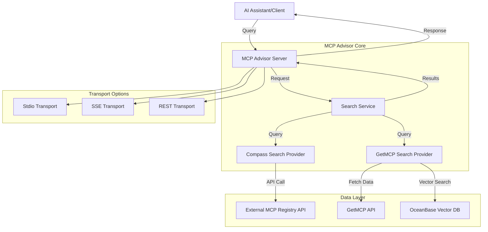
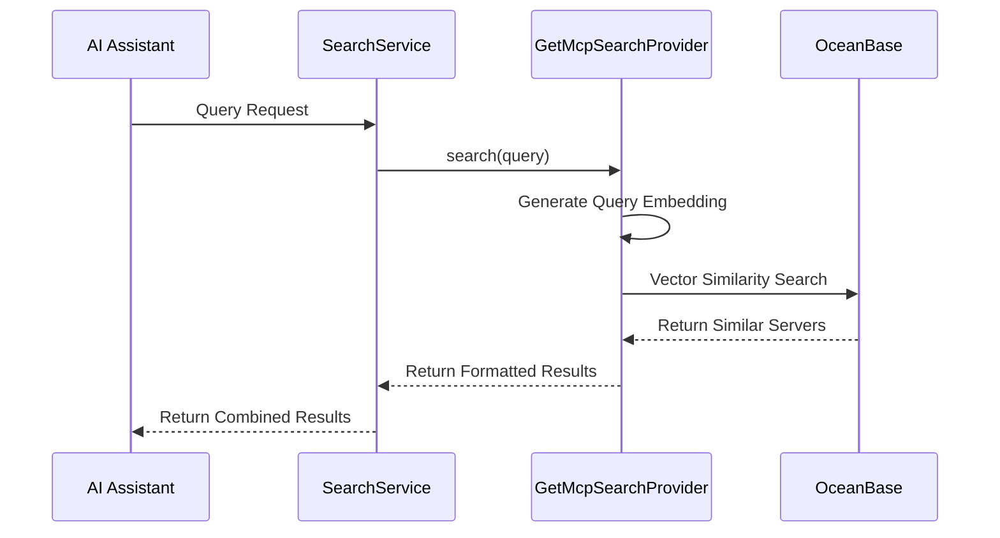

# MCP Advisor 

[](https://modelcontextprotocol.org)


## MCP Advisor & Installation

### Experience MCP Advisor 


## What is this? 

MCP Advisor is a discovery & recommendation service that helps you explore Model Context Protocol servers. It acts as a smart guide that helps AI assistants find and understand available MCP services out there based on **natural language queries**, making it easier to discover and utilize the right tools for specific tasks.


## Features 

-  **Smart Search**: Find MCP services using natural language queries
-  **Rich Metadata**: Get detailed information about each service
-  **Real-time Updates**: Always up-to-date with the latest MCP services [](https://github.com/modelcontextprotocol/servers)
-  **Easy Integration**: Simple to integrate with any MCP-compatible AI assistant
-  **Vector Search**: Powered by OceanBase for high-performance semantic search
-  **Modular Architecture**: Clean separation of concerns for maintainability and extensibility

## Architecture



### Data Flow



## Quick Start 

### Usage

1. Clone the repository

or 

2. Use `npx`


### Installation

For Claude Desktop, edit your `claude_desktop_config.json` file:

#### MacOS/Linux
``` bash
code ~/Library/Application\ Support/Claude/claude_desktop_config.json
```

#### Windows
``` bash
code $env:AppData\Claude\claude_desktop_config.json
```

### Transport Options

MCP Advisor supports two transport methods:

#### 1. Stdio Transport (Default)

Use this for command-line tools and direct integrations.

Add to your AI assistant's MCP configuration to enable service discovery capabilities:

``` json
{
"mcpServers": {
   "mcp-advisor": {
      "command": "npx",
      "args": [
         "-y",
         "/path/to/repo/build/index.js"
      ]
   }
}
}
```

#### 2. SSE Transport (HTTP Server)

Use this for remote servers or web-based integrations. Start the server with:

```bash
# Start with SSE transport on port 3000
TRANSPORT_TYPE=sse SERVER_PORT=3000  ENABLE_FILE_LOGGING=true node build/index.js
```

Environment variables for SSE configuration:
- `TRANSPORT_TYPE`: Set to `sse` to use SSE transport (default is stdio)
- `SERVER_PORT`: HTTP server port (default: 3000)
- `SERVER_HOST`: HTTP server host (default: localhost)
- `SSE_PATH`: SSE endpoint path (default: /sse)
- `MESSAGE_PATH`: Messages endpoint path (default: /messages)

Connect to the server using:
- SSE endpoint: `http://localhost:3000/sse`
- Messages endpoint: `http://localhost:3000/messages?sessionId=<SESSION_ID>`
- Health check: `http://localhost:3000/health`

#### 3. REST Transport

```sh
TRANSPORT_TYPE=rest SERVER_PORT=3000  ENABLE_FILE_LOGGING=true node build/index.js
```

## Examples

### Example Queries

Here are some example queries you can use with MCP Advisor:

```
"Find an MCP server for natural language processing"
"MCP server for financial data analysis"
"Recommendation engine MCP server for e-commerce"
"MCP server with image recognition capabilities"
"Weather data processing MCP server"
"Document summarization MCP server"
```

### Example Response

```json
[
  {
    "title": "NLP Toolkit",
    "description": "Comprehensive natural language processing toolkit with sentiment analysis, entity recognition, and text summarization capabilities.",
    "github_url": "https://github.com/example/nlp-toolkit",
    "similarity": 0.92
  },
  {
    "title": "Text Processor",
    "description": "Efficient text processing MCP server with multilingual support.",
    "github_url": "https://github.com/example/text-processor",
    "similarity": 0.85
  }
]
```

## Troubleshooting

### Common Issues

1. **Connection Refused**
   - Ensure the server is running on the specified port
   - Check firewall settings
   - Verify the host address is correct

2. **No Results Returned**
   - Try a more general query
   - Check network connectivity to the registry API
   - Verify API endpoints are correctly configured

3. **SSE Connection Drops**
   - Increase client timeout settings
   - Check server logs for error messages
   - Ensure proper CORS configuration if connecting from a browser

4. **Performance Issues**
   - Consider adding more specific search terms
   - Check server resources (CPU/memory)
   - Implement caching if making frequent similar queries

### Logs

For detailed troubleshooting, check the logs in the `logs` directory. Enable debug logging with:

```bash
DEBUG=true node build/index.js
```

## Environment Variables

MCP Advisor can be configured using the following environment variables:

| Variable | Description | Default | Required |
|----------|-------------|---------|----------|
| `TRANSPORT_TYPE` | Transport method (`stdio`, `sse`, `rest`) | `stdio` | No |
| `SERVER_PORT` | HTTP server port for SSE/REST transport | `3000` | No |
| `SERVER_HOST` | HTTP server host for SSE/REST transport | `localhost` | No |
| `SSE_PATH` | SSE endpoint path | `/sse` | No |
| `MESSAGE_PATH` | Messages endpoint path | `/messages` | No |
| `ENDPOINT` | REST endpoint path | `/rest` | No |
| `DEBUG` | Enable debug logging | `false` | No |
| `ENABLE_FILE_LOGGING` | Enable logging to files | `false` | No |
| `LOG_LEVEL` | Log level (debug, info, warn, error) | `info` | No |

## API Documentation

### REST API Endpoints

#### GET `/health`

Health check endpoint.

**Response:**
```json
{
  "status": "ok",
  "version": "1.0.0"
}
```

#### GET `/sse`

Server-Sent Events endpoint for establishing a connection.

**Query Parameters:**
- None

**Response:**
- Establishes an SSE connection

#### POST `/messages`

Endpoint for sending messages to an established SSE connection.

**Query Parameters:**
- `sessionId` (string, required): The session ID of the SSE connection

**Request Body:**
```json
{
  "jsonrpc": "2.0",
  "method": "callTool",
  "params": {
    "name": "recommend-mcp-servers",
    "arguments": {
      "query": "financial data analysis"
    }
  },
  "id": "1"
}
```

**Response:**
```json
{
  "jsonrpc": "2.0",
  "result": {
    "content": [
      {
        "title": "Financial Analytics MCP",
        "description": "Comprehensive financial data analysis toolkit",
        "github_url": "https://github.com/example/financial-mcp",
        "similarity": 0.95
      }
    ]
  },
  "id": "1"
}
```

#### POST `/rest`

REST API endpoint for direct requests (when using REST transport).

**Request Body:**
```json
{
  "jsonrpc": "2.0",
  "method": "callTool",
  "params": {
    "name": "recommend-mcp-servers",
    "arguments": {
      "query": "financial data analysis"
    }
  },
  "id": "1"
}
```

**Response:**
Same as `/messages` endpoint.

## Test
with [inspector](https://github.com/modelcontextprotocol/inspector)
```bash 
 npx @modelcontextprotocol/inspector
```

## License 

MIT License - See [LICENSE](LICENSE) file for details.