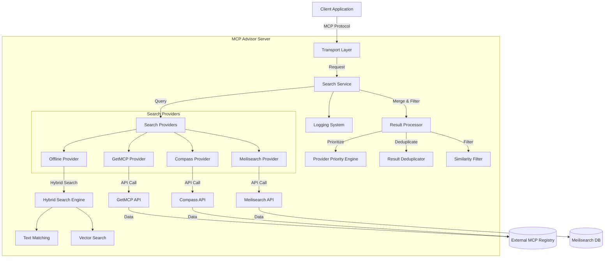
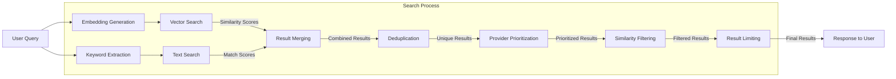
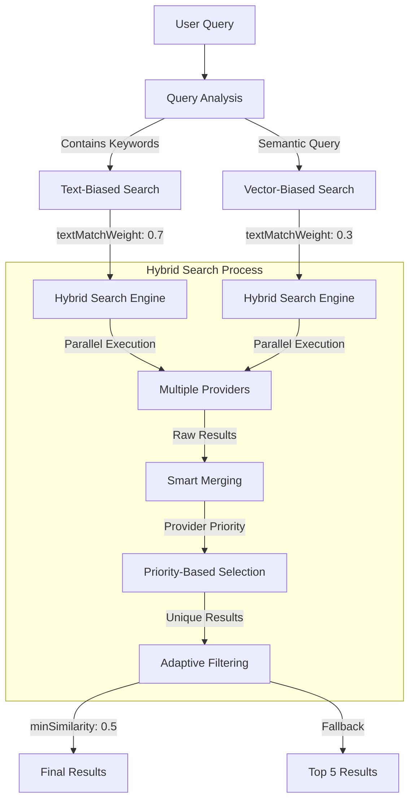
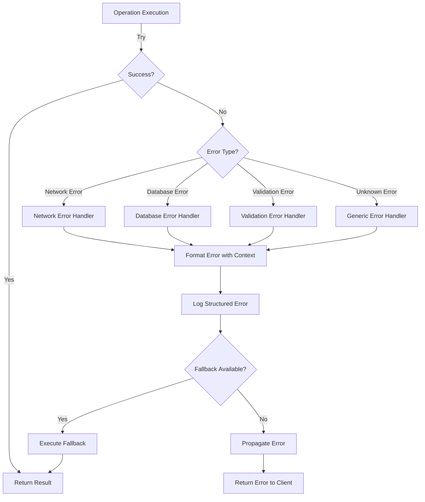
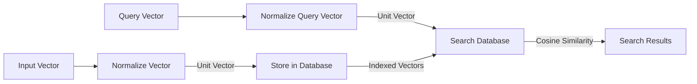
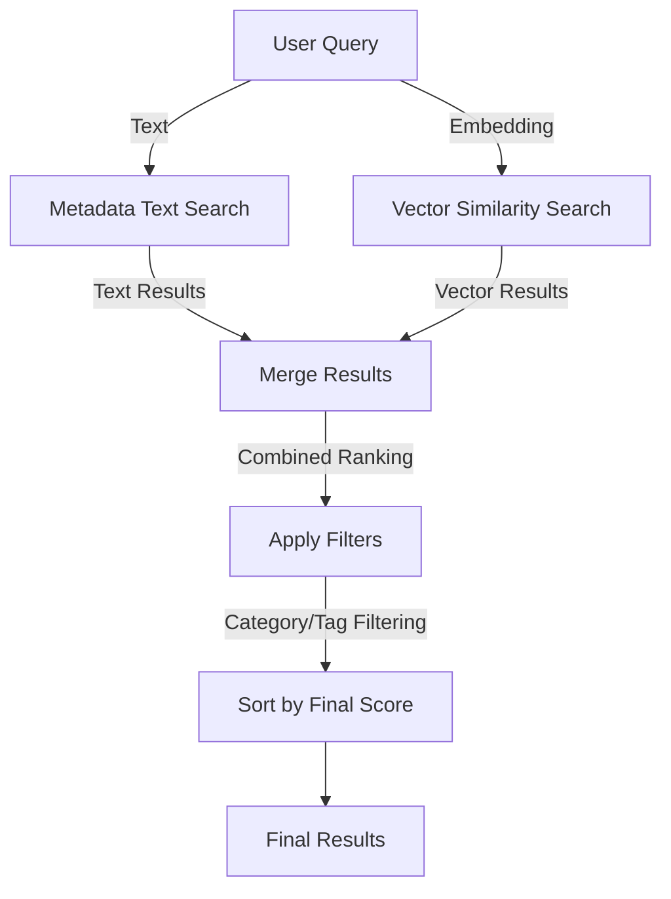

# MCP Advisor

[](https://modelcontextprotocol.org)
[](https://www.npmjs.com/package/@xiaohui-wang/mcpadvisor)
[](https://opensource.org/licenses/MIT)

<a href="https://glama.ai/mcp/servers/@istarwyh/mcpadvisor">
  
</a>

## What is MCP Advisor?

MCP Advisor is a discovery & recommendation service that helps AI assistants explore Model Context Protocol (MCP) servers using natural language queries. It makes it easier to find and utilize the right MCP tools for specific tasks.

## User Guide

### Quick Integration

The fastest way to integrate MCP Advisor with your AI assistant is through the MCP configuration:

```json
{
  "mcpServers": {
    "mcpadvisor": {
      "command": "npx",
      "args": ["-y", "@xiaohui-wang/mcpadvisor"]
    }
  }
}
```

Add this configuration to your AI assistant's MCP settings file:

- MacOS/Linux: `~/Library/Application Support/Claude/claude_desktop_config.json`
- Windows: `%AppData%\Claude\claude_desktop_config.json`

### Features

- **Natural Language Search**: Find MCP services using conversational queries
- **Rich Metadata**: Get detailed information about each service
- **Real-time Updates**: Always up-to-date with the latest MCP services [](https://github.com/modelcontextprotocol/servers)
- **Easy Integration**: Simple configuration for any MCP-compatible AI assistant

### Alternative Installation Methods

#### NPM Package
```bash
npm install @xiaohui-wang/mcpadvisor
# or
yarn add @xiaohui-wang/mcpadvisor
# or
pnpm add @xiaohui-wang/mcpadvisor
```

#### Direct Usage
```bash
# Run with npx
npx @xiaohui-wang/mcpadvisor

# Or if installed globally
mcpadvisor
```

## Developer Guide

### Architecture

MCP Advisor follows a modular architecture with clean separation of concerns and functional programming principles:

#### System Architecture Diagram



#### Data Flow Diagram



#### Search Strategy


    
    Providers->>ExternalAPIs: API Requests
    ExternalAPIs->>Providers: API Responses
    
    Providers->>SearchSvc: All Provider Results
    SearchSvc->>SearchSvc: Merge & Deduplicate Results
    SearchSvc->>SearchSvc: Sort & Filter Results
    SearchSvc->>Logger: Log Search Results
    SearchSvc->>Client: Final Results
```

#### Core Components

1. **Search Service Layer**
   - Unified search interface with provider aggregation
   - Multiple search provider support with parallel execution
   - Configurable search options (limit, minSimilarity)
   - Intelligent result merging and deduplication
   - Provider priority system for result ranking
   - Adaptive similarity filtering with fallback mechanism

2. **Search Providers**
   - **Meilisearch Provider**: Vector-based search using Meilisearch
   - **GetMCP Provider**: API-based search from GetMCP registry
   - **Compass Provider**: API-based search from Compass registry
   - **Offline Provider**: Hybrid search combining text and vector matching

3. **Hybrid Search Strategy**
   - **Text Matching**: Keyword-based search with exact and fuzzy matching
   - **Vector Search**: Semantic similarity using embedding vectors
   - **Configurable Weights**: Adjustable balance between text and vector search
   - **Smart Fallback**: Ensures minimum result count even with high similarity thresholds

4. **Result Processing Pipeline**
   - **Merging**: Combines results from multiple providers
   - **Deduplication**: Removes duplicate results based on GitHub URL or title
   - **Provider Prioritization**: Ranks results based on provider reliability
   - **Similarity Filtering**: Filters results based on configurable threshold
   - **Adaptive Fallback**: Ensures minimum result count for better user experience

5. **Vector Database Layer**
   - Time-based data update strategy (1-hour freshness)
   - Efficient vector indexing with HNSW
   - Automatic schema management
   - Connection pooling for performance

6. **Data Management**
   - Intelligent caching with timestamp tracking
   - Incremental updates to minimize resource usage
   - Background data refresh to maintain responsiveness
   - Comprehensive error handling and fallbacks

5. **Transport Layer**
   - Stdio (default for CLI)
   - SSE (for web integration)
   - REST API endpoints

6. **Logging System**
   - Structured logging with context information
   - Detailed process tracking for debugging
   - Performance metrics and timing
   - Clean separation of console and file outputs

## System Optimizations

### Enhanced Error Handling System

MCP Advisor implements a robust error handling system to ensure reliability and provide detailed diagnostics:

#### Error Handling Flow Diagram



#### Key Features

1. **Contextual Error Formatting**
   - Standardized error object enrichment
   - Stack trace preservation and formatting
   - Error type classification and normalization
   - Request context inclusion (query, URL, parameters)

2. **Structured Logging**
   - JSON-formatted error metadata
   - Component and operation identification
   - Timestamp and correlation IDs
   - Error severity classification

3. **Provider-Specific Error Handling**
   - Custom handlers for each search provider
   - Network error retry mechanisms
   - API-specific error parsing and normalization
   - Detailed diagnostic information for external services

4. **Graceful Degradation**
   - Multi-provider fallback strategy
   - Partial results handling
   - Default responses for critical failures
   - User-friendly error messages

### Time-Based Data Update Strategy

MCP Advisor implements an intelligent data update strategy to balance performance and data freshness:

1. **Timestamp Tracking**
   - Each data source maintains a last-update timestamp
   - System tracks update frequency and patterns
   - Configurable freshness window (default: 1 hour)

2. **Conditional Indexing**
   - Vector database only rebuilds when data is stale
   - Avoids redundant indexing operations on frequent queries
   - Dramatically reduces database load and query latency

3. **Background Processing**
   - Data updates happen asynchronously after serving requests
   - Users get immediate responses from existing data
   - Fresh data is available for subsequent queries

4. **Fallback Mechanisms**
   - Graceful degradation when data sources are unavailable
   - Multiple provider strategy ensures results even if one fails
   - Comprehensive error handling with detailed logging

### Structured Logging System

The enhanced logging system provides detailed visibility into system operations:

1. **Context-Aware Logs**
   - Each log entry includes component context
   - Structured data for machine parsing
   - Clean separation between message and metadata

2. **Performance Tracking**
   - Timing information for key operations
   - Resource usage monitoring
   - Query execution statistics

3. **Process Visualization**
   - Complete visibility into search execution flow
   - Provider-specific result tracking
   - Detailed error context for debugging

### Vector Search Optimizations

#### Vector Normalization

MCP Advisor implements vector normalization to improve search accuracy and consistency:



1. **Vector Normalization Process**
   - All vectors are normalized to unit length (magnitude = 1)
   - Ensures consistent cosine similarity calculations
   - Improves search precision by focusing on direction, not magnitude
   - Reduces the impact of vector dimension variations

2. **Implementation Details**
   - Euclidean norm calculation for vector magnitude
   - Division of each component by the magnitude
   - Validation to prevent division by zero
   - Logging of normalization effects for debugging

#### Hybrid Search Strategy

MCP Advisor combines vector similarity and text matching for more accurate results:



1. **Parallel Search Execution**
   - Vector search and text search run concurrently
   - Leverages Promise.all for optimal performance
   - Fallback mechanisms if either search fails

2. **Weighted Result Merging**
   - Vector similarity: 70% weight
   - Text matching: 30% weight
   - Configurable weighting through environment variables
   - Deduplication based on unique identifiers

3. **Advanced Filtering**
   - Category and tag-based filtering
   - Minimum similarity threshold (default: 0.3)
   - Result count limiting with intelligent selection
   - Sorting by combined relevance score

### Development Setup

1. Clone the repository
2. Install dependencies:
   ```bash
   npm install
   ```
3. Configure environment variables:
   ```bash
   # Required for vector search
   OCEANBASE_URL=mysql://your_connection_string
   
   # Optional for SSE transport
   TRANSPORT_TYPE=sse
   SERVER_PORT=3000
   ENABLE_FILE_LOGGING=true
   ```

### Library Usage

```typescript
import { SearchService } from '@xiaohui-wang/mcpadvisor';

// Initialize the search service
const searchService = new SearchService();

// Search for MCP servers
const results = await searchService.search('vector database integration');
console.log(results);
```

### Transport Options

#### 1. Stdio Transport (Default)

Ideal for command-line tools and direct integrations:

```javascript
// index.js
const { createServer } = require('@xiaohui-wang/mcpadvisor');
const server = createServer({ transport: 'stdio' });
server.start();
```

#### 2. SSE Transport

For web-based integrations:

```javascript
// server.js
const { createServer } = require('@xiaohui-wang/mcpadvisor');
const server = createServer({
  transport: 'sse',
  port: 3000
});
server.start();
```

### Contributing

1. Follow the commit message convention:
   - Use lowercase types (feat, fix, docs, etc.)
   - Write descriptive messages in sentence format

2. Ensure code quality:
   - Run tests: `npm test`
   - Check types: `npm run type-check`
   - Lint code: `npm run lint`

3. Submit a pull request with:
   - Clear description of changes
   - Updated tests if needed
   - Documentation updates if needed

### API Documentation

#### SearchService

```typescript
class SearchService {
  constructor(options?: SearchOptions);
  search(query: string): Promise<SearchResult[]>;
}

interface SearchOptions {
  limit?: number;
  minSimilarity?: number;
}

interface SearchResult {
  id: string;
  name: string;
  description: string;
  similarity: number;
}
```

#### Server Configuration

```typescript
interface ServerConfig {
  transport: 'stdio' | 'sse';
  port?: number;  // Required for SSE
  enableFileLogging?: boolean;
}
```
### Environment Variables

#### Required
- `OCEANBASE_URL`: Connection string for OceanBase vector database

#### Optional
- `TRANSPORT_TYPE`: Transport method (`stdio` or `sse`, default: `stdio`)
- `SERVER_PORT`: HTTP server port (default: 3000)
- `SERVER_HOST`: HTTP server host (default: localhost)
- `SSE_PATH`: SSE endpoint path (default: /sse)
- `MESSAGE_PATH`: Messages endpoint path (default: /messages)
- `ENABLE_FILE_LOGGING`: Enable file logging (default: false)

### License

This project is licensed under the MIT License - see the LICENSE file for details.

Connect to the server using:
- SSE endpoint: `http://localhost:3000/sse`
- Messages endpoint: `http://localhost:3000/messages?sessionId=<SESSION_ID>`
- Health check: `http://localhost:3000/health`

#### 3. REST Transport

```sh
TRANSPORT_TYPE=rest SERVER_PORT=3000 ENABLE_FILE_LOGGING=true node build/index.js
```

## Examples

### Example Queries

Here are some example queries you can use with MCP Advisor:

```
"Find an MCP server for natural language processing"
"MCP server for financial data analysis"
"Recommendation engine MCP server for e-commerce"
"MCP server with image recognition capabilities"
"Weather data processing MCP server"
"Document summarization MCP server"
```

### Example Response

```json
[
  {
    "title": "NLP Toolkit",
    "description": "Comprehensive natural language processing toolkit with sentiment analysis, entity recognition, and text summarization capabilities.",
    "github_url": "https://github.com/example/nlp-toolkit",
    "similarity": 0.92
  },
  {
    "title": "Text Processor",
    "description": "Efficient text processing MCP server with multilingual support.",
    "github_url": "https://github.com/example/text-processor",
    "similarity": 0.85
  }
]
```

## Troubleshooting

### Common Issues

1. **Connection Refused**
   - Ensure the server is running on the specified port
   - Check firewall settings
   - Verify the host address is correct

2. **No Results Returned**
   - Try a more general query
   - Check network connectivity to the registry API
   - Verify API endpoints are correctly configured

3. **SSE Connection Drops**
   - Increase client timeout settings
   - Check server logs for error messages
   - Ensure proper CORS configuration if connecting from a browser

4. **Performance Issues**
   - Consider adding more specific search terms
   - Check server resources (CPU/memory)
   - Implement caching if making frequent similar queries

### Logs

For detailed troubleshooting, check the logs in the `logs` directory. Enable debug logging with:

```bash
DEBUG=true node build/index.js
```

## Environment Variables

MCP Advisor can be configured using the following environment variables:

| Variable | Description | Default | Required |
|----------|-------------|---------|----------|
| `TRANSPORT_TYPE` | Transport method (`stdio`, `sse`, `rest`) | `stdio` | No |
| `SERVER_PORT` | HTTP server port for SSE/REST transport | `3000` | No |
| `SERVER_HOST` | HTTP server host for SSE/REST transport | `localhost` | No |
| `SSE_PATH` | SSE endpoint path | `/sse` | No |
| `MESSAGE_PATH` | Messages endpoint path | `/messages` | No |
| `ENDPOINT` | REST endpoint path | `/rest` | No |
| `DEBUG` | Enable debug logging | `false` | No |
| `ENABLE_FILE_LOGGING` | Enable logging to files | `false` | No |
| `LOG_LEVEL` | Log level (debug, info, warn, error) | `info` | No |
| `ENABLE_MEILISEARCH_TESTS` | Enable Meilisearch tests | `false` | No |
| `VECTOR_ENGINE_TYPE` | Vector engine type (`memory`, `oceanbase`, `meilisearch`) | `memory` | No |

## Search Providers

MCP Advisor supports multiple search providers that can be used simultaneously:

### 1. Compass Search Provider
Uses the Compass API to retrieve MCP server information.

### 2. GetMCP Search Provider
Uses the GetMCP API and vector search for semantic matching.

### 3. Meilisearch Search Provider
Uses Meilisearch for fast, typo-tolerant text search.

## Meilisearch Configuration

Meilisearch integration can be configured in `src/config/meilisearch.ts`:

```typescript
export const MEILISEARCH_CONFIG = {
  host: 'https://ms-1c8c8f2b0bc7-1.lon.meilisearch.io',
  apiKey: '', // API key with read permissions
  indexName: 'mcp_server_info_from_getmcp_io'
};
```

## API Documentation

### REST API Endpoints

#### GET `/health`

Health check endpoint.

**Response:**
```json
{
  "status": "ok",
  "version": "1.0.0"
}
```

#### GET `/sse`

Server-Sent Events endpoint for establishing a connection.

**Query Parameters:**
- None

**Response:**
- Establishes an SSE connection

#### POST `/messages`

Endpoint for sending messages to an established SSE connection.

**Query Parameters:**
- `sessionId` (string, required): The session ID of the SSE connection

**Request Body:**
```json
{
  "jsonrpc": "2.0",
  "method": "callTool",
  "params": {
    "name": "recommend-mcp-servers",
    "arguments": {
      "query": "financial data analysis"
    }
  },
  "id": "1"
}
```

**Response:**
```json
{
  "jsonrpc": "2.0",
  "result": {
    "content": [
      {
        "title": "Financial Analytics MCP",
        "description": "Comprehensive financial data analysis toolkit",
        "github_url": "https://github.com/example/financial-mcp",
        "similarity": 0.95
      }
    ]
  },
  "id": "1"
}
```

#### POST `/rest`

REST API endpoint for direct requests (when using REST transport).

**Request Body:**
```json
{
  "jsonrpc": "2.0",
  "method": "callTool",
  "params": {
    "name": "recommend-mcp-servers",
    "arguments": {
      "query": "financial data analysis"
    }
  },
  "id": "1"
}
```

**Response:**
Same as `/messages` endpoint.

## Test
with [inspector](https://github.com/modelcontextprotocol/inspector)
```bash 
 npx @modelcontextprotocol/inspector
```

## License 

MIT License - See [LICENSE](LICENSE) file for details.