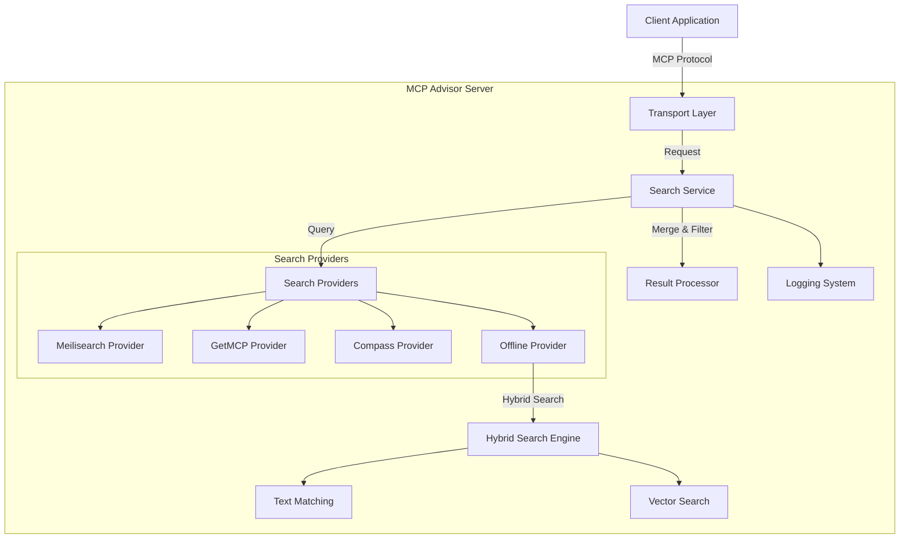

# MCP Advisor

[](https://modelcontextprotocol.org)
[](https://www.npmjs.com/package/@xiaohui-wang/mcpadvisor)
[](https://opensource.org/licenses/MIT) [![DeepWiki](https://img.shields.io/badge/DeepWiki-istarwyh%2Fmcpadvisor-blue.svg?logo=data:image/png;base64,iVBORw0KGgoAAAANSUhEUgAAACwAAAAyCAYAAAAnWDnqAAAAAXNSR0IArs4c6QAAA05JREFUaEPtmUtyEzEQhtWTQyQLHNak2AB7ZnyXZMEjXMGeK/AIi+QuHrMnbChYY7MIh8g01fJoopFb0uhhEqqcbWTp06/uv1saEDv4O3n3dV60RfP947Mm9/SQc0ICFQgzfc4CYZoTPAswgSJCCUJUnAAoRHOAUOcATwbmVLWdGoH//PB8mnKqScAhsD0kYP3j/Yt5LPQe2KvcXmGvRHcDnpxfL2zOYJ1mFwrryWTz0advv1Ut4CJgf5uhDuDj5eUcAUoahrdY/56ebRWeraTjMt/00Sh3UDtjgHtQNHwcRGOC98BJEAEymycmYcWwOprTgcB6VZ5JK5TAJ+fXGLBm3FDAmn6oPPjR4rKCAoJCal2eAiQp2x0vxTPB3ALO2CRkwmDy5WohzBDwSEFKRwPbknEggCPB/imwrycgxX2NzoMCHhPkDwqYMr9tRcP5qNrMZHkVnOjRMWwLCcr8ohBVb1OMjxLwGCvjTikrsBOiA6fNyCrm8V1rP93iVPpwaE+gO0SsWmPiXB+jikdf6SizrT5qKasx5j8ABbHpFTx+vFXp9EnYQmLx02h1QTTrl6eDqxLnGjporxl3NL3agEvXdT0WmEost648sQOYAeJS9Q7bfUVoMGnjo4AZdUMQku50McDcMWcBPvr0SzbTAFDfvJqwLzgxwATnCgnp4wDl6Aa+Ax283gghmj+vj7feE2KBBRMW3FzOpLOADl0Isb5587h/U4gGvkt5v60Z1VLG8BhYjbzRwyQZemwAd6cCR5/XFWLYZRIMpX39AR0tjaGGiGzLVyhse5C9RKC6ai42ppWPKiBagOvaYk8lO7DajerabOZP46Lby5wKjw1HCRx7p9sVMOWGzb/vA1hwiWc6jm3MvQDTogQkiqIhJV0nBQBTU+3okKCFDy9WwferkHjtxib7t3xIUQtHxnIwtx4mpg26/HfwVNVDb4oI9RHmx5WGelRVlrtiw43zboCLaxv46AZeB3IlTkwouebTr1y2NjSpHz68WNFjHvupy3q8TFn3Hos2IAk4Ju5dCo8B3wP7VPr/FGaKiG+T+v+TQqIrOqMTL1VdWV1DdmcbO8KXBz6esmYWYKPwDL5b5FA1a0hwapHiom0r/cKaoqr+27/XcrS5UwSMbQAAAABJRU5ErkJggg==)](https://deepwiki.com/istarwyh/mcpadvisor) [](https://insiders.vscode.dev/redirect/mcp/install?name=mcpadvisor&inputs=%5B%5D&config=%7B%22command%22%3A%22npx%22%2C%22args%22%3A%5B%22-y%22%2C%22%40xiaohui-wang%2Fmcpadvisor%22%5D%7D) [](https://smithery.ai/server/@istarwyh/mcpadvisor)
<!-- DeepWiki badge generated by https://deepwiki.ryoppippi.com/ --> 


<a href="https://glama.ai/mcp/servers/@istarwyh/mcpadvisor">
  
</a>


[English](./README.md) | [简体中文](./README_zh.md) 

## Introduction

MCP Advisor is a discovery and recommendation service that helps AI assistants explore Model Context Protocol (MCP) servers using natural language queries. It makes it easier for users to find and leverage MCP tools suitable for specific tasks.

## User Stories

1. **Discover & Recommend MCP Servers**
   - As an AI agent developer, I want to quickly find the right MCP servers for a specific task using natural-language queries.
   - Example prompt: `"Find MCP servers for insurance risk analysis"`

2. **Install & Configure MCP Servers**
   - As a regular user who discovers a useful MCP server, I want to install and start using it as quickly as possible.
   - Example prompt: `"Install this MCP: https://github.com/Deepractice/PromptX"`

### Demo

https://github.com/user-attachments/assets/7a536315-e316-4978-8e5a-e8f417169eb1


## Documentation Navigation

- [Installation Guide](docs/INSTALLATION.md) - Detailed installation and configuration instructions
- [User Guide](docs/USER_GUIDE.md) - How to use MCP Advisor
- [Architecture Documentation](docs/ARCHITECTURE.md) - System architecture details
- [Technical Details](docs/TECHNICAL_DETAILS.md) - Advanced technical features
- [Developer Guide](docs/DEVELOPER_GUIDE.md) - Development environment setup and code contribution
- [Best Practices](docs/BEST_PRACTICES.md) - Coding standards and best practices for contributors
- [Troubleshooting](docs/TROUBLESHOOTING.md) - Common issues and solutions
- [Search Providers](docs/SEARCH_PROVIDERS.md) - Search provider details
- [API Reference](docs/API_REFERENCE.md) - API documentation
- [Roadmap](ROADMAP.md) - Future development plans
- [Contribution Guidelines](CONTRIBUTING.md) - How to contribute code

## Quick Start

### Installation

The fastest way is to integrate MCP Advisor through MCP configuration:

```json
{
  "mcpServers": {
    "mcpadvisor": {
      "command": "npx",
      "args": ["-y", "@xiaohui-wang/mcpadvisor"]
    }
  }
}
```

Add this configuration to your AI assistant's MCP settings file:

- MacOS/Linux: `~/Library/Application Support/Claude/claude_desktop_config.json`
- Windows: `%AppData%\Claude\claude_desktop_config.json`

### Installing via Smithery

To install Advisor for Claude Desktop automatically via [Smithery](https://smithery.ai/server/@istarwyh/mcpadvisor):

```bash
npx -y @smithery/cli install @istarwyh/mcpadvisor --client claude
```

For more installation methods, see the [Installation Guide](docs/INSTALLATION.md).

## Developer Guide

### Architecture Overview

MCP Advisor adopts a modular architecture with clear separation of concerns and functional programming principles:



### Core Components

1. **Search Service Layer**
   - Unified search interface and provider aggregation
   - Support for multiple search providers executing in parallel
   - Configurable search options (limit, minSimilarity)

2. **Search Providers**
   - **Meilisearch Provider**: Vector search using Meilisearch
   - **GetMCP Provider**: API search from the GetMCP registry
   - **Compass Provider**: API search from the Compass registry
   - **Offline Provider**: Hybrid search combining text and vectors

3. **Hybrid Search Strategy**
   - Intelligent combination of text matching and vector search
   - Configurable weight balancing
   - Smart adaptive filtering mechanisms

4. **Transport Layer**
   - Stdio (CLI default)
   - SSE (Web integration)
   - REST API endpoints

For more detailed architecture documentation, see [ARCHITECTURE.md](docs/ARCHITECTURE.md).

## Technical Highlights

### Advanced Search Techniques

1. **Vector Normalization**
   - All vectors are normalized to unit length (magnitude = 1)
   - Ensures consistent cosine similarity calculations
   - Improves search precision by focusing on direction rather than magnitude

2. **Parallel Search Execution**
   - Vector search and text search run in parallel
   - Leverages Promise.all for optimal performance
   - Fallback mechanisms enabled if either search fails

3. **Weighted Result Merging**
   - Configurable weights between vector and text results
   - Default: vector similarity (70%), text matching (30%)

### Error Handling and Logging System

MCP Advisor implements robust error handling and logging systems:

1. **Contextual Error Formatting**
   - Standardized error object enrichment
   - Stack trace preservation and formatting
   - Error type categorization and standardization

2. **Graceful Degradation**
   - Multi-provider fallback strategies
   - Partial result processing
   - Default responses for critical failures

For more technical details, see [TECHNICAL_DETAILS.md](docs/TECHNICAL_DETAILS.md).

## Developer Quick Start

### Development Environment Setup

1. Clone the repository
2. Install dependencies:
   ```bash
   npm install
   ```
3. Configure environment variables (see [INSTALLATION.md](docs/INSTALLATION.md))

### Library Usage

```typescript
import { SearchService } from '@xiaohui-wang/mcpadvisor';

// Initialize search service
const searchService = new SearchService();

// Search for MCP servers
const results = await searchService.search('vector database integration');
console.log(results);
```

### Transport Options

MCP Advisor supports multiple transport methods:

1. **Stdio Transport** (default) - Suitable for command-line tools
2. **SSE Transport** - Suitable for web integration
3. **REST Transport** - Provides REST API endpoints

For more development details, see [DEVELOPER_GUIDE.md](docs/DEVELOPER_GUIDE.md).

## Contribution Guidelines

1. Follow commit message conventions:
   - Use lowercase types (feat, fix, docs, etc.)
   - Write descriptive messages in sentence format

2. Ensure code quality:
   - Run tests: `npm test`
   - Check types: `npm run type-check`
   - Lint code: `npm run lint`

For detailed contribution guidelines, see [CONTRIBUTING.md](CONTRIBUTING.md).

## Usage Examples

### Example Queries

Here are some example queries you can use with MCP Advisor:

```
"Find MCP servers for natural language processing"
"MCP servers for financial data analysis"
"E-commerce recommendation engine MCP servers"
"MCP servers with image recognition capabilities"
"Weather data processing MCP servers"
"Document summarization MCP servers"
```

### Example Response

```json
[
  {
    "title": "NLP Toolkit",
    "description": "Comprehensive natural language processing toolkit with sentiment analysis, entity recognition, and text summarization capabilities.",
    "github_url": "https://github.com/example/nlp-toolkit",
    "similarity": 0.92
  },
  {
    "title": "Text Processor",
    "description": "Efficient text processing MCP server with multi-language support.",
    "github_url": "https://github.com/example/text-processor",
    "similarity": 0.85
  }
]
```

For more examples, see [EXAMPLES.md](docs/EXAMPLES.md).

## Troubleshooting

### Common Issues

1. **Connection Refused**
   - Ensure the server is running on the specified port
   - Check firewall settings

2. **No Results Returned**
   - Try a more general query
   - Check network connection to registry APIs

3. **Performance Issues**
   - Consider adding more specific search terms
   - Check server resources (CPU/memory)

For more troubleshooting information, see [TROUBLESHOOTING.md](docs/TROUBLESHOOTING.md).

## Search Providers

MCP Advisor supports multiple search providers that can be used simultaneously:

1. **Compass Search Provider**: Retrieves MCP server information using the Compass API
2. **GetMCP Search Provider**: Uses the GetMCP API and vector search for semantic matching
3. **Meilisearch Search Provider**: Uses Meilisearch for fast, fault-tolerant text search

For detailed information about search providers, see [SEARCH_PROVIDERS.md](docs/SEARCH_PROVIDERS.md).

## API Documentation

For detailed API documentation, see [API_REFERENCE.md](docs/API_REFERENCE.md).

## Roadmap

MCP Advisor is evolving from a simple recommendation system to an intelligent agent orchestration platform. Our vision is to create a system that not only recommends the right MCP servers but also learns from interactions and helps agents dynamically plan and execute complex tasks.


### Major Development Phases

1. **Recommendation Capability Optimization** (2025 Q2-Q3)
   - Accept user feedback
   - Refine recommendation effectiveness
   - Introduce more indices

For a detailed roadmap, see [ROADMAP.md](ROADMAP.md).

To Implement the above features, we need to:

- [ ] Support Full-Text Index Search
- [ ] Support MCP Resources to read log
- [ ] Utilize Professional Rerank Module like https://github.com/PrithivirajDamodaran/FlashRank or Qwen Rerank Model
- [ ] Support Cline marketplace: https://api.cline.bot/v1/mcp/marketplace

## Testing

Use [inspector](https://github.com/modelcontextprotocol/inspector) for testing:

```bash 
ENABLE_FILE_LOGGING=true node YOUR-MCPADVISOR-PATH/build/index.js npx @modelcontextprotocol/inspector
```


## License

This project is licensed under the MIT License - see the [LICENSE](LICENSE) file for details.