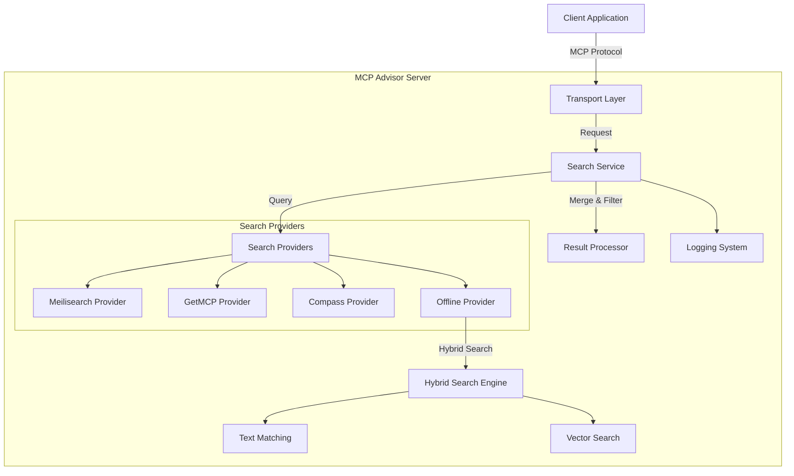
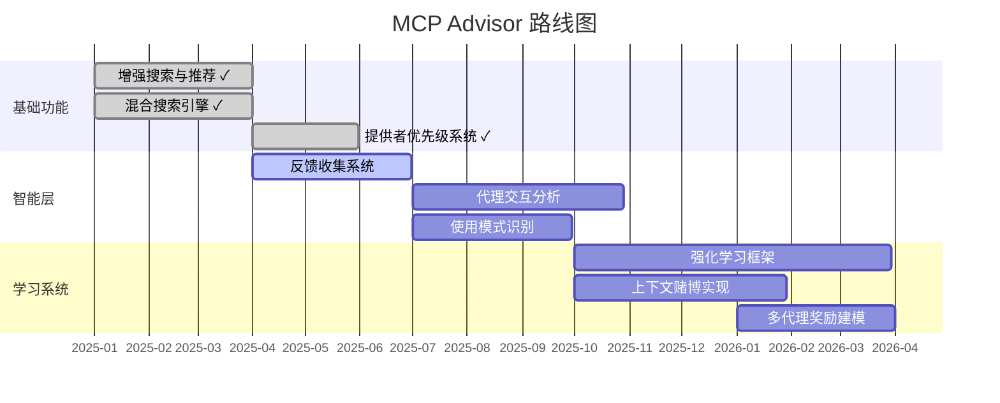

# MCP Advisor

[](https://modelcontextprotocol.org)
[](https://www.npmjs.com/package/@xiaohui-wang/mcpadvisor)
[](https://opensource.org/licenses/MIT)

<a href="https://glama.ai/mcp/servers/@istarwyh/mcpadvisor">
  
</a>

[![DeepWiki](https://img.shields.io/badge/DeepWiki-istarwyh%2Fmcpadvisor-blue.svg?logo=data:image/png;base64,iVBORw0KGgoAAAANSUhEUgAAACwAAAAyCAYAAAAnWDnqAAAAAXNSR0IArs4c6QAAA05JREFUaEPtmUtyEzEQhtWTQyQLHNak2AB7ZnyXZMEjXMGeK/AIi+QuHrMnbChYY7MIh8g01fJoopFb0uhhEqqcbWTp06/uv1saEDv4O3n3dV60RfP947Mm9/SQc0ICFQgzfc4CYZoTPAswgSJCCUJUnAAoRHOAUOcATwbmVLWdGoH//PB8mnKqScAhsD0kYP3j/Yt5LPQe2KvcXmGvRHcDnpxfL2zOYJ1mFwrryWTz0advv1Ut4CJgf5uhDuDj5eUcAUoahrdY/56ebRWeraTjMt/00Sh3UDtjgHtQNHwcRGOC98BJEAEymycmYcWwOprTgcB6VZ5JK5TAJ+fXGLBm3FDAmn6oPPjR4rKCAoJCal2eAiQp2x0vxTPB3ALO2CRkwmDy5WohzBDwSEFKRwPbknEggCPB/imwrycgxX2NzoMCHhPkDwqYMr9tRcP5qNrMZHkVnOjRMWwLCcr8ohBVb1OMjxLwGCvjTikrsBOiA6fNyCrm8V1rP93iVPpwaE+gO0SsWmPiXB+jikdf6SizrT5qKasx5j8ABbHpFTx+vFXp9EnYQmLx02h1QTTrl6eDqxLnGjporxl3NL3agEvXdT0WmEost648sQOYAeJS9Q7bfUVoMGnjo4AZdUMQku50McDcMWcBPvr0SzbTAFDfvJqwLzgxwATnCgnp4wDl6Aa+Ax283gghmj+vj7feE2KBBRMW3FzOpLOADl0Isb5587h/U4gGvkt5v60Z1VLG8BhYjbzRwyQZemwAd6cCR5/XFWLYZRIMpX39AR0tjaGGiGzLVyhse5C9RKC6ai42ppWPKiBagOvaYk8lO7DajerabOZP46Lby5wKjw1HCRx7p9sVMOWGzb/vA1hwiWc6jm3MvQDTogQkiqIhJV0nBQBTU+3okKCFDy9WwferkHjtxib7t3xIUQtHxnIwtx4mpg26/HfwVNVDb4oI9RHmx5WGelRVlrtiw43zboCLaxv46AZeB3IlTkwouebTr1y2NjSpHz68WNFjHvupy3q8TFn3Hos2IAk4Ju5dCo8B3wP7VPr/FGaKiG+T+v+TQqIrOqMTL1VdWV1DdmcbO8KXBz6esmYWYKPwDL5b5FA1a0hwapHiom0r/cKaoqr+27/XcrS5UwSMbQAAAABJRU5ErkJggg==)](https://deepwiki.com/istarwyh/mcpadvisor)
<!-- DeepWiki badge generated by https://deepwiki.ryoppippi.com/ -->

[English](./README.md) | [简体中文](./README_zh.md) 

## 简介

MCP Advisor 是一个发现和推荐服务，帮助 AI 助手使用自然语言查询探索 Model Context Protocol (MCP) 服务器。它让用户更容易找到并利用适合特定任务的 MCP 工具。

## 特性

- **自然语言搜索**：使用会话式查询查找 MCP 服务
- **丰富元数据**：获取每个服务的详细信息
- **实时更新**：始终与最新的 MCP 服务保持同步 [](https://github.com/modelcontextprotocol/servers)
- **易于集成**：为任何兼容 MCP 的 AI 助手提供简单配置
- **混合搜索引擎**：结合向量搜索和文本匹配的高级搜索能力
- **多提供者支持**：支持多个搜索提供者并行执行

## 文档导航

- [安装指南](docs/INSTALLATION.md) - 详细的安装和配置说明
- [用户指南](docs/USER_GUIDE.md) - 如何使用 MCP Advisor
- [架构文档](docs/ARCHITECTURE.md) - 系统架构详解
- [技术细节](docs/TECHNICAL_DETAILS.md) - 高级技术特性
- [开发者指南](docs/DEVELOPER_GUIDE.md) - 开发环境设置和代码贡献
- [故障排除](docs/TROUBLESHOOTING.md) - 常见问题和解决方案
- [搜索提供者](docs/SEARCH_PROVIDERS.md) - 搜索提供者详情
- [API 参考](docs/API_REFERENCE.md) - API 文档
- [路线图](ROADMAP.md) - 项目未来发展计划
- [贡献指南](CONTRIBUTING.md) - 如何贡献代码

## 快速开始

### 安装

最快的方式是通过 MCP 配置集成 MCP Advisor：

```json
{
  "mcpServers": {
    "mcpadvisor": {
      "command": "npx",
      "args": ["-y", "@xiaohui-wang/mcpadvisor"]
    }
  }
}
```

将此配置添加到您的 AI 助手的 MCP 设置文件中：

- MacOS/Linux: `~/Library/Application Support/Claude/claude_desktop_config.json`
- Windows: `%AppData%\Claude\claude_desktop_config.json`

更多安装方法请参阅 [安装指南](docs/INSTALLATION.md)。

### 演示

<div align="center">
  <a href="https://www.bilibili.com/video/BV17tJuz9Eci">
    
  </a>
  <p>点击图片观看演示视频</p>
</div>

## 开发者指南

### 架构概述

MCP Advisor 采用模块化架构，具有清晰的关注点分离和函数式编程原则：



### 核心组件

1. **搜索服务层**
   - 统一的搜索接口与提供者聚合
   - 支持多个搜索提供者并行执行
   - 可配置的搜索选项（limit，minSimilarity）

2. **搜索提供者**
   - **Meilisearch Provider**: 使用 Meilisearch 的向量搜索
   - **GetMCP Provider**: 来自 GetMCP 注册表的 API 搜索
   - **Compass Provider**: 来自 Compass 注册表的 API 搜索
   - **Offline Provider**: 结合文本和向量的混合搜索

3. **混合搜索策略**
   - 文本匹配与向量搜索的智能结合
   - 可配置的权重平衡
   - 智能适应性过滤机制

4. **传输层**
   - Stdio（CLI 默认）
   - SSE（Web 集成）
   - REST API 端点

更详细的架构文档请参阅 [ARCHITECTURE.md](docs/ARCHITECTURE.md)。

## 技术亮点

### 高级搜索技术

1. **向量归一化**
   - 所有向量都被归一化为单位长度（大小 = 1）
   - 确保一致的余弦相似度计算
   - 通过关注方向而非大小来提高搜索精度

2. **并行搜索执行**
   - 向量搜索和文本搜索并行运行
   - 利用 Promise.all 实现最佳性能
   - 如果任一搜索失败，则启用后备机制

3. **加权结果合并**
   - 向量和文本结果之间的可配置权重
   - 默认：向量相似度 (70%)，文本匹配 (30%)

### 错误处理和日志系统

MCP Advisor 实现了强大的错误处理和日志系统：

1. **上下文错误格式化**
   - 标准化的错误对象丰富
   - 堆栈跟踪保存和格式化
   - 错误类型分类和标准化

2. **优雅降级**
   - 多提供者后备策略
   - 部分结果处理
   - 关键失败的默认响应

更多技术细节请参阅 [TECHNICAL_DETAILS.md](docs/TECHNICAL_DETAILS.md)。

## 开发者快速上手

### 开发环境设置

1. 克隆仓库
2. 安装依赖项：
   ```bash
   npm install
   ```
3. 配置环境变量（参见 [INSTALLATION.md](docs/INSTALLATION.md)）

### 库使用

```typescript
import { SearchService } from '@xiaohui-wang/mcpadvisor';

// 初始化搜索服务
const searchService = new SearchService();

// 搜索 MCP 服务器
const results = await searchService.search('向量数据库集成');
console.log(results);
```

### 传输选项

MCP Advisor 支持多种传输方式：

1. **Stdio 传输**（默认） - 适用于命令行工具
2. **SSE 传输** - 适用于 Web 集成
3. **REST 传输** - 提供 REST API 端点

更多开发详情请参阅 [DEVELOPER_GUIDE.md](docs/DEVELOPER_GUIDE.md)。

## 贡献指南

1. 遵循提交消息约定：
   - 使用小写类型（feat, fix, docs 等）
   - 编写描述性消息，采用句子格式

2. 确保代码质量：
   - 运行测试：`npm test`
   - 检查类型：`npm run type-check`
   - 代码检查：`npm run lint`

详细的贡献指南请参阅 [CONTRIBUTING.md](CONTRIBUTING.md)。

## 使用示例

### 示例查询

以下是一些可以使用 MCP Advisor 的示例查询：

```
"查找用于自然语言处理的 MCP 服务器"
"金融数据分析的 MCP 服务器"
"电商推荐引擎 MCP 服务器"
"具有图像识别功能的 MCP 服务器"
"天气数据处理 MCP 服务器"
"文档摘要 MCP 服务器"
```

### 示例响应

```json
[
  {
    "title": "NLP Toolkit",
    "description": "全面的自然语言处理工具包，具有情感分析、实体识别和文本摘要功能。",
    "github_url": "https://github.com/example/nlp-toolkit",
    "similarity": 0.92
  },
  {
    "title": "Text Processor",
    "description": "高效的文本处理 MCP 服务器，支持多语言。",
    "github_url": "https://github.com/example/text-processor",
    "similarity": 0.85
  }
]
```

更多示例请参阅 [EXAMPLES.md](docs/EXAMPLES.md)。

## 故障排除

### 常见问题

1. **连接被拒绝**
   - 确保服务器在指定端口上运行
   - 检查防火墙设置

2. **未返回结果**
   - 尝试更一般的查询
   - 检查与注册表 API 的网络连接

3. **性能问题**
   - 考虑添加更具体的搜索词
   - 检查服务器资源（CPU/内存）

更多故障排除信息请参阅 [TROUBLESHOOTING.md](docs/TROUBLESHOOTING.md)。

## 搜索提供者

MCP Advisor 支持多个可同时使用的搜索提供者：

1. **Compass 搜索提供者**：使用 Compass API 检索 MCP 服务器信息
2. **GetMCP 搜索提供者**：使用 GetMCP API 和向量搜索进行语义匹配
3. **Meilisearch 搜索提供者**：使用 Meilisearch 进行快速、容错的文本搜索

有关搜索提供者的详细信息，请参阅 [SEARCH_PROVIDERS.md](docs/SEARCH_PROVIDERS.md)。

## API 文档

有关 API 的详细文档，请参阅 [API_REFERENCE.md](docs/API_REFERENCE.md)。

## 路线图

MCP Advisor 正在从简单的推荐系统发展为智能代理编排平台。我们的愿景是创建一个系统，它不仅推荐正确的 MCP 服务器，还能从交互中学习并帮助代理动态规划和执行复杂任务。



### 主要发展阶段

1. **推荐能力优化** (2025 Q2-Q3)
   - 接受用户反馈
   - 打磨推荐效果
   - 引入更多索引

详细的路线图请参阅 [ROADMAP.md](ROADMAP.md)。

## 测试

使用 [inspector](https://github.com/modelcontextprotocol/inspector) 进行测试：

```bash 
npx @modelcontextprotocol/inspector
```


## 许可证

本项目采用 MIT 许可证 - 详见 [LICENSE](LICENSE) 文件。