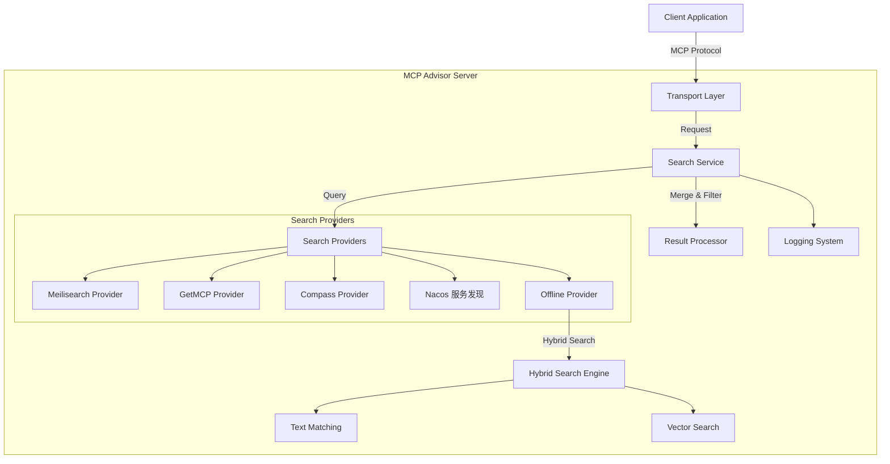

# MCP Advisor

[](https://modelcontextprotocol.org)
[](https://www.npmjs.com/package/@xiaohui-wang/mcpadvisor)
[](https://opensource.org/licenses/MIT)

[![DeepWiki](https://img.shields.io/badge/DeepWiki-istarwyh%2Fmcpadvisor-blue.svg?logo=data:image/png;base64,iVBORw0KGgoAAAANSUhEUgAAACwAAAAyCAYAAAAnWDnqAAAAAXNSR0IArs4c6QAAA05JREFUaEPtmUtyEzEQhtWTQyQLHNak2AB7ZnyXZMEjXMGeK/AIi+QuHrMnbChYY7MIh8g01fJoopFb0uhhEqqcbWTp06/uv1saEDv4O3n3dV60RfP947Mm9/SQc0ICFQgzfc4CYZoTPAswgSJCCUJUnAAoRHOAUOcATwbmVLWdGoH//PB8mnKqScAhsD0kYP3j/Yt5LPQe2KvcXmGvRHcDnpxfL2zOYJ1mFwrryWTz0advv1Ut4CJgf5uhDuDj5eUcAUoahrdY/56ebRWeraTjMt/00Sh3UDtjgHtQNHwcRGOC98BJEAEymycmYcWwOprTgcB6VZ5JK5TAJ+fXGLBm3FDAmn6oPPjR4rKCAoJCal2eAiQp2x0vxTPB3ALO2CRkwmDy5WohzBDwSEFKRwPbknEggCPB/imwrycgxX2NzoMCHhPkDwqYMr9tRcP5qNrMZHkVnOjRMWwLCcr8ohBVb1OMjxLwGCvjTikrsBOiA6fNyCrm8V1rP93iVPpwaE+gO0SsWmPiXB+jikdf6SizrT5qKasx5j8ABbHpFTx+vFXp9EnYQmLx02h1QTTrl6eDqxLnGjporxl3NL3agEvXdT0WmEost648sQOYAeJS9Q7bfUVoMGnjo4AZdUMQku50McDcMWcBPvr0SzbTAFDfvJqwLzgxwATnCgnp4wDl6Aa+Ax283gghmj+vj7feE2KBBRMW3FzOpLOADl0Isb5587h/U4gGvkt5v60Z1VLG8BhYjbzRwyQZemwAd6cCR5/XFWLYZRIMpX39AR0tjaGGiGzLVyhse5C9RKC6ai42ppWPKiBagOvaYk8lO7DajerabOZP46Lby5wKjw1HCRx7p9sVMOWGzb/vA1hwiWc6jm3MvQDTogQkiqIhJV0nBQBTU+3okKCFDy9WwferkHjtxib7t3xIUQtHxnIwtx4mpg26/HfwVNVDb4oI9RHmx5WGelRVlrtiw43zboCLaxv46AZeB3IlTkwouebTr1y2NjSpHz68WNFjHvupy3q8TFn3Hos2IAk4Ju5dCo8B3wP7VPr/FGaKiG+T+v+TQqIrOqMTL1VdWV1DdmcbO8KXBz6esmYWYKPwDL5b5FA1a0hwapHiom0r/cKaoqr+27/XcrS5UwSMbQAAAABJRU5ErkJggg==)](https://deepwiki.com/istarwyh/mcpadvisor)
<!-- DeepWiki badge generated by https://deepwiki.ryoppippi.com/ -->

[](https://mseep.ai/app/a6ebedc6-e004-46f0-b7ec-e692a17ee7aa)
[](https://lobehub.com/mcp/istarwyh-mcpadvisor)

<a href="https://glama.ai/mcp/servers/@istarwyh/mcpadvisor">
  
</a>


[English](./README.md) | [简体中文](./README_zh.md) 

## 简介

MCP Advisor 是一个发现和推荐服务，帮助 AI 助手使用自然语言查询探索 Model Context Protocol (MCP) 服务器。它让用户更容易找到并利用适合特定任务的 MCP 工具。

## 用户故事

1. **MCP服务器发现与推荐**
   - 作为AI Agent 开发者，我希望通过自然语言查询快速找到适合特定任务的MCP服务器
   - 直接提问：`"Find MCP servers for insurance risk analysis"`

2. **MCP服务器安装与配置**  
   - 作为普通用户发现一个 MCP 很好用，我希望能够快速用上这个MCP
   - 直接指示：`"安装一下这个 MCP： https://github.com/Deepractice/PromptX`

3. **企业内部MCP服务器发现与安装**
   - 作为内部的 MCP 管理者，我同样希望运用 MCP Advisor 提供企业内部的 MCP 服务器发现与安装服务
   - 可以配置 MySQL 的 transport 或者 Nacos 的环境变量实现和您自己的 MCP 数据源无缝连接
   

### 演示

https://github.com/user-attachments/assets/7a536315-e316-4978-8e5a-e8f417169eb1

## 文档导航

- [安装指南](docs/INSTALLATION.md) - 详细的安装和配置说明
- [用户指南](docs/USER_GUIDE.md) - 如何使用 MCP Advisor
- [架构文档](docs/ARCHITECTURE.md) - 系统架构详解
- [技术细节](docs/TECHNICAL_DETAILS.md) - 高级技术特性
- [开发者指南](docs/DEVELOPER_GUIDE.md) - 开发环境设置和代码贡献
- [最佳实践](docs/BEST_PRACTICES.md) - 编码规范和贡献者最佳实践
- [故障排除](docs/TROUBLESHOOTING.md) - 常见问题和解决方案
- [搜索提供者](docs/SEARCH_PROVIDERS.md) - 搜索提供者详情
- [发展路线图](ROADMAP.md) - 未来发展计划

## 2025年重构更新 🚀

项目在2025年进行了重大重构，提升了代码组织和可维护性：

### ✅ 主要改进

- **🏗️ 目录结构重构** - 采用清洁架构原则重新组织代码
- **🧪 全面测试覆盖** - 单元测试、集成测试和端到端测试
- **🤖 自动化测试** - 基于 Playwright 的完整自动化测试流程
- **🔧 改进的错误处理** - 更好的错误处理和日志记录
- **📦 模块化设计** - 清晰的服务分层和依赖管理

### 新的项目结构

```
src/
├── services/
│   ├── core/                    # 核心业务逻辑
│   │   ├── installation/        # 安装指南服务
│   │   ├── search/             # 搜索提供者
│   │   └── server/             # MCP服务器实现
│   ├── providers/              # 外部服务提供者
│   │   ├── meilisearch/        # Meilisearch集成
│   │   ├── nacos/              # Nacos服务发现
│   │   ├── oceanbase/          # OceanBase向量数据库
│   │   └── offline/            # 离线搜索引擎
│   ├── common/                 # 共享工具
│   └── interfaces/             # 类型定义
├── tests/                      # 测试套件
│   ├── unit/                   # 单元测试
│   ├── integration/            # 集成测试
│   └── e2e/                    # 端到端测试
└── scripts/                    # 自动化脚本
```
- [API 参考](docs/API_REFERENCE.md) - API 文档
- [路线图](ROADMAP.md) - 项目未来发展计划
- [贡献指南](CONTRIBUTING.md) - 如何贡献代码

## 快速开始

### 安装

最快的方式是通过 MCP 配置集成 MCP Advisor：

```json
{
  "mcpServers": {
    "mcpadvisor": {
      "command": "npx",
      "args": ["-y", "@xiaohui-wang/mcpadvisor"]
    }
  }
}
```

将此配置添加到您的 AI 助手的 MCP 设置文件中：

- MacOS/Linux: `~/Library/Application Support/Claude/claude_desktop_config.json`
- Windows: `%AppData%\Claude\claude_desktop_config.json`

更多安装方法请参阅 [安装指南](docs/INSTALLATION.md)。


## 开发者指南

### 架构概述

MCP Advisor 采用模块化架构，具有清晰的关注点分离和函数式编程原则：



### 核心组件

1. **搜索服务层**
   - 统一的搜索接口与提供者聚合
   - 支持多个搜索提供者并行执行
   - 可配置的搜索选项（limit，minSimilarity）

2. **搜索提供者**
   - **Meilisearch Provider**: 使用 Meilisearch 的向量搜索
   - **GetMCP Provider**: 来自 GetMCP 注册表的 API 搜索
   - **Compass Provider**: 来自 Compass 注册表的 API 搜索
   - **Nacos Provider**: 从 Nacos 服务注册中心发现 MCP 服务器
   - **Offline Provider**: 结合文本和向量的混合搜索

3. **混合搜索策略**
   - 文本匹配与向量搜索的智能结合
   - 可配置的权重平衡
   - 智能适应性过滤机制

4. **传输层**
   - Stdio（CLI 默认）
   - SSE（Web 集成）
   - REST API 端点

更详细的架构文档请参阅 [ARCHITECTURE.md](docs/ARCHITECTURE.md)。

## 技术亮点

### 高级搜索技术

1. **向量归一化**
   - 所有向量都被归一化为单位长度（大小 = 1）
   - 确保一致的余弦相似度计算
   - 通过关注方向而非大小来提高搜索精度

2. **并行搜索执行**
   - 向量搜索和文本搜索并行运行
   - 利用 Promise.all 实现最佳性能
   - 如果任一搜索失败，则启用后备机制

3. **加权结果合并**
   - 向量和文本结果之间的可配置权重
   - 默认：向量相似度 (70%)，文本匹配 (30%)

### 错误处理和日志系统

MCP Advisor 实现了强大的错误处理和日志系统：

1. **上下文错误格式化**
   - 标准化的错误对象丰富
   - 堆栈跟踪保存和格式化
   - 错误类型分类和标准化

2. **优雅降级**
   - 多提供者后备策略
   - 部分结果处理
   - 关键失败的默认响应

更多技术细节请参阅 [TECHNICAL_DETAILS.md](docs/TECHNICAL_DETAILS.md)。

## 开发者快速上手

### 开发环境设置

1. 克隆仓库
2. 安装依赖项：
   ```bash
   pnpm install
   ```
3. 构建项目：
   ```bash
   pnpm run build
   ```
4. 配置环境变量（参见 [INSTALLATION.md](docs/INSTALLATION.md)）

### 测试

MCP Advisor 包含全面的测试套件以确保代码质量和功能性：

#### 单元测试
```bash
# 运行单元测试
pnpm run test

# 监听模式运行测试
pnpm run test:watch

# 生成覆盖率报告
pnpm run test:coverage
```

#### 端到端测试
项目包含使用 Playwright 的自动化端到端测试，测试完整的 MCP Inspector 工作流程：

```bash
# 运行端到端测试（推荐用于开发）
pnpm run test:e2e:headed

# 无头模式运行端到端测试（CI/CD）
pnpm run test:e2e

# 交互式调试端到端测试
pnpm run test:e2e:debug
```

#### 自动化测试脚本
为了方便使用，使用自动化测试脚本处理完整的测试工作流：

```bash
# 运行完整的端到端测试套件（构建、启动inspector、运行测试）
./scripts/run-e2e-test.sh

# 可用模式：
./scripts/run-e2e-test.sh headed    # 浏览器可见（默认）
./scripts/run-e2e-test.sh headless # 后台测试
./scripts/run-e2e-test.sh debug    # 调试模式
```

自动化测试覆盖：
- ✅ **推荐功能** - 自然语言 MCP 服务器发现
- ✅ **安装指南生成** - 自动化安装说明
- ✅ **错误处理** - 优雅的错误响应
- ✅ **性能测试** - 响应时间验证

### 库使用

```typescript
import { SearchService } from '@xiaohui-wang/mcpadvisor';

// 初始化搜索服务
const searchService = new SearchService();

// 搜索 MCP 服务器
const results = await searchService.search('向量数据库集成');
console.log(results);
```

### 传输选项

MCP Advisor 支持多种传输方式：

1. **Stdio 传输**（默认） - 适用于命令行工具
2. **SSE 传输** - 适用于 Web 集成
3. **REST 传输** - 提供 REST API 端点

更多开发详情请参阅 [DEVELOPER_GUIDE.md](docs/DEVELOPER_GUIDE.md)。

## 贡献指南

我们欢迎对 MCP Advisor 的贡献！项目最近进行了重构以改善代码组织和可维护性。

### 开发工作流

1. **Fork 和克隆**：Fork 仓库并克隆您的 fork
2. **设置环境**：按照上面的开发环境设置
3. **创建分支**：从 `main` 创建功能分支
4. **进行更改**：按照我们的编码标准实现您的更改
5. **测试**：运行所有测试以确保您的更改不会破坏现有功能：
   ```bash
   pnpm run check          # 代码检查和格式检查
   pnpm run test           # 单元测试
   pnpm run test:e2e       # 端到端测试
   ```
6. **提交**：遵循常规提交消息格式：
   ```
   feat: 添加新的搜索提供者集成
   fix: 解决向量搜索性能问题
   docs: 更新安装指南
   test: 为推荐工作流添加端到端测试
   refactor: 重新组织服务目录结构
   ```
7. **拉取请求**：提交带有清晰更改描述的 PR

### 代码质量标准

- **TypeScript**：使用严格类型，避免 `any`
- **测试**：保持测试覆盖率在 80% 以上
- **文档**：为新功能更新文档
- **架构**：遵循清洁架构原则
- **性能**：考虑性能影响

### 最近改进（2025年）

- ✅ **目录重构** 提升可维护性
- ✅ **全面测试套件** 包含单元、集成和端到端测试
- ✅ **自动化测试工作流** 使用 Playwright
- ✅ **改进的错误处理** 和日志记录
- ✅ **清洁架构** 实现

## 使用示例

### 示例查询

以下是一些可以使用 MCP Advisor 的示例查询：

```
"查找用于自然语言处理的 MCP 服务器"
"金融数据分析的 MCP 服务器"
"电商推荐引擎 MCP 服务器"
"具有图像识别功能的 MCP 服务器"
"天气数据处理 MCP 服务器"
"文档摘要 MCP 服务器"
```

### 示例响应

```json
[
  {
    "title": "NLP Toolkit",
    "description": "全面的自然语言处理工具包，具有情感分析、实体识别和文本摘要功能。",
    "github_url": "https://github.com/example/nlp-toolkit",
    "similarity": 0.92
  },
  {
    "title": "Text Processor",
    "description": "高效的文本处理 MCP 服务器，支持多语言。",
    "github_url": "https://github.com/example/text-processor",
    "similarity": 0.85
  }
]
```

更多示例请参阅 [EXAMPLES.md](docs/EXAMPLES.md)。

## 故障排除

### 常见问题

1. **连接被拒绝**
   - 确保服务器在指定端口上运行
   - 检查防火墙设置

2. **未返回结果**
   - 尝试更一般的查询
   - 检查与注册表 API 的网络连接

3. **性能问题**
   - 考虑添加更具体的搜索词
   - 检查服务器资源（CPU/内存）

更多故障排除信息请参阅 [TROUBLESHOOTING.md](docs/TROUBLESHOOTING.md)。

## 搜索提供者

MCP Advisor 支持多个可同时使用的搜索提供者：

1. **Compass 搜索提供者**：使用 Compass API 检索 MCP 服务器信息
2. **GetMCP 搜索提供者**：使用 GetMCP API 和向量搜索进行语义匹配
3. **Meilisearch 搜索提供者**：使用 Meilisearch 进行快速、容错的文本搜索

有关搜索提供者的详细信息，请参阅 [SEARCH_PROVIDERS.md](docs/SEARCH_PROVIDERS.md)。

## API 文档

有关 API 的详细文档，请参阅 [API_REFERENCE.md](docs/API_REFERENCE.md)。

## 路线图

MCP Advisor 正在从简单的推荐系统发展为智能代理编排平台。我们的愿景是创建一个系统，它不仅推荐正确的 MCP 服务器，还能从交互中学习并帮助代理动态规划和执行复杂任务。

### 主要发展阶段

1. **推荐能力优化** (2025 Q2-Q3)
   - 接受用户反馈
   - 打磨推荐效果
   - 引入更多索引

详细的路线图请参阅 [ROADMAP.md](docs/ROADMAP.md)。

## 测试

### 手动测试

使用 [MCP Inspector](https://github.com/modelcontextprotocol/inspector) 进行交互式测试：

```bash 
ENABLE_FILE_LOGGING=true npx @modelcontextprotocol/inspector node build/index.js
```

### 自动化测试

项目包含全面的自动化测试：

#### 快速测试
```bash
# 运行所有测试
pnpm run check && pnpm run test && pnpm run test:e2e
```

#### 完整端到端测试工作流
```bash
# 自动化脚本，构建、启动 inspector 并运行测试
./scripts/run-e2e-test.sh
```

此自动化测试涵盖：
- **推荐功能** - 自然语言 MCP 服务器发现
- **安装指南生成** - 自动化安装说明
- **错误处理** - 优雅的错误响应
- **性能验证** - 响应时间测试

#### 测试结构
```
tests/
├── unit/           # 单个组件的单元测试
├── integration/    # 提供者交互的集成测试
└── e2e/           # 使用 Playwright 的端到端测试
```

详细的测试信息请参阅[开发者指南](#开发者快速上手)部分。


## 许可证

本项目采用 MIT 许可证 - 详见 [LICENSE](LICENSE) 文件。