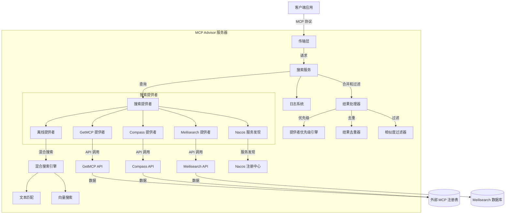
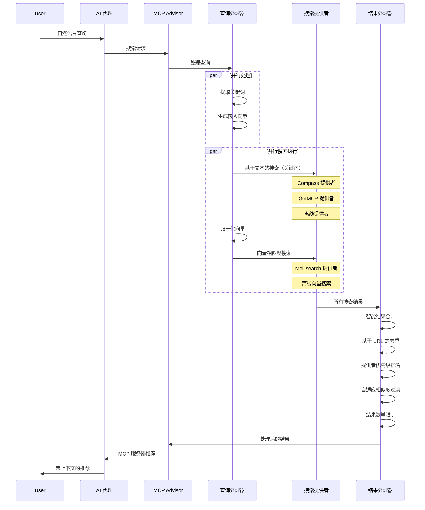
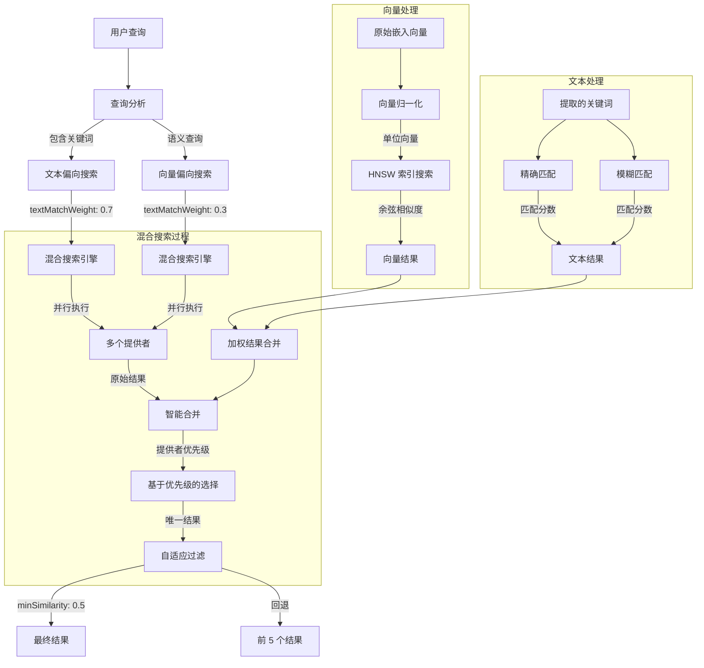

# 系统架构

本文档详细介绍了 MCP Advisor 的系统架构、核心组件和数据流。

## 目录

- [架构概述](#架构概述)
- [核心组件](#核心组件)
- [数据流](#数据流)
- [搜索策略](#搜索策略)
- [技术实现](#技术实现)

## 架构概述

MCP Advisor 采用模块化架构，遵循函数式编程原则和关注点分离。系统由以下主要部分组成：

### 系统架构图



## 核心组件

### 1. 搜索服务层

搜索服务是系统的核心，负责协调不同的搜索提供者并处理结果：

- **统一搜索接口**：提供简单的 API 用于查询 MCP 服务器
- **提供者聚合**：从多个搜索提供者收集结果
- **并行执行**：同时查询多个提供者以提高性能
- **可配置选项**：支持自定义限制、相似度阈值等
- **智能结果合并**：基于相似度和提供者优先级合并结果
- **去重机制**：基于 GitHub URL 或标题删除重复结果

```typescript
class SearchService {
  constructor(options?: SearchOptions);
  search(query: string): Promise<SearchResult[]>;
}
```

### 2. 搜索提供者

系统支持多个搜索提供者，每个提供者实现相同的接口但使用不同的数据源或搜索策略：

#### Meilisearch 提供者

使用 Meilisearch 进行向量搜索：

- 高性能向量数据库集成
- 支持语义相似度搜索
- 使用 HNSW 索引进行快速检索

#### GetMCP 提供者

从 GetMCP 注册表获取数据：

- 直接与官方 MCP 注册表集成
- 实时数据更新
- 支持元数据过滤

#### Compass 提供者

使用 Compass API 检索 MCP 服务器信息：

- 与 Compass 注册表集成
- 支持高级过滤和排序
- 提供额外的元数据

#### 离线提供者

结合文本和向量的混合搜索：

- 在本地执行搜索，无需外部 API
- 结合关键词匹配和向量相似度
- 可配置的权重平衡
- 作为其他提供者的备用机制

### 3. 混合搜索引擎

混合搜索引擎结合了文本匹配和向量搜索的优点：

- **文本匹配**：基于关键词的精确和模糊匹配
- **向量搜索**：使用嵌入向量的语义相似度
- **可配置权重**：文本和向量搜索之间的可调平衡
- **智能回退**：即使在高相似度阈值下也能确保最小结果数

### 4. 结果处理管道

结果处理管道负责优化和过滤搜索结果：

- **合并**：组合来自多个提供者的结果
- **去重**：基于 GitHub URL 或标题删除重复结果
- **提供者优先级**：基于提供者可靠性对结果进行排名
- **相似度过滤**：基于可配置阈值过滤结果
- **自适应回退**：确保最小结果数以获得更好的用户体验

### 5. 传输层

传输层处理与客户端的通信：

- **Stdio**：默认用于命令行工具
- **SSE**：用于 Web 集成的服务器发送事件
- **REST API**：提供 RESTful 端点

## 数据流

以下序列图展示了 MCP Advisor 中的数据流：



## 搜索策略

MCP Advisor 使用复杂的搜索策略来提供最相关的结果：



## 技术实现

### 向量归一化

所有向量在存储和搜索前都经过归一化处理：

```typescript
function normalizeVector(vector: number[]): number[] {
  const magnitude = Math.sqrt(vector.reduce((sum, val) => sum + val * val, 0));
  if (magnitude === 0) return vector;
  return vector.map(val => val / magnitude);
}
```

### 混合搜索实现

混合搜索结合了文本和向量搜索的结果：

```typescript
async function hybridSearch(query: string, options: SearchOptions): Promise<SearchResult[]> {
  const [textResults, vectorResults] = await Promise.all([
    textSearch(query, options),
    vectorSearch(query, options)
  ]);
  
  return mergeSearchResults(textResults, vectorResults, {
    textMatchWeight: 0.3,
    vectorMatchWeight: 0.7
  });
}
```

### 提供者优先级系统

提供者优先级系统确保最可靠的结果排在前面：

```typescript
const PROVIDER_PRIORITIES = {
  'compass': 3,
  'getmcp': 2,
  'meilisearch': 2,
  'offline': 1
};

function prioritizeResults(results: SearchResult[]): SearchResult[] {
  return results.sort((a, b) => {
    // 首先按提供者优先级排序
    const priorityDiff = 
      (PROVIDER_PRIORITIES[b.provider] || 0) - 
      (PROVIDER_PRIORITIES[a.provider] || 0);
    
    if (priorityDiff !== 0) return priorityDiff;
    
    // 然后按相似度排序
    return b.similarity - a.similarity;
  });
}
```

## 总结

MCP Advisor 的架构设计注重模块化、可扩展性和性能。通过结合多种搜索策略和智能结果处理，系统能够提供高质量的 MCP 服务器推荐，同时保持良好的响应时间和用户体验。

---

有关更多技术实现细节和搜索提供者配置，请参阅：
- [技术参考手册](./TECHNICAL_REFERENCE.md) - 详细的技术实现和搜索提供者
- [快速开始指南](./GETTING_STARTED.md) - 安装配置和基本使用
- [贡献指南](../CONTRIBUTING.md) - 开发环境设置和代码贡献
