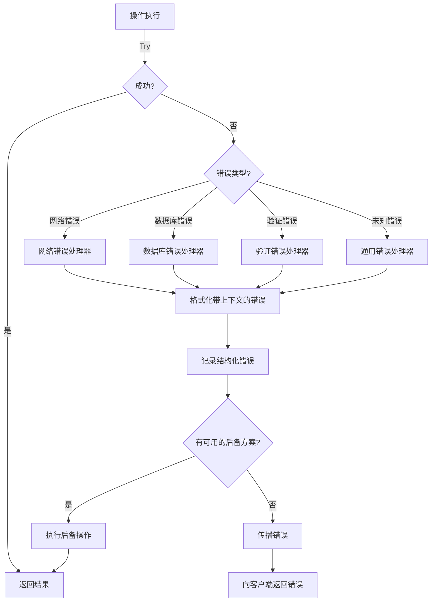

# 技术细节

本文档详细介绍了 MCP Advisor 的高级技术特性和优化。

## 目录

- [高级搜索技术](#高级搜索技术)
- [错误处理系统](#错误处理系统)
- [数据更新策略](#数据更新策略)
- [日志系统](#日志系统)
- [性能优化](#性能优化)

## 高级搜索技术

### 向量归一化

向量归一化是提高搜索质量的关键技术：

- **实现原理**：将所有向量转换为单位长度（大小 = 1）
- **数学基础**：使用欧几里得范数进行归一化
- **优势**：
  - 确保一致的余弦相似度计算
  - 通过关注方向而非大小来提高搜索精度
  - 减少向量维度变化的影响
  - 改善跨语言查询的性能

```typescript
/**
 * 将向量归一化为单位长度
 * @param vector 输入向量
 * @returns 归一化后的向量
 */
function normalizeVector(vector: number[]): number[] {
  // 计算向量大小（欧几里得范数）
  const magnitude = Math.sqrt(vector.reduce((sum, val) => sum + val * val, 0));
  
  // 防止除以零
  if (magnitude === 0 || !isFinite(magnitude)) {
    return vector;
  }
  
  // 归一化向量
  return vector.map(val => val / magnitude);
}
```

### 并行搜索执行

MCP Advisor 使用并行搜索策略来优化性能：

- **实现方式**：使用 `Promise.all` 同时执行多个搜索
- **优势**：
  - 显著减少总搜索时间
  - 提高系统响应性
  - 允许不同搜索策略的结果合并

```typescript
/**
 * 并行执行多个搜索提供者
 * @param query 搜索查询
 * @param providers 搜索提供者列表
 * @returns 合并的搜索结果
 */
async function parallelSearch(
  query: string, 
  providers: SearchProvider[]
): Promise<SearchResult[]> {
  try {
    // 并行执行所有提供者的搜索
    const resultsPromises = providers.map(provider => 
      provider.search(query).catch(error => {
        logger.error(`Provider ${provider.name} failed:`, error);
        return []; // 失败时返回空结果
      })
    );
    
    // 等待所有搜索完成
    const results = await Promise.all(resultsPromises);
    
    // 合并并去重结果
    return deduplicateResults(results.flat());
  } catch (error) {
    logger.error('Parallel search failed:', error);
    throw error;
  }
}
```

### 加权结果合并

加权结果合并技术允许智能组合不同搜索策略的结果：

- **实现原理**：基于可配置权重合并向量和文本搜索结果
- **默认配置**：向量相似度 (70%)，文本匹配 (30%)
- **动态调整**：根据查询特征自动调整权重

```typescript
/**
 * 合并向量和文本搜索结果
 * @param textResults 文本搜索结果
 * @param vectorResults 向量搜索结果
 * @param weights 合并权重配置
 * @returns 合并后的结果
 */
function mergeSearchResults(
  textResults: SearchResult[],
  vectorResults: SearchResult[],
  weights: { textMatchWeight: number; vectorMatchWeight: number }
): SearchResult[] {
  const { textMatchWeight, vectorMatchWeight } = weights;
  const mergedMap = new Map<string, SearchResult>();
  
  // 处理文本搜索结果
  for (const result of textResults) {
    const key = result.github_url || result.title;
    mergedMap.set(key, {
      ...result,
      similarity: result.similarity * textMatchWeight
    });
  }
  
  // 处理向量搜索结果，合并相同项
  for (const result of vectorResults) {
    const key = result.github_url || result.title;
    if (mergedMap.has(key)) {
      const existing = mergedMap.get(key)!;
      mergedMap.set(key, {
        ...existing,
        similarity: existing.similarity + (result.similarity * vectorMatchWeight)
      });
    } else {
      mergedMap.set(key, {
        ...result,
        similarity: result.similarity * vectorMatchWeight
      });
    }
  }
  
  // 转换回数组并排序
  return Array.from(mergedMap.values())
    .sort((a, b) => b.similarity - a.similarity);
}
```

## 错误处理系统

MCP Advisor 实现了强大的错误处理系统，确保可靠性并提供详细的诊断信息：

### 错误处理流程



### 上下文错误格式化

错误对象格式化是错误处理系统的核心：

```typescript
/**
 * 格式化错误对象，添加上下文信息
 * @param error 原始错误
 * @param context 错误上下文
 * @returns 格式化后的错误
 */
function formatError(error: any, context: ErrorContext): FormattedError {
  // 提取错误消息
  const message = error instanceof Error 
    ? error.message 
    : String(error);
  
  // 提取和格式化堆栈
  const stack = error instanceof Error && error.stack
    ? error.stack.split('\n').map(line => line.trim())
    : [];
  
  // 创建格式化的错误对象
  return {
    message,
    stack,
    type: error.constructor.name || 'Unknown',
    code: error.code || 'UNKNOWN_ERROR',
    context: {
      component: context.component,
      operation: context.operation,
      params: context.params,
      timestamp: new Date().toISOString(),
      ...context.additionalInfo
    }
  };
}
```

### 优雅降级

MCP Advisor 实现了多层次的优雅降级策略：

- **多提供者后备**：如果一个搜索提供者失败，系统会使用其他提供者
- **部分结果处理**：即使某些提供者失败，系统仍能返回部分结果
- **默认响应**：对于关键失败，系统提供默认响应
- **用户友好错误消息**：将技术错误转换为用户可理解的消息

```typescript
/**
 * 实现优雅降级的搜索函数
 * @param query 搜索查询
 * @param options 搜索选项
 * @returns 搜索结果
 */
async function resilientSearch(
  query: string, 
  options: SearchOptions
): Promise<SearchResult[]> {
  try {
    // 尝试使用所有提供者
    return await searchWithAllProviders(query, options);
  } catch (primaryError) {
    logger.warn('Primary search failed, falling back:', primaryError);
    
    try {
      // 尝试使用离线提供者
      return await searchWithOfflineProvider(query, options);
    } catch (fallbackError) {
      logger.error('Fallback search failed:', fallbackError);
      
      // 返回默认结果
      return getDefaultResults(query);
    }
  }
}
```

## 数据更新策略

MCP Advisor 实现了智能数据更新策略，平衡性能和数据新鲜度：

### 时间戳跟踪

- 每个数据源维护最后更新时间戳
- 系统跟踪更新频率和模式
- 可配置的新鲜度窗口（默认：1 小时）

```typescript
/**
 * 检查数据是否需要更新
 * @param dataSource 数据源
 * @returns 是否需要更新
 */
function shouldUpdateData(dataSource: DataSource): boolean {
  const lastUpdate = dataSource.getLastUpdateTimestamp();
  const now = Date.now();
  const freshnessWindow = config.getFreshnessWindow();
  
  // 如果没有上次更新时间或超过新鲜度窗口，则更新
  return !lastUpdate || (now - lastUpdate) > freshnessWindow;
}
```

### 条件索引

- 向量数据库仅在数据过时时重建
- 避免频繁查询上的冗余索引操作
- 显著减少数据库负载和查询延迟

```typescript
/**
 * 条件更新向量索引
 * @param dataSource 数据源
 */
async function conditionalIndexUpdate(dataSource: DataSource): Promise<void> {
  // 检查是否需要更新
  if (!shouldUpdateData(dataSource)) {
    logger.debug('Index is fresh, skipping update');
    return;
  }
  
  try {
    // 获取新数据
    const newData = await dataSource.fetchLatestData();
    
    // 检查数据是否有变化
    if (dataSource.hasDataChanged(newData)) {
      logger.info('Data changed, rebuilding index');
      await vectorDatabase.rebuildIndex(newData);
      dataSource.updateLastUpdateTimestamp();
    } else {
      logger.info('No data changes detected');
      dataSource.updateLastUpdateTimestamp();
    }
  } catch (error) {
    logger.error('Index update failed:', error);
    // 失败不会阻止使用现有索引
  }
}
```

### 后台处理

- 数据更新在服务请求后异步发生
- 用户从现有数据获得即时响应
- 新数据可用于后续查询

```typescript
/**
 * 后台更新数据
 * @param dataSource 数据源
 */
function backgroundDataUpdate(dataSource: DataSource): void {
  // 使用 setImmediate 在当前事件循环完成后执行
  setImmediate(async () => {
    try {
      await conditionalIndexUpdate(dataSource);
      logger.info('Background data update completed');
    } catch (error) {
      logger.error('Background data update failed:', error);
    }
  });
}
```

## 日志系统

MCP Advisor 实现了增强的日志系统，提供详细的系统操作可见性：

### 上下文感知日志

- 每个日志条目包含组件上下文
- 结构化数据便于机器解析
- 消息和元数据之间的清晰分离

```typescript
/**
 * 创建上下文感知的日志条目
 * @param level 日志级别
 * @param message 日志消息
 * @param context 日志上下文
 */
function logWithContext(
  level: LogLevel,
  message: string,
  context: LogContext
): void {
  const logEntry = {
    timestamp: new Date().toISOString(),
    level,
    message,
    component: context.component,
    operation: context.operation,
    ...context.metadata
  };
  
  // 输出到控制台
  if (config.consoleLogging) {
    console[level](JSON.stringify(logEntry));
  }
  
  // 输出到文件
  if (config.fileLogging) {
    fileLogger.write(logEntry);
  }
}
```

### 性能跟踪

- 关键操作的计时信息
- 资源使用监控
- 查询执行统计

```typescript
/**
 * 性能跟踪包装器
 * @param operation 操作名称
 * @param func 要执行的函数
 * @returns 函数结果
 */
async function trackPerformance<T>(
  operation: string,
  func: () => Promise<T>
): Promise<T> {
  const start = performance.now();
  try {
    const result = await func();
    const duration = performance.now() - start;
    
    logger.debug(`Operation ${operation} completed in ${duration.toFixed(2)}ms`);
    
    // 记录性能指标
    metrics.recordOperationDuration(operation, duration);
    
    return result;
  } catch (error) {
    const duration = performance.now() - start;
    logger.error(`Operation ${operation} failed after ${duration.toFixed(2)}ms:`, error);
    throw error;
  }
}
```

## 性能优化

MCP Advisor 采用了多种性能优化技术：

### 缓存策略

- **查询缓存**：缓存常见查询的结果
- **嵌入缓存**：重用计算成本高的嵌入向量
- **LRU 策略**：限制缓存大小，优先保留最近使用的项

```typescript
/**
 * 创建 LRU 缓存
 * @param maxSize 最大缓存项数
 * @returns 缓存对象
 */
function createLRUCache<K, V>(maxSize: number): Cache<K, V> {
  const cache = new Map<K, V>();
  const keys: K[] = [];
  
  return {
    get(key: K): V | undefined {
      const value = cache.get(key);
      if (value !== undefined) {
        // 将项移到最近使用的位置
        const index = keys.indexOf(key);
        if (index > -1) {
          keys.splice(index, 1);
          keys.push(key);
        }
      }
      return value;
    },
    
    set(key: K, value: V): void {
      // 如果达到最大大小，删除最旧的项
      if (keys.length >= maxSize && !cache.has(key)) {
        const oldestKey = keys.shift();
        if (oldestKey !== undefined) {
          cache.delete(oldestKey);
        }
      }
      
      // 添加或更新项
      if (!cache.has(key)) {
        keys.push(key);
      }
      cache.set(key, value);
    },
    
    clear(): void {
      cache.clear();
      keys.length = 0;
    }
  };
}
```

### 批处理

- **批量嵌入生成**：一次处理多个文本，减少 API 调用
- **批量数据库操作**：减少数据库往返
- **请求合并**：合并短时间内的类似请求

```typescript
/**
 * 批量生成嵌入向量
 * @param texts 要嵌入的文本列表
 * @returns 嵌入向量列表
 */
async function batchGenerateEmbeddings(
  texts: string[]
): Promise<number[][]> {
  // 如果只有一个文本，直接处理
  if (texts.length === 1) {
    return [await generateEmbedding(texts[0])];
  }
  
  // 批量处理多个文本
  logger.debug(`Generating embeddings for ${texts.length} texts in batch`);
  
  try {
    // 调用嵌入模型的批处理 API
    const embeddings = await embeddingModel.embedBatch(texts);
    
    // 归一化所有嵌入
    return embeddings.map(normalizeVector);
  } catch (error) {
    logger.error('Batch embedding generation failed:', error);
    
    // 回退到单个处理
    logger.info('Falling back to individual embedding generation');
    const results: number[][] = [];
    
    for (const text of texts) {
      try {
        results.push(await generateEmbedding(text));
      } catch (innerError) {
        logger.error(`Failed to generate embedding for text: ${text.substring(0, 50)}...`, innerError);
        // 对于失败的文本，添加零向量
        results.push(new Array(embeddingModel.dimensions).fill(0));
      }
    }
    
    return results;
  }
}
```

### 延迟加载

- **按需加载组件**：仅在需要时初始化重量级组件
- **渐进式数据加载**：首先加载基本数据，然后在后台加载详细信息
- **动态导入**：减少启动时间

```typescript
/**
 * 延迟加载搜索提供者
 */
class LazyLoadedProvider implements SearchProvider {
  private provider: SearchProvider | null = null;
  private readonly factory: () => SearchProvider;
  
  constructor(factory: () => SearchProvider) {
    this.factory = factory;
  }
  
  async search(query: string): Promise<SearchResult[]> {
    // 按需初始化提供者
    if (!this.provider) {
      this.provider = this.factory();
    }
    
    return this.provider.search(query);
  }
}
```

## 总结

MCP Advisor 的技术实现注重性能、可靠性和用户体验。通过高级搜索技术、强大的错误处理、智能数据更新策略和全面的日志系统，MCP Advisor 能够提供高质量的 MCP 服务器推荐，同时保持系统的稳定性和响应性。
