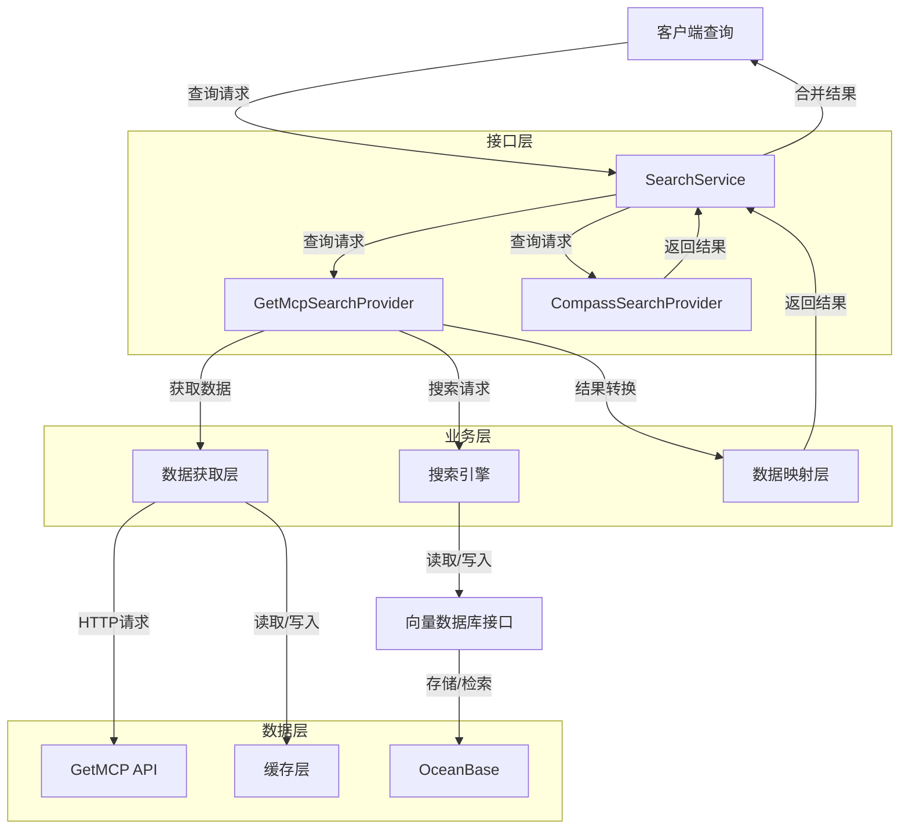
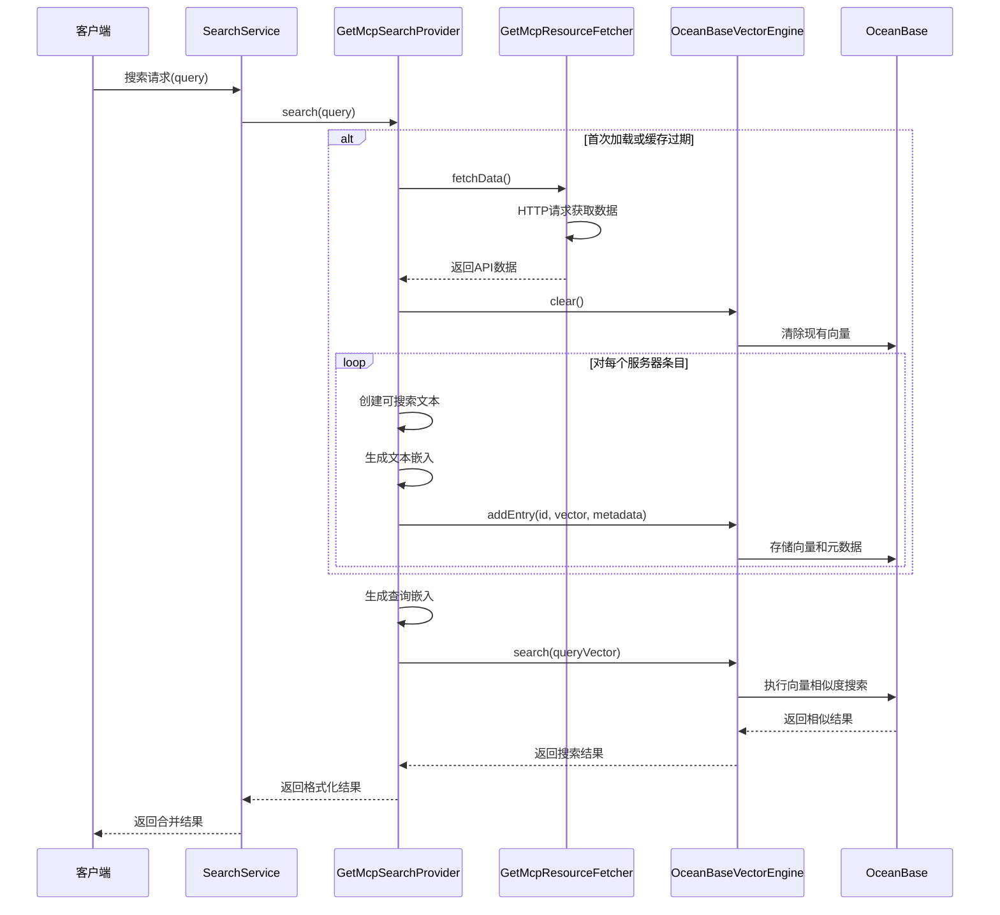

## 背景

searchService.ts 中 CompassSearchProvider 提供了一个搜索的接口，我们希望在 GetMcpSearchProvider 同样实现一个搜索的接口。
不一样的是，GetMcpSearchProvider 接受到的是一个 mcp.json 文件，而不是一个现成的 api base url。
mcp.json 文件的格式如下：

```json
{
    "rabbitmq": {
        "name": "rabbitmq",
        "display_name": "RabbitMQ",
        "description": "The MCP server that interacts with RabbitMQ to publish and consume messages.",
        "repository": {
            "type": "git",
            "url": "https://github.com/kenliao94/mcp-server-rabbitmq"
        },
        "homepage": "https://github.com/kenliao94/mcp-server-rabbitmq",
        "author": {
            "name": "kenliao94"
        },
        "license": "MIT",
        "categories": [
            "RabbitMQ",
            "Messaging"
        ],
        "tags": [
            "rabbitmq",
            "server",
            "messaging"
        ],
        "installations": {
            "uvx": {
                "type": "uvx",
                "command": "uvx",
                "args": [
                    "--from",
                    "https://github.com/kenliao94/mcp-server-rabbitmq",
                    "mcp-server-rabbitmq",
                    "--rabbitmq-host",
                    "${RABBITMQ_HOST}",
                    "--port",
                    "${RABBITMQ_PORT}",
                    "--username",
                    "${RABBITMQ_USERNAME}",
                    "--password",
                    "${RABBITMQ_PASSWORD}",
                    "--use-tls",
                    "${USE_TLS}"
                ]
            }
        },
        "examples": [
            {
                "title": "Publish Message",
                "description": "Ask Claude to publish a message to a queue.",
                "prompt": "Please publish a message to the queue."
            }
        ],
        "arguments": {
            "RABBITMQ_HOST": {
                "description": "The hostname of the RabbitMQ server (e.g., test.rabbit.com, localhost).",
                "required": true,
                "example": "test.rabbit.com"
            },
            "RABBITMQ_PORT": {
                "description": "The port number to connect to the RabbitMQ server (e.g., 5672).",
                "required": true,
                "example": "5672"
            },
            "RABBITMQ_USERNAME": {
                "description": "The username to authenticate with the RabbitMQ server.",
                "required": true,
                "example": "guest"
            },
            "RABBITMQ_PASSWORD": {
                "description": "The password for the RabbitMQ username provided.",
                "required": true,
                "example": "guest"
            },
            "USE_TLS": {
                "description": "Set to true if using TLS (AMQPS), otherwise false.",
                "required": false,
                "example": "true or false"
            }
        }
    }
}
```

获取的 GET URL：https://getmcp.io/api/servers.json

实现时应该注意技术的优雅。
1. 按照最佳实践实现 GET 资源的获取，包含缓存，一个小时缓存失效
2. 实现一个搜索的接口，接收一个从 URL 中获取的 mcp.json 文件，返回一个可以搜索的 MCP 服务器的列表
  2.1 数据库选择 OceanBase 单机版，使用向量索引
  2.2 接口设计参考 CompassSearchProvider
3. 根据实现的搜索接口实现 GetMcpSearchProvider

## 实现状态

### 已完成功能

1. **模块化架构实现**
   - 采用SOLID原则，将功能拆分为多个独立模块
   - 实现了清晰的接口定义和依赖注入模式
   - 分离了数据获取、向量处理和搜索逻辑

2. **OceanBase向量搜索集成**
   - 实现了基于OceanBase的向量存储和检索功能
   - 支持HNSW索引进行高效相似度搜索
   - 添加了健壮的错误处理和连接管理

3. **数据流优化**
   - 实现了高效的数据获取和处理流程
   - 支持数据的增量更新和清除
   - 优化了向量搜索的性能

4. **安全性和兼容性改进**
   - 禁用SSL连接以适应服务器限制
   - 增强了数据库连接的稳定性
   - 添加了详细的日志记录

### 遗留问题

1. **数据结构兼容性问题**
   - `categories`和`tags`字段在某些API响应中可能不是数组格式
   - 已添加类型检查和容错处理，但需要进一步验证所有可能的数据格式

2. **数据库表结构管理**
   - 表结构变更需要更健壮的处理机制
   - 需要考虑添加数据库迁移工具

3. **向量索引创建限制**
   - OceanBase对已有向量索引的列再次创建索引存在限制
   - 需要优化索引创建逻辑，避免重复创建

4. **性能优化空间**
   - 批量插入操作可以进一步优化
   - 缓存机制可以进一步完善

## 技术方案

### 1. 系统架构



### 2. 数据流设计



### 3. 模块结构

实现采用了模块化设计，主要包含以下组件：

1. **资源获取模块 (getMcpResourceFetcher.ts)**
   - 负责从API获取数据
   - 处理HTTP请求和响应
   - 定义数据类型和接口

2. **搜索提供者模块 (oceanbaseSearchProvider.ts)**
   - 实现向量搜索逻辑
   - 处理数据索引和查询
   - 提供纯函数式处理方法

3. **数据库控制模块 (controller.ts)**
   - 管理数据库连接和操作
   - 处理表结构和索引创建
   - 提供向量存储和检索功能

4. **向量引擎模块 (vectorEngine.ts)**
   - 实现向量搜索引擎接口
   - 封装向量操作逻辑
   - 提供统一的搜索方法

5. **主提供者模块 (GetMcpSearchProvider.ts)**
   - 协调各组件之间的交互
   - 实现搜索接口
   - 管理数据加载和处理流程

### 4. 数据库设计

OceanBase表结构设计如下：

```sql
CREATE TABLE mcp_vector_data (
  id BIGINT AUTO_INCREMENT PRIMARY KEY,
  vector VECTOR(1536) NOT NULL,
  server_id VARCHAR(50) NOT NULL,
  server_name VARCHAR(100) NOT NULL,
  description TEXT,
  github_url VARCHAR(255) NOT NULL,
  categories VARCHAR(255),
  tags VARCHAR(255),
  createtime TIMESTAMP DEFAULT CURRENT_TIMESTAMP
);

-- 向量索引
CREATE VECTOR INDEX vector_index ON mcp_vector_data(vector) 
WITH (distance=inner_product, type=hnsw, m=32, ef_construction=128);

-- 普通索引
CREATE INDEX server_id_index ON mcp_vector_data(server_id);
CREATE INDEX create_time_index ON mcp_vector_data(createtime);
```

## 后续优化方向

1. **数据结构优化**
   - 完善对不同数据格式的处理
   - 优化categories和tags字段的存储方式

2. **错误处理增强**
   - 添加更细粒度的错误处理
   - 实现自动重试机制

3. **性能优化**
   - 实现批量向量操作
   - 优化查询性能

4. **监控和日志**
   - 添加性能监控指标
   - 完善日志记录系统

5. **测试覆盖**
   - 增加单元测试和集成测试
   - 添加性能基准测试