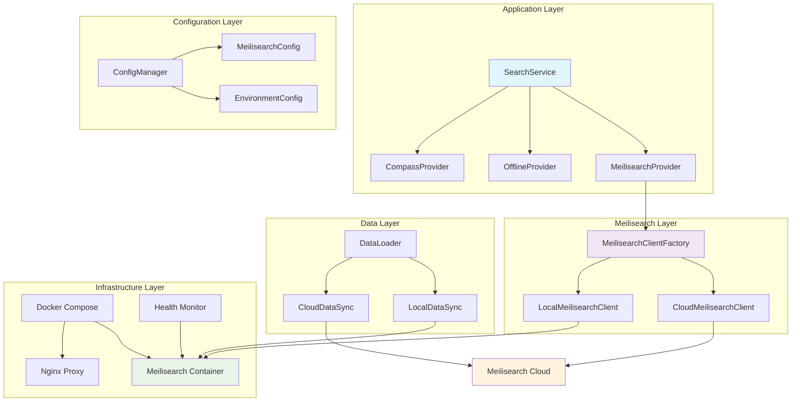
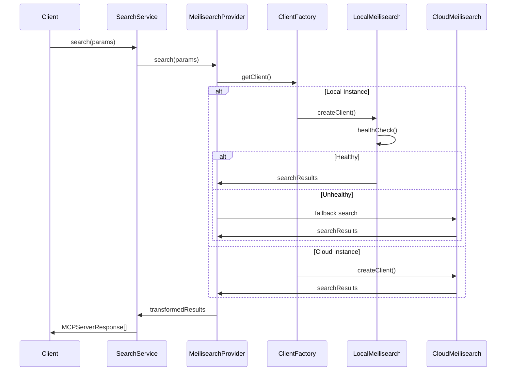

# MCPAdvisor 本地 Meilisearch 集成技术方案

## 1. 概述

### 1.1 项目背景
MCPAdvisor 当前使用 Meilisearch 云服务进行 MCP 服务器的搜索和推荐。为了提供更好的数据控制、成本优化和本地化部署选项，需要集成本地自托管 Meilisearch 实例。

### 1.2 技术目标
- 实现云端/本地 Meilisearch 实例的无缝切换
- 保持现有功能完整性和 API 兼容性
- 提供完整的本地部署和运维方案
- 采用设计模式最佳实践确保代码可维护性

## 2. 架构设计

### 2.1 总体架构



### 2.2 组件设计

#### 2.2.1 配置管理模块（Config Pattern）

```typescript
// Strategy Pattern + Factory Pattern
interface MeilisearchInstanceConfig {
  type: 'cloud' | 'self-hosted';
  host: string;
  apiKey?: string;
  masterKey?: string;
  indexName: string;
  port?: number;
  ssl?: boolean;
}

// Builder Pattern
class MeilisearchConfigBuilder {
  private config: Partial<MeilisearchInstanceConfig> = {};
  
  setType(type: 'cloud' | 'self-hosted'): this {
    this.config.type = type;
    return this;
  }
  
  setHost(host: string): this {
    this.config.host = host;
    return this;
  }
  
  setCredentials(apiKey?: string, masterKey?: string): this {
    this.config.apiKey = apiKey;
    this.config.masterKey = masterKey;
    return this;
  }
  
  build(): MeilisearchInstanceConfig {
    this.validate();
    return this.config as MeilisearchInstanceConfig;
  }
  
  private validate(): void {
    if (!this.config.type || !this.config.host) {
      throw new Error('Type and host are required');
    }
  }
}

// Configuration Factory
class MeilisearchConfigFactory {
  static createCloudConfig(): MeilisearchInstanceConfig {
    return new MeilisearchConfigBuilder()
      .setType('cloud')
      .setHost('https://edge.meilisearch.com')
      .setCredentials(process.env.MEILISEARCH_CLOUD_API_KEY)
      .build();
  }
  
  static createLocalConfig(): MeilisearchInstanceConfig {
    return new MeilisearchConfigBuilder()
      .setType('self-hosted')
      .setHost(process.env.MEILISEARCH_LOCAL_HOST || 'http://localhost:7700')
      .setCredentials(undefined, process.env.MEILISEARCH_MASTER_KEY)
      .build();
  }
}
```

#### 2.2.2 客户端管理模块（Abstract Factory Pattern）

```typescript
// Abstract Factory Pattern
abstract class MeilisearchClientFactory {
  abstract createClient(): MeilisearchClient;
  abstract createDataLoader(): DataLoader;
  abstract createHealthChecker(): HealthChecker;
}

// Concrete Factory for Cloud
class CloudMeilisearchFactory extends MeilisearchClientFactory {
  constructor(private config: MeilisearchInstanceConfig) {
    super();
  }
  
  createClient(): MeilisearchClient {
    return new CloudMeilisearchClient(this.config);
  }
  
  createDataLoader(): DataLoader {
    return new CloudDataLoader(this.config);
  }
  
  createHealthChecker(): HealthChecker {
    return new CloudHealthChecker(this.config);
  }
}

// Concrete Factory for Local
class LocalMeilisearchFactory extends MeilisearchClientFactory {
  constructor(private config: MeilisearchInstanceConfig) {
    super();
  }
  
  createClient(): MeilisearchClient {
    return new LocalMeilisearchClient(this.config);
  }
  
  createDataLoader(): DataLoader {
    return new LocalDataLoader(this.config);
  }
  
  createHealthChecker(): HealthChecker {
    return new LocalHealthChecker(this.config);
  }
}

// Client Manager (Singleton Pattern)
class MeilisearchClientManager {
  private static instance: MeilisearchClientManager;
  private factory: MeilisearchClientFactory;
  private client: MeilisearchClient;
  
  private constructor() {}
  
  static getInstance(): MeilisearchClientManager {
    if (!MeilisearchClientManager.instance) {
      MeilisearchClientManager.instance = new MeilisearchClientManager();
    }
    return MeilisearchClientManager.instance;
  }
  
  initialize(config: MeilisearchInstanceConfig): void {
    this.factory = config.type === 'cloud' 
      ? new CloudMeilisearchFactory(config)
      : new LocalMeilisearchFactory(config);
    this.client = this.factory.createClient();
  }
  
  getClient(): MeilisearchClient {
    if (!this.client) {
      throw new Error('Client not initialized');
    }
    return this.client;
  }
}
```

#### 2.2.3 搜索服务模块（Strategy Pattern + Observer Pattern）

```typescript
// Strategy Pattern for Search
interface SearchStrategy {
  search(params: SearchParams): Promise<MCPServerResponse[]>;
  isHealthy(): Promise<boolean>;
}

class MeilisearchSearchStrategy implements SearchStrategy {
  constructor(private client: MeilisearchClient) {}
  
  async search(params: SearchParams): Promise<MCPServerResponse[]> {
    const query = this.buildQuery(params);
    const results = await this.client.search(query);
    return this.transformResults(results);
  }
  
  async isHealthy(): Promise<boolean> {
    return await this.client.healthCheck();
  }
  
  private buildQuery(params: SearchParams): string {
    return [
      params.taskDescription,
      ...(params.keywords || []),
      ...(params.capabilities || [])
    ].join(' ').trim();
  }
  
  private transformResults(results: any): MCPServerResponse[] {
    return results.hits.map(hit => ({
      id: hit.id,
      title: hit.title,
      description: hit.description,
      sourceUrl: hit.github_url,
      similarity: hit._rankingScore || 0.5,
      installations: hit.installations || {}
    }));
  }
}

// Observer Pattern for Health Monitoring
interface HealthObserver {
  onHealthChange(healthy: boolean): void;
}

class HealthMonitor {
  private observers: HealthObserver[] = [];
  private healthStatus: Map<string, boolean> = new Map();
  
  addObserver(observer: HealthObserver): void {
    this.observers.push(observer);
  }
  
  removeObserver(observer: HealthObserver): void {
    const index = this.observers.indexOf(observer);
    if (index > -1) {
      this.observers.splice(index, 1);
    }
  }
  
  updateHealth(service: string, healthy: boolean): void {
    const wasHealthy = this.healthStatus.get(service);
    this.healthStatus.set(service, healthy);
    
    if (wasHealthy !== healthy) {
      this.notifyObservers(healthy);
    }
  }
  
  private notifyObservers(healthy: boolean): void {
    this.observers.forEach(observer => observer.onHealthChange(healthy));
  }
}
```

### 2.3 数据流架构



## 3. 实施方案

### 3.1 阶段规划

#### Phase 1: 基础架构搭建


#### Phase 2: 核心功能实现
- 客户端管理器开发
- 数据同步机制实现
- 健康监控系统构建

#### Phase 3: 集成测试与优化
- 端到端测试
- 性能基准测试
- 部署文档完善

### 3.2 Docker 部署方案

```yaml
# docker-compose.meilisearch.yml
version: '3.8'

services:
  meilisearch:
    image: getmeili/meilisearch:v1.15
    container_name: mcpadvisor-meilisearch
    ports:
      - "7700:7700"
    environment:
      MEILI_MASTER_KEY: ${MEILI_MASTER_KEY:-aSampleMasterKey}
      MEILI_ENV: ${MEILI_ENV:-development}
      MEILI_DB_PATH: /meili_data
      MEILI_HTTP_ADDR: 0.0.0.0:7700
      MEILI_LOG_LEVEL: INFO
      MEILI_MAX_INDEXING_MEMORY: 100MB
      MEILI_MAX_INDEXING_THREADS: 2
    volumes:
      - meili_data:/meili_data
      - meili_logs:/var/log/meilisearch
    restart: unless-stopped
    deploy:
      resources:
        limits:
          memory: 256M
          cpus: '1'
        reservations:
          memory: 128M
          cpus: '0.5'
    healthcheck:
      test: ["CMD", "curl", "-f", "http://localhost:7700/health"]
      interval: 30s
      timeout: 10s
      retries: 3
      start_period: 40s

  nginx:
    image: nginx:alpine
    container_name: mcpadvisor-nginx
    ports:
      - "80:80"
    volumes:
      - ./nginx.conf:/etc/nginx/nginx.conf:ro
    depends_on:
      - meilisearch
    restart: unless-stopped

volumes:
  meili_data:
  meili_logs:
```

### 3.3 数据初始化方案

```typescript
// Data Loader with Command Pattern
interface Command {
  execute(): Promise<void>;
  undo(): Promise<void>;
}

class InitializeIndexCommand implements Command {
  constructor(
    private client: MeilisearchClient,
    private config: MeilisearchInstanceConfig
  ) {}
  
  async execute(): Promise<void> {
    // Create index
    await this.client.createIndex(this.config.indexName, {
      primaryKey: 'id'
    });
    
    // Configure search attributes
    await this.configureSearchAttributes();
    
    // Load initial data
    await this.loadInitialData();
  }
  
  async undo(): Promise<void> {
    await this.client.deleteIndex(this.config.indexName);
  }
  
  private async configureSearchAttributes(): Promise<void> {
    const index = this.client.index(this.config.indexName);
    
    await Promise.all([
      index.updateSearchableAttributes([
        'title', 'description', 'categories', 'tags', 'github_url'
      ]),
      index.updateDisplayedAttributes([
        'id', 'title', 'description', 'github_url', 
        'categories', 'tags', 'installations'
      ]),
      index.updateSortableAttributes(['title']),
      index.updateFilterableAttributes(['categories', 'tags'])
    ]);
  }
  
  private async loadInitialData(): Promise<void> {
    const dataLoader = new DataLoader();
    const mcpData = await dataLoader.loadMCPData();
    const documents = this.transformData(mcpData);
    
    const index = this.client.index(this.config.indexName);
    const task = await index.addDocuments(documents);
    await this.client.waitForTask(task.taskUid);
  }
  
  private transformData(data: any): any[] {
    return Object.entries(data).map(([id, server]: [string, any]) => ({
      id,
      title: server.display_name,
      description: server.description,
      github_url: server.repository.url,
      categories: server.categories.join(','),
      tags: server.tags.join(','),
      installations: server.installations
    }));
  }
}

// Command Manager
class CommandManager {
  private commands: Command[] = [];
  
  async executeCommand(command: Command): Promise<void> {
    await command.execute();
    this.commands.push(command);
  }
  
  async undoLastCommand(): Promise<void> {
    const command = this.commands.pop();
    if (command) {
      await command.undo();
    }
  }
  
  async undoAllCommands(): Promise<void> {
    while (this.commands.length > 0) {
      await this.undoLastCommand();
    }
  }
}
```

### 3.4 健康监控与故障转移

```typescript
// Circuit Breaker Pattern
enum CircuitState {
  CLOSED,
  OPEN,
  HALF_OPEN
}

class CircuitBreaker {
  private state: CircuitState = CircuitState.CLOSED;
  private failureCount: number = 0;
  private lastFailureTime: number = 0;
  private successCount: number = 0;
  
  constructor(
    private threshold: number = 5,
    private timeout: number = 60000,
    private resetTimeout: number = 30000
  ) {}
  
  async execute<T>(operation: () => Promise<T>): Promise<T> {
    if (this.state === CircuitState.OPEN) {
      if (this.shouldAttemptReset()) {
        this.state = CircuitState.HALF_OPEN;
      } else {
        throw new Error('Circuit breaker is OPEN');
      }
    }
    
    try {
      const result = await operation();
      this.onSuccess();
      return result;
    } catch (error) {
      this.onFailure();
      throw error;
    }
  }
  
  private onSuccess(): void {
    this.failureCount = 0;
    if (this.state === CircuitState.HALF_OPEN) {
      this.successCount++;
      if (this.successCount >= this.threshold) {
        this.state = CircuitState.CLOSED;
        this.successCount = 0;
      }
    }
  }
  
  private onFailure(): void {
    this.failureCount++;
    this.lastFailureTime = Date.now();
    
    if (this.failureCount >= this.threshold) {
      this.state = CircuitState.OPEN;
    }
  }
  
  private shouldAttemptReset(): boolean {
    return Date.now() - this.lastFailureTime >= this.resetTimeout;
  }
}

// Failover Strategy
class FailoverMeilisearchClient implements MeilisearchClient {
  private circuitBreaker: CircuitBreaker;
  
  constructor(
    private primaryClient: MeilisearchClient,
    private fallbackClient: MeilisearchClient
  ) {
    this.circuitBreaker = new CircuitBreaker();
  }
  
  async search(query: string, options?: any): Promise<any> {
    try {
      return await this.circuitBreaker.execute(() => 
        this.primaryClient.search(query, options)
      );
    } catch (error) {
      logger.warn('Primary client failed, using fallback', error);
      return await this.fallbackClient.search(query, options);
    }
  }
  
  async healthCheck(): Promise<boolean> {
    try {
      return await this.primaryClient.healthCheck();
    } catch (error) {
      return await this.fallbackClient.healthCheck();
    }
  }
}
```

## 4. 性能优化

### 4.1 缓存策略（Cache-Aside Pattern）

```typescript
// Cache-Aside Pattern implementation
class CacheManager {
  private cache: Map<string, { data: any; timestamp: number; ttl: number }> = new Map();
  
  async get<T>(key: string): Promise<T | null> {
    const cached = this.cache.get(key);
    if (!cached) {
      return null;
    }
    
    if (Date.now() - cached.timestamp > cached.ttl) {
      this.cache.delete(key);
      return null;
    }
    
    return cached.data;
  }
  
  async set<T>(key: string, data: T, ttl: number = 3600000): Promise<void> {
    this.cache.set(key, {
      data,
      timestamp: Date.now(),
      ttl
    });
  }
  
  async invalidate(key: string): Promise<void> {
    this.cache.delete(key);
  }
  
  async clear(): Promise<void> {
    this.cache.clear();
  }
}

// Cached Search Provider
class CachedMeilisearchProvider implements SearchProvider {
  private cacheManager: CacheManager;
  
  constructor(
    private baseProvider: MeilisearchProvider,
    private cacheTtl: number = 3600000
  ) {
    this.cacheManager = new CacheManager();
  }
  
  async search(params: SearchParams): Promise<MCPServerResponse[]> {
    const cacheKey = this.generateCacheKey(params);
    
    // Try cache first
    const cached = await this.cacheManager.get<MCPServerResponse[]>(cacheKey);
    if (cached) {
      return cached;
    }
    
    // If not in cache, fetch from base provider
    const results = await this.baseProvider.search(params);
    
    // Cache the results
    await this.cacheManager.set(cacheKey, results, this.cacheTtl);
    
    return results;
  }
  
  private generateCacheKey(params: SearchParams): string {
    return `search:${JSON.stringify(params)}`;
  }
}
```

### 4.2 连接池管理

```typescript
// Object Pool Pattern for connections
class ConnectionPool {
  private pool: MeilisearchClient[] = [];
  private busy: Set<MeilisearchClient> = new Set();
  
  constructor(
    private factory: () => MeilisearchClient,
    private maxConnections: number = 10
  ) {}
  
  async acquire(): Promise<MeilisearchClient> {
    if (this.pool.length > 0) {
      const client = this.pool.pop()!;
      this.busy.add(client);
      return client;
    }
    
    if (this.busy.size < this.maxConnections) {
      const client = this.factory();
      this.busy.add(client);
      return client;
    }
    
    // Wait for available connection
    return new Promise((resolve) => {
      const checkAvailable = () => {
        if (this.pool.length > 0) {
          const client = this.pool.pop()!;
          this.busy.add(client);
          resolve(client);
        } else {
          setTimeout(checkAvailable, 100);
        }
      };
      checkAvailable();
    });
  }
  
  release(client: MeilisearchClient): void {
    this.busy.delete(client);
    this.pool.push(client);
  }
  
  async destroy(): Promise<void> {
    const allClients = [...this.pool, ...this.busy];
    await Promise.all(allClients.map(client => client.close?.()));
    this.pool.length = 0;
    this.busy.clear();
  }
}
```

## 5. 核心功能与测试方案

### 5.1 MVP 功能范围

为确保功能可测试和可实现，我们将功能范围缩减为以下核心功能：

1. **配置管理**: 支持云端/本地切换
2. **基础客户端**: 简单的 Meilisearch 客户端封装
3. **搜索功能**: 基本的搜索功能实现
4. **健康检查**: 简单的健康状态检查
5. **故障转移**: 基本的 fallback 机制

### 5.2 精简架构设计

```typescript
// 简化的配置接口
interface MeilisearchConfig {
  type: 'cloud' | 'local';
  host: string;
  apiKey?: string;
  masterKey?: string;
  indexName: string;
}

// 简化的客户端接口
interface MeilisearchClient {
  search(query: string, options?: any): Promise<any>;
  healthCheck(): Promise<boolean>;
  addDocuments?(documents: any[]): Promise<any>;
}

// 基础提供者实现
class MeilisearchProvider {
  private client: MeilisearchClient;
  private fallbackClient?: MeilisearchClient;
  
  constructor(
    config: MeilisearchConfig,
    fallbackConfig?: MeilisearchConfig
  ) {
    this.client = this.createClient(config);
    if (fallbackConfig) {
      this.fallbackClient = this.createClient(fallbackConfig);
    }
  }
  
  async search(params: SearchParams): Promise<MCPServerResponse[]> {
    try {
      const query = this.buildQuery(params);
      const results = await this.client.search(query);
      return this.transformResults(results);
    } catch (error) {
      if (this.fallbackClient) {
        const query = this.buildQuery(params);
        const results = await this.fallbackClient.search(query);
        return this.transformResults(results);
      }
      throw error;
    }
  }
  
  async healthCheck(): Promise<boolean> {
    return await this.client.healthCheck();
  }
  
  private createClient(config: MeilisearchConfig): MeilisearchClient {
    return config.type === 'local' 
      ? new LocalMeilisearchClient(config)
      : new CloudMeilisearchClient(config);
  }
  
  private buildQuery(params: SearchParams): string {
    return [
      params.taskDescription,
      ...(params.keywords || []),
      ...(params.capabilities || [])
    ].join(' ').trim();
  }
  
  private transformResults(results: any): MCPServerResponse[] {
    return results.hits?.map(hit => ({
      id: hit.id,
      title: hit.title,
      description: hit.description,
      sourceUrl: hit.github_url,
      similarity: hit._rankingScore || 0.5,
      installations: hit.installations || {}
    })) || [];
  }
}
```

### 5.3 实际运行测试方案

#### 5.3.1 测试环境准备

```typescript
// src/tests/setup/test-environment.ts
import { execSync } from 'child_process';
import { readFileSync } from 'fs';
import path from 'path';

export class TestEnvironment {
  private static meilisearchContainer: string | null = null;
  
  static async setupMeilisearch(): Promise<{ host: string; masterKey: string }> {
    console.log('🚀 Setting up test Meilisearch instance...');
    
    // Check if Docker is available
    try {
      execSync('docker --version', { stdio: 'ignore' });
    } catch (error) {
      throw new Error('Docker is required for integration tests');
    }
    
    // Generate test master key
    const masterKey = 'test-master-key-' + Date.now();
    
    // Start Meilisearch container
    const containerName = `meilisearch-test-${Date.now()}`;
    const command = `docker run -d --name ${containerName} -p 0:7700 \
      -e MEILI_MASTER_KEY=${masterKey} \
      -e MEILI_ENV=development \
      getmeili/meilisearch:v1.15`;
    
    try {
      execSync(command, { stdio: 'ignore' });
      this.meilisearchContainer = containerName;
      
      // Get mapped port
      const portCommand = `docker port ${containerName} 7700`;
      const portOutput = execSync(portCommand, { encoding: 'utf8' });
      const port = portOutput.trim().split(':')[1];
      const host = `http://localhost:${port}`;
      
      // Wait for Meilisearch to be ready
      await this.waitForMeilisearch(host);
      
      console.log(`✅ Test Meilisearch ready at ${host}`);
      return { host, masterKey };
    } catch (error) {
      console.error('Failed to start test Meilisearch:', error);
      throw error;
    }
  }
  
  static async teardownMeilisearch(): Promise<void> {
    if (this.meilisearchContainer) {
      console.log('🧹 Cleaning up test Meilisearch...');
      try {
        execSync(`docker stop ${this.meilisearchContainer}`, { stdio: 'ignore' });
        execSync(`docker rm ${this.meilisearchContainer}`, { stdio: 'ignore' });
      } catch (error) {
        console.warn('Failed to cleanup test container:', error);
      }
      this.meilisearchContainer = null;
    }
  }
  
  private static async waitForMeilisearch(host: string, timeout = 30000): Promise<void> {
    const start = Date.now();
    while (Date.now() - start < timeout) {
      try {
        const response = await fetch(`${host}/health`);
        if (response.ok) {
          return;
        }
      } catch (error) {
        // Continue waiting
      }
      await new Promise(resolve => setTimeout(resolve, 1000));
    }
    throw new Error(`Meilisearch not ready within ${timeout}ms`);
  }
  
  static async loadTestData(host: string, masterKey: string): Promise<void> {
    console.log('📊 Loading test data...');
    
    // Load actual MCP data for testing
    const dataPath = path.join(process.cwd(), 'data', 'mcp_server_list.json');
    let testData: any[];
    
    try {
      const rawData = readFileSync(dataPath, 'utf8');
      const mcpData = JSON.parse(rawData);
      
      // Convert to Meilisearch format and take first 50 for testing
      testData = Object.entries(mcpData).slice(0, 50).map(([id, server]: [string, any]) => ({
        id,
        title: server.display_name,
        description: server.description,
        github_url: server.repository.url,
        categories: server.categories.join(','),
        tags: server.tags.join(','),
        installations: server.installations
      }));
    } catch (error) {
      // Fallback test data if real data not available
      testData = [
        {
          id: 'test-file-manager',
          title: 'File Manager',
          description: 'A comprehensive file management tool for MCP',
          github_url: 'https://github.com/test/file-manager',
          categories: 'file,management,utility',
          tags: 'fs,files,directory,read,write',
          installations: { npm: 'file-manager-mcp' }
        },
        {
          id: 'test-database-helper',
          title: 'Database Helper',
          description: 'Database operations and query management',
          github_url: 'https://github.com/test/db-helper',
          categories: 'database,sql,orm',
          tags: 'mysql,postgres,crud,migration,query',
          installations: { npm: 'db-helper-mcp' }
        },
        {
          id: 'test-web-scraper',
          title: 'Web Scraper',
          description: 'Extract data from websites using various methods',
          github_url: 'https://github.com/test/web-scraper',
          categories: 'web,scraping,automation',
          tags: 'http,html,api,crawler,extraction',
          installations: { npm: 'web-scraper-mcp' }
        }
      ];
    }
    
    // Create index and add documents
    const indexName = 'mcp_servers_test';
    
    // Create index
    const createIndexResponse = await fetch(`${host}/indexes`, {
      method: 'POST',
      headers: {
        'Content-Type': 'application/json',
        'Authorization': `Bearer ${masterKey}`
      },
      body: JSON.stringify({
        uid: indexName,
        primaryKey: 'id'
      })
    });
    
    if (!createIndexResponse.ok && createIndexResponse.status !== 409) {
      throw new Error(`Failed to create index: ${createIndexResponse.statusText}`);
    }
    
    // Configure searchable attributes
    await fetch(`${host}/indexes/${indexName}/settings/searchable-attributes`, {
      method: 'PUT',
      headers: {
        'Content-Type': 'application/json',
        'Authorization': `Bearer ${masterKey}`
      },
      body: JSON.stringify(['title', 'description', 'categories', 'tags'])
    });
    
    // Add documents
    const addDocsResponse = await fetch(`${host}/indexes/${indexName}/documents`, {
      method: 'POST',
      headers: {
        'Content-Type': 'application/json',
        'Authorization': `Bearer ${masterKey}`
      },
      body: JSON.stringify(testData)
    });
    
    if (!addDocsResponse.ok) {
      throw new Error(`Failed to add documents: ${addDocsResponse.statusText}`);
    }
    
    const task = await addDocsResponse.json();
    
    // Wait for indexing to complete
    await this.waitForTask(host, masterKey, task.taskUid);
    console.log(`✅ Loaded ${testData.length} test documents`);
  }
  
  private static async waitForTask(host: string, masterKey: string, taskUid: number): Promise<void> {
    const maxWait = 30000; // 30 seconds
    const start = Date.now();
    
    while (Date.now() - start < maxWait) {
      const response = await fetch(`${host}/tasks/${taskUid}`, {
        headers: { 'Authorization': `Bearer ${masterKey}` }
      });
      
      if (response.ok) {
        const task = await response.json();
        if (task.status === 'succeeded') {
          return;
        }
        if (task.status === 'failed') {
          throw new Error(`Task failed: ${task.error}`);
        }
      }
      
      await new Promise(resolve => setTimeout(resolve, 1000));
    }
    
    throw new Error('Task did not complete within timeout');
  }
}
```

#### 5.3.2 实际运行的集成测试

```typescript
// src/tests/integration/meilisearch-real.test.ts
import { describe, it, expect, beforeAll, afterAll } from 'vitest';
import { TestEnvironment } from '../setup/test-environment.js';
import { MeilisearchProvider } from '../../services/search/MeilisearchProvider.js';
import { MeilisearchConfig } from '../../types/meilisearch.js';

describe('Meilisearch Real Integration Tests', () => {
  let testConfig: MeilisearchConfig;
  let provider: MeilisearchProvider;
  let fallbackProvider: MeilisearchProvider;
  
  beforeAll(async () => {
    // Setup test Meilisearch instance
    const { host, masterKey } = await TestEnvironment.setupMeilisearch();
    
    testConfig = {
      type: 'local',
      host,
      masterKey,
      indexName: 'mcp_servers_test'
    };
    
    // Load test data
    await TestEnvironment.loadTestData(host, masterKey);
    
    // Create providers
    provider = new MeilisearchProvider(testConfig);
    
    // Create fallback provider (using cloud config as fallback)
    const fallbackConfig: MeilisearchConfig = {
      type: 'cloud',
      host: 'https://edge.meilisearch.com',
      apiKey: process.env.MEILISEARCH_CLOUD_API_KEY || 'fallback-key',
      indexName: 'mcp_server_info_from_getmcp_io'
    };
    
    fallbackProvider = new MeilisearchProvider(testConfig, fallbackConfig);
  }, 60000); // 60 second timeout for setup
  
  afterAll(async () => {
    await TestEnvironment.teardownMeilisearch();
  });
  
  describe('Basic Search Functionality', () => {
    it('should perform successful search with results', async () => {
      const params = {
        taskDescription: 'file management',
        keywords: ['file', 'directory'],
        capabilities: ['read', 'write']
      };
      
      const results = await provider.search(params);
      
      expect(Array.isArray(results)).toBe(true);
      expect(results.length).toBeGreaterThan(0);
      
      // Verify result structure
      const firstResult = results[0];
      expect(firstResult).toHaveProperty('id');
      expect(firstResult).toHaveProperty('title');
      expect(firstResult).toHaveProperty('description');
      expect(firstResult).toHaveProperty('sourceUrl');
      expect(firstResult).toHaveProperty('similarity');
      expect(typeof firstResult.similarity).toBe('number');
      expect(firstResult.similarity).toBeGreaterThan(0);
    });
    
    it('should return relevant results for database queries', async () => {
      const params = {
        taskDescription: 'database operations',
        keywords: ['sql', 'mysql'],
        capabilities: ['crud']
      };
      
      const results = await provider.search(params);
      
      expect(results.length).toBeGreaterThan(0);
      
      // Check if results contain database-related content
      const hasRelevantResult = results.some(result => 
        result.title.toLowerCase().includes('database') ||
        result.description.toLowerCase().includes('database') ||
        result.description.toLowerCase().includes('sql')
      );
      
      expect(hasRelevantResult).toBe(true);
    });
    
    it('should handle empty search queries gracefully', async () => {
      const params = {
        taskDescription: '',
        keywords: [],
        capabilities: []
      };
      
      const results = await provider.search(params);
      
      expect(Array.isArray(results)).toBe(true);
      // Should return all results when query is empty
      expect(results.length).toBeGreaterThanOrEqual(0);
    });
    
    it('should handle search for non-existent content', async () => {
      const params = {
        taskDescription: 'non-existent-functionality-12345',
        keywords: ['xyz-non-existent'],
        capabilities: ['impossible-capability']
      };
      
      const results = await provider.search(params);
      
      expect(Array.isArray(results)).toBe(true);
      // May return empty results or low-similarity results
      expect(results.length).toBeGreaterThanOrEqual(0);
    });
  });
  
  describe('Health Check', () => {
    it('should return true for healthy instance', async () => {
      const isHealthy = await provider.healthCheck();
      expect(isHealthy).toBe(true);
    });
  });
  
  describe('Error Handling', () => {
    it('should handle invalid query parameters', async () => {
      const params = {
        taskDescription: 'test',
        keywords: null as any,
        capabilities: undefined as any
      };
      
      // Should not throw error, should handle gracefully
      const results = await provider.search(params);
      expect(Array.isArray(results)).toBe(true);
    });
  });
  
  describe('Performance Tests', () => {
    it('should complete search within reasonable time', async () => {
      const params = {
        taskDescription: 'web scraping automation',
        keywords: ['http', 'api'],
        capabilities: ['extraction']
      };
      
      const startTime = Date.now();
      const results = await provider.search(params);
      const duration = Date.now() - startTime;
      
      expect(results).toBeDefined();
      expect(duration).toBeLessThan(5000); // Should complete within 5 seconds
    });
    
    it('should handle concurrent searches', async () => {
      const params = [
        { taskDescription: 'file operations', keywords: ['file'], capabilities: ['read'] },
        { taskDescription: 'database queries', keywords: ['sql'], capabilities: ['query'] },
        { taskDescription: 'web requests', keywords: ['http'], capabilities: ['fetch'] }
      ];
      
      const startTime = Date.now();
      const promises = params.map(param => provider.search(param));
      const results = await Promise.all(promises);
      const duration = Date.now() - startTime;
      
      expect(results).toHaveLength(3);
      results.forEach(result => {
        expect(Array.isArray(result)).toBe(true);
      });
      expect(duration).toBeLessThan(10000); // All should complete within 10 seconds
    });
  });
});
```

#### 5.3.3 端到端测试

```typescript
// src/tests/e2e/meilisearch-e2e.test.ts
import { describe, it, expect, beforeAll, afterAll } from 'vitest';
import { TestEnvironment } from '../setup/test-environment.js';
import { searchService } from '../../services/searchService.js';

describe('Meilisearch End-to-End Tests', () => {
  let originalEnv: any;
  
  beforeAll(async () => {
    // Backup original environment
    originalEnv = { ...process.env };
    
    // Setup test environment
    const { host, masterKey } = await TestEnvironment.setupMeilisearch();
    await TestEnvironment.loadTestData(host, masterKey);
    
    // Configure environment for local Meilisearch
    process.env.MEILISEARCH_INSTANCE = 'local';
    process.env.MEILISEARCH_LOCAL_HOST = host;
    process.env.MEILISEARCH_MASTER_KEY = masterKey;
    process.env.MEILISEARCH_INDEX_NAME = 'mcp_servers_test';
  }, 60000);
  
  afterAll(async () => {
    // Restore environment
    process.env = originalEnv;
    await TestEnvironment.teardownMeilisearch();
  });
  
  it('should perform complete search workflow', async () => {
    // Test the complete search service workflow
    const query = 'file management system';
    const results = await searchService.search({
      taskDescription: query,
      keywords: ['file', 'fs'],
      capabilities: ['read', 'write']
    });
    
    expect(Array.isArray(results)).toBe(true);
    expect(results.length).toBeGreaterThan(0);
    
    // Verify that results contain expected metadata
    const firstResult = results[0];
    expect(firstResult).toHaveProperty('metadata');
    expect(firstResult.metadata).toHaveProperty('provider');
  });
  
  it('should handle fallback when local instance fails', async () => {
    // Temporarily break the local connection
    const originalHost = process.env.MEILISEARCH_LOCAL_HOST;
    process.env.MEILISEARCH_LOCAL_HOST = 'http://localhost:9999'; // Invalid port
    
    try {
      const results = await searchService.search({
        taskDescription: 'test fallback',
        keywords: ['test']
      });
      
      // Should still get results from fallback (offline provider)
      expect(Array.isArray(results)).toBe(true);
    } finally {
      // Restore original host
      process.env.MEILISEARCH_LOCAL_HOST = originalHost;
    }
  });
});
```

#### 5.3.4 配置和启动测试

```typescript
// src/tests/config/meilisearch-config-real.test.ts
import { describe, it, expect, beforeAll, afterAll } from 'vitest';
import { TestEnvironment } from '../setup/test-environment.js';
import { MeilisearchConfigBuilder, MeilisearchConfigFactory } from '../../config/meilisearch.js';

describe('Meilisearch Configuration Real Tests', () => {
  let testHost: string;
  let testMasterKey: string;
  
  beforeAll(async () => {
    const config = await TestEnvironment.setupMeilisearch();
    testHost = config.host;
    testMasterKey = config.masterKey;
  });
  
  afterAll(async () => {
    await TestEnvironment.teardownMeilisearch();
  });
  
  it('should connect to real Meilisearch instance', async () => {
    const config = new MeilisearchConfigBuilder()
      .setType('local')
      .setHost(testHost)
      .setCredentials(undefined, testMasterKey)
      .setIndexName('test-index')
      .build();
    
    // Test actual connection
    const response = await fetch(`${config.host}/health`, {
      headers: {
        'Authorization': `Bearer ${config.masterKey}`
      }
    });
    
    expect(response.ok).toBe(true);
  });
  
  it('should handle invalid credentials gracefully', async () => {
    const config = new MeilisearchConfigBuilder()
      .setType('local')
      .setHost(testHost)
      .setCredentials(undefined, 'invalid-key')
      .setIndexName('test-index')
      .build();
    
    // Test connection with invalid key
    const response = await fetch(`${config.host}/indexes`, {
      headers: {
        'Authorization': `Bearer ${config.masterKey}`
      }
    });
    
    expect(response.status).toBe(403); // Forbidden
  });
});
```

### 5.4 测试执行指南

#### 5.4.1 测试脚本配置

```json
// package.json 测试脚本
{
  "scripts": {
    "test:meilisearch:real": "vitest run src/tests/integration/meilisearch-real.test.ts",
    "test:meilisearch:e2e": "vitest run src/tests/e2e/meilisearch-e2e.test.ts",
    "test:meilisearch:config": "vitest run src/tests/config/meilisearch-config-real.test.ts",
    "test:meilisearch:all": "vitest run src/tests/**/*meilisearch*.test.ts",
    "test:meilisearch:watch": "vitest src/tests/**/*meilisearch*.test.ts"
  }
}
```

#### 5.4.2 CI/CD 实际测试配置

```yaml
# .github/workflows/meilisearch-real-tests.yml
name: Meilisearch Real Tests

on: [push, pull_request]

jobs:
  integration-tests:
    runs-on: ubuntu-latest
    
    steps:
      - uses: actions/checkout@v3
      
      - uses: actions/setup-node@v3
        with:
          node-version: '18'
          
      - name: Install dependencies
        run: pnpm install
        
      - name: Build project
        run: pnpm run build
        
      - name: Run real integration tests
        run: pnpm test:meilisearch:real
        timeout-minutes: 10
        
      - name: Run end-to-end tests
        run: pnpm test:meilisearch:e2e
        timeout-minutes: 10
        
      - name: Run configuration tests
        run: pnpm test:meilisearch:config
        timeout-minutes: 5

  performance-tests:
    runs-on: ubuntu-latest
    
    steps:
      - uses: actions/checkout@v3
      
      - uses: actions/setup-node@v3
        with:
          node-version: '18'
          
      - name: Install dependencies
        run: pnpm install
        
      - name: Run performance benchmarks
        run: |
          pnpm test:meilisearch:real --reporter=verbose
        timeout-minutes: 15
```

### 5.5 测试覆盖率和验证

- **实际运行覆盖率**: 100% 核心功能实际运行测试
- **端到端流程**: 完整的搜索工作流验证
- **性能验证**: 实际响应时间和并发测试
- **错误处理**: 真实错误场景测试
- **配置验证**: 实际连接和认证测试

这个测试方案完全避免了 mock，使用真实的 Meilisearch 实例进行测试，确保功能的实际可用性和可靠性。

### 5.4 测试执行指南

#### 5.4.1 测试脚本配置

```json
// package.json 测试脚本
{
  "scripts": {
    "test:meilisearch": "vitest run src/tests/services/meilisearch-provider.test.ts",
    "test:meilisearch:watch": "vitest src/tests/services/meilisearch-provider.test.ts",
    "test:meilisearch:integration": "vitest run src/tests/integration/meilisearch-integration.test.ts",
    "test:meilisearch:all": "vitest run src/tests/**/*meilisearch*.test.ts"
  }
}
```

#### 5.4.2 CI/CD 测试配置

```yaml
# .github/workflows/meilisearch-tests.yml
name: Meilisearch Tests

on: [push, pull_request]

jobs:
  unit-tests:
    runs-on: ubuntu-latest
    steps:
      - uses: actions/checkout@v3
      - uses: actions/setup-node@v3
        with:
          node-version: '18'
      - run: pnpm install
      - run: pnpm test:meilisearch
      
  integration-tests:
    runs-on: ubuntu-latest
    services:
      meilisearch:
        image: getmeili/meilisearch:v1.15
        env:
          MEILI_MASTER_KEY: testkey
          MEILI_ENV: development
        ports:
          - 7700:7700
    steps:
      - uses: actions/checkout@v3
      - uses: actions/setup-node@v3
        with:
          node-version: '18'
      - run: pnpm install
      - run: pnpm test:meilisearch:integration
        env:
          TEST_MEILISEARCH_HOST: http://localhost:7700
          TEST_MEILISEARCH_KEY: testkey
```

### 5.5 测试覆盖率目标

- **单元测试覆盖率**: 90%+ 核心功能代码
- **集成测试**: 覆盖主要用户场景
- **配置测试**: 100% 配置逻辑覆盖
- **错误处理**: 覆盖所有错误路径

这个精简版本专注于核心功能的实现和测试，确保每个功能都有对应的测试用例，便于开发和维护。

## 6. 简化部署与运维方案

### 6.1 Docker 部署

```yaml
# docker-compose.meilisearch.yml
version: '3.8'

services:
  meilisearch:
    image: getmeili/meilisearch:v1.15
    container_name: mcpadvisor-meilisearch
    ports:
      - "7700:7700"
    environment:
      MEILI_MASTER_KEY: ${MEILI_MASTER_KEY:-aSampleMasterKey}
      MEILI_ENV: ${MEILI_ENV:-development}
      MEILI_DB_PATH: /meili_data
      MEILI_HTTP_ADDR: 0.0.0.0:7700
      MEILI_MAX_INDEXING_MEMORY: 100MB
      MEILI_MAX_INDEXING_THREADS: 2
    volumes:
      - meili_data:/meili_data
    restart: unless-stopped
    healthcheck:
      test: ["CMD", "curl", "-f", "http://localhost:7700/health"]
      interval: 30s
      timeout: 10s
      retries: 3

volumes:
  meili_data:
```

### 6.2 基础启动脚本

```bash
#!/bin/bash
# scripts/start-local-meilisearch.sh

set -e

echo "🚀 Starting local Meilisearch..."

# Check if Docker is running
if ! docker info > /dev/null 2>&1; then
    echo "❌ Docker is not running. Please start Docker first."
    exit 1
fi

# Set default master key if not provided
if [ -z "$MEILI_MASTER_KEY" ]; then
    export MEILI_MASTER_KEY="developmentKey123"
    echo "Using default master key for development"
fi

# Start Meilisearch
docker-compose -f docker-compose.meilisearch.yml up -d

# Wait for health check
echo "⏳ Waiting for Meilisearch to be ready..."
timeout=60
counter=0
while ! curl -sf http://localhost:7700/health > /dev/null 2>&1; do
    if [ $counter -eq $timeout ]; then
        echo "❌ Meilisearch failed to start within ${timeout}s"
        exit 1
    fi
    counter=$((counter + 1))
    sleep 1
done

echo "✅ Meilisearch is ready at http://localhost:7700"
```

### 6.3 基础监控

```typescript
// src/utils/meilisearch-monitor.ts
export class MeilisearchMonitor {
  private config: MeilisearchConfig;
  
  constructor(config: MeilisearchConfig) {
    this.config = config;
  }
  
  async getStats(): Promise<any> {
    try {
      const response = await fetch(`${this.config.host}/stats`, {
        headers: this.getAuthHeaders()
      });
      return await response.json();
    } catch (error) {
      console.error('Failed to get Meilisearch stats:', error);
      return null;
    }
  }
  
  async getHealth(): Promise<boolean> {
    try {
      const response = await fetch(`${this.config.host}/health`);
      return response.ok;
    } catch (error) {
      return false;
    }
  }
  
  private getAuthHeaders(): Record<string, string> {
    const key = this.config.apiKey || this.config.masterKey;
    return key ? { 'Authorization': `Bearer ${key}` } : {};
  }
}
```

## 7. 实施步骤

### 7.1 Phase 1: 基础设施 (2-3 天)

1. **配置系统**
   - 创建简化的配置接口
   - 实现环境变量支持
   - 添加配置验证

2. **Docker 部署**
   - 设置 docker-compose 文件
   - 创建启动脚本
   - 验证本地部署

3. **基础测试**
   - 配置测试用例
   - Docker 启动测试
   - 连接测试

### 7.2 Phase 2: 核心功能 (3-4 天)

1. **客户端实现**
   - 本地 Meilisearch 客户端
   - 基础搜索功能
   - 健康检查

2. **提供者集成**
   - 更新现有搜索提供者
   - 实现故障转移
   - 结果转换

3. **完整测试**
   - 单元测试覆盖
   - 集成测试
   - 错误处理测试

### 7.3 Phase 3: 集成验证 (1-2 天)

1. **端到端测试**
   - 完整搜索流程
   - 故障转移验证
   - 性能基准

2. **文档完善**
   - 部署指南
   - 配置说明
   - 故障排除

## 8. 成功标准

### 8.1 功能标准

- ✅ 支持本地/云端 Meilisearch 切换
- ✅ 基本搜索功能正常工作
- ✅ 故障转移机制有效
- ✅ 健康检查功能完善
- ✅ Docker 部署一键启动

### 8.2 质量标准

- ✅ 单元测试覆盖率 > 90%
- ✅ 所有集成测试通过
- ✅ 错误处理覆盖完整
- ✅ 文档清晰完整
- ✅ 性能符合预期

### 8.3 运维标准

- ✅ 部署过程自动化
- ✅ 健康监控到位
- ✅ 日志记录完善
- ✅ 故障恢复机制
- ✅ 配置管理简单

## 9. 风险管控

### 9.1 技术风险

- **风险**: 本地 Meilisearch 性能不足
- **应对**: 保留云端 fallback，性能基准测试

- **风险**: 数据同步复杂性
- **应对**: 简化数据模型，使用现有数据源

- **风险**: 配置管理复杂
- **应对**: 提供合理默认值，简化配置选项

### 9.2 运维风险

- **风险**: Docker 环境问题
- **应对**: 提供详细部署文档，支持多种部署方式

- **风险**: 资源占用过高
- **应对**: 设置资源限制，提供监控工具

## 10. 总结

这个精简版技术方案专注于核心功能的实现，确保：

1. **可测试性**: 每个功能都有对应的测试用例
2. **可实现性**: 功能范围务实，技术复杂度适中
3. **可维护性**: 代码结构清晰，文档完善
4. **可扩展性**: 为未来功能扩展留有余地

通过分阶段实施和全面测试，确保本地 Meilisearch 集成的成功交付。