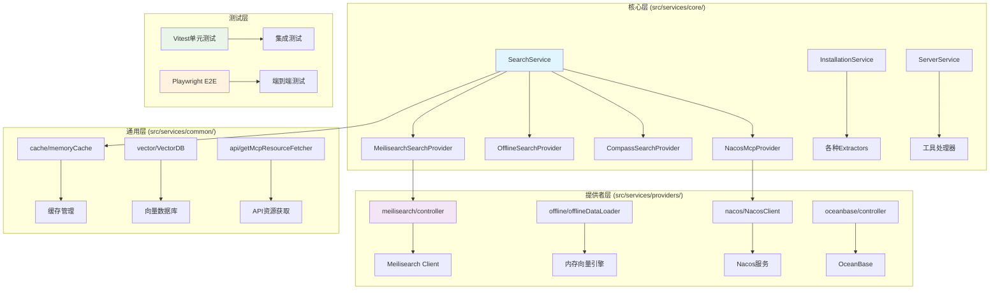
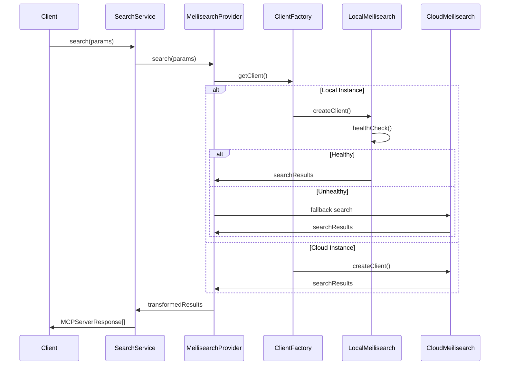
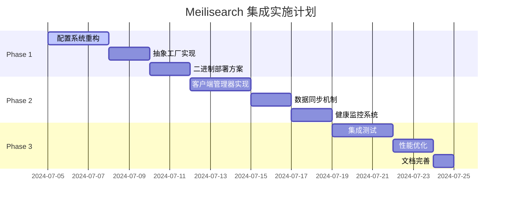

# MCPAdvisor 本地 Meilisearch 集成技术方案

## 1. 概述

### 1.1 项目背景
MCPAdvisor 当前使用 Meilisearch 云服务进行 MCP 服务器的搜索和推荐。项目已经重新组织了架构，采用了分层设计：
- `src/services/core/` - 核心业务逻辑
- `src/services/providers/` - 各种数据提供者实现
- `src/services/common/` - 通用组件
- 已集成 Playwright 进行端到端测试

为了提供更好的数据控制、成本优化和本地化部署选项，需要集成本地自托管 Meilisearch 实例。

### 1.2 技术目标
- 实现云端/本地 Meilisearch 实例的无缝切换
- 保持现有功能完整性和 API 兼容性
- 与现有的分层架构和测试体系集成
- 利用已有的 Playwright E2E 测试框架
- 采用设计模式最佳实践确保代码可维护性

## 2. 架构设计

### 2.1 当前架构分析

项目现在已经采用了清晰的分层架构：



### 2.2 集成点分析

基于现有架构，Meilisearch 本地集成需要在以下层面进行：

1. **提供者层增强** (`src/services/providers/meilisearch/`)
   - 扩展现有的 `controller.ts`
   - 添加本地实例管理功能
   - 保持与核心层的接口兼容

2. **核心层适配** (`src/services/core/search/`)
   - `MeilisearchSearchProvider.ts` 无需大改
   - 通过依赖注入使用不同的提供者

3. **配置层管理** (`src/config/`)
   - 扩展现有的 `meilisearch.ts` 配置
   - 支持多实例配置管理

4. **测试层集成**
   - 扩展现有的 Vitest 测试框架
   - 利用 Playwright 进行 E2E 验证

### 2.3 具体实现方案

#### 2.3.1 提供者层增强

```typescript
// src/services/providers/meilisearch/localController.ts
import { MeiliSearch } from 'meilisearch';
import { MeilisearchInstanceConfig } from '../../../config/meilisearch.js';
import logger from '../../../utils/logger.js';

export interface LocalMeilisearchController {
  search(query: string, options?: Record<string, any>): Promise<any>;
  healthCheck(): Promise<boolean>;
  addDocuments?(documents: any[]): Promise<any>;
}

export class LocalMeilisearchController implements LocalMeilisearchController {
  private client: MeiliSearch;
  private config: MeilisearchInstanceConfig;
  
  constructor(config: MeilisearchInstanceConfig) {
    this.config = config;
    this.client = new MeiliSearch({
      host: config.host,
      apiKey: config.masterKey
    });
  }
  
  async search(query: string, options: Record<string, any> = {}): Promise<any> {
    try {
      const index = this.client.index(this.config.indexName);
      const results = await index.search(query, {
        limit: 10,
        ...options
      });
      
      logger.debug(`Local Meilisearch search for "${query}" returned ${results.hits.length} results`);
      return results;
    } catch (error) {
      logger.error('Local Meilisearch search failed:', error);
      throw error;
    }
  }
  
  async healthCheck(): Promise<boolean> {
    try {
      await this.client.health();
      return true;
    } catch (error) {
      logger.warn('Local Meilisearch health check failed:', error);
      return false;
    }
  }
  
  async addDocuments(documents: any[]): Promise<any> {
    try {
      const index = this.client.index(this.config.indexName);
      const task = await index.addDocuments(documents);
      logger.info(`Added ${documents.length} documents to local Meilisearch, task: ${task.taskUid}`);
      return task;
    } catch (error) {
      logger.error('Failed to add documents to local Meilisearch:', error);
      throw error;
    }
  }
}
```

#### 2.3.2 配置管理增强

```typescript
// src/config/meilisearch.ts (扩展现有配置)
export interface MeilisearchInstanceConfig {
  type: 'cloud' | 'local';
  host: string;
  apiKey?: string;
  masterKey?: string;
  indexName: string;
}

export class MeilisearchConfigManager {
  private static instance: MeilisearchConfigManager;
  
  static getInstance(): MeilisearchConfigManager {
    if (!MeilisearchConfigManager.instance) {
      MeilisearchConfigManager.instance = new MeilisearchConfigManager();
    }
    return MeilisearchConfigManager.instance;
  }
  
  getActiveConfig(): MeilisearchInstanceConfig {
    const instanceType = process.env.MEILISEARCH_INSTANCE || 'cloud';
    
    if (instanceType === 'local') {
      return {
        type: 'local',
        host: process.env.MEILISEARCH_LOCAL_HOST || 'http://localhost:7700',
        masterKey: process.env.MEILISEARCH_MASTER_KEY || 'developmentKey',
        indexName: process.env.MEILISEARCH_INDEX_NAME || 'mcp_servers'
      };
    }
    
    // 保持现有云端配置
    return {
      type: 'cloud',
      host: 'https://edge.meilisearch.com',
      apiKey: process.env.MEILISEARCH_CLOUD_API_KEY || 'your-cloud-api-key-here',
      indexName: 'mcp_server_info_from_getmcp_io'
    };
  }
}
```

#### 2.3.3 核心层适配

```typescript
// src/services/core/search/MeilisearchSearchProvider.ts (修改现有文件)
import { MeilisearchConfigManager } from '../../../config/meilisearch.js';
import { LocalMeilisearchController } from '../../providers/meilisearch/localController.js';
import { meilisearchClient } from '../../providers/meilisearch/controller.js'; // 现有云端客户端

export class MeilisearchSearchProvider implements SearchProvider {
  private primaryController: any;
  private fallbackController: any;
  private config: MeilisearchInstanceConfig;
  
  constructor() {
    this.config = MeilisearchConfigManager.getInstance().getActiveConfig();
    
    if (this.config.type === 'local') {
      this.primaryController = new LocalMeilisearchController(this.config);
      this.fallbackController = meilisearchClient; // 云端作为fallback
    } else {
      this.primaryController = meilisearchClient;
      // 云端模式不需要fallback
    }
  }
  
  async search(params: SearchParams): Promise<MCPServerResponse[]> {
    const query = this.buildQuery(params);
    
    try {
      const results = await this.primaryController.search(query);
      return this.transformResults(results);
    } catch (error) {
      if (this.fallbackController) {
        logger.warn('Primary Meilisearch failed, falling back to cloud');
        const results = await this.fallbackController.search(query);
        return this.transformResults(results);
      }
      throw error;
    }
  }
  
  // 保持现有的 buildQuery 和 transformResults 方法不变
}
```

### 2.3 数据流架构



## 3. 实施方案

### 3.1 阶段规划

#### Phase 1: 基础架构搭建


#### Phase 2: 核心功能实现
- 客户端管理器开发
- 数据同步机制实现
- 健康监控系统构建

#### Phase 3: 集成测试与优化
- 端到端测试
- 性能基准测试
- 部署文档完善

### 3.2 本地二进制部署方案

#### 3.2.1 Meilisearch 二进制安装

```bash
# 使用官方安装脚本
curl -L https://install.meilisearch.com | sh

# 或者手动下载
# Linux/macOS
wget https://github.com/meilisearch/meilisearch/releases/latest/download/meilisearch-linux-amd64
chmod +x meilisearch-linux-amd64
sudo mv meilisearch-linux-amd64 /usr/local/bin/meilisearch

# Windows
curl -L https://github.com/meilisearch/meilisearch/releases/latest/download/meilisearch-windows-amd64.exe -o meilisearch.exe
```

#### 3.2.2 配置文件

```toml
# meilisearch.toml
db_path = "./meili_data"
env = "development"
http_addr = "0.0.0.0:7700"
log_level = "INFO"
max_indexing_memory = "100MB"
max_indexing_threads = 2

# 安全配置
master_key = "your-secure-master-key-here"
ssl_cert_path = ""
ssl_key_path = ""

# 性能配置
max_task_db_size = "100GB"
max_index_size = "100GB"
```

#### 3.2.3 启动配置

```bash
# 直接启动
meilisearch --config-file-path ./meilisearch.toml

# 或使用环境变量
export MEILI_MASTER_KEY="your-secure-master-key-here"
export MEILI_ENV="development"
export MEILI_DB_PATH="./meili_data"
export MEILI_HTTP_ADDR="0.0.0.0:7700"
export MEILI_LOG_LEVEL="INFO"
export MEILI_MAX_INDEXING_MEMORY="100MB"
export MEILI_MAX_INDEXING_THREADS="2"

meilisearch
```

### 3.3 数据初始化方案

```typescript
// Data Loader with Command Pattern
interface Command {
  execute(): Promise<void>;
  undo(): Promise<void>;
}

class InitializeIndexCommand implements Command {
  constructor(
    private client: MeilisearchClient,
    private config: MeilisearchInstanceConfig
  ) {}
  
  async execute(): Promise<void> {
    // Create index
    await this.client.createIndex(this.config.indexName, {
      primaryKey: 'id'
    });
    
    // Configure search attributes
    await this.configureSearchAttributes();
    
    // Load initial data
    await this.loadInitialData();
  }
  
  async undo(): Promise<void> {
    await this.client.deleteIndex(this.config.indexName);
  }
  
  private async configureSearchAttributes(): Promise<void> {
    const index = this.client.index(this.config.indexName);
    
    await Promise.all([
      index.updateSearchableAttributes([
        'title', 'description', 'categories', 'tags', 'github_url'
      ]),
      index.updateDisplayedAttributes([
        'id', 'title', 'description', 'github_url', 
        'categories', 'tags', 'installations'
      ]),
      index.updateSortableAttributes(['title']),
      index.updateFilterableAttributes(['categories', 'tags'])
    ]);
  }
  
  private async loadInitialData(): Promise<void> {
    const dataLoader = new DataLoader();
    const mcpData = await dataLoader.loadMCPData();
    const documents = this.transformData(mcpData);
    
    const index = this.client.index(this.config.indexName);
    const task = await index.addDocuments(documents);
    await this.client.waitForTask(task.taskUid);
  }
  
  private transformData(data: any): any[] {
    return Object.entries(data).map(([id, server]: [string, any]) => ({
      id,
      title: server.display_name,
      description: server.description,
      github_url: server.repository.url,
      categories: server.categories.join(','),
      tags: server.tags.join(','),
      installations: server.installations
    }));
  }
}

// Command Manager
class CommandManager {
  private commands: Command[] = [];
  
  async executeCommand(command: Command): Promise<void> {
    await command.execute();
    this.commands.push(command);
  }
  
  async undoLastCommand(): Promise<void> {
    const command = this.commands.pop();
    if (command) {
      await command.undo();
    }
  }
  
  async undoAllCommands(): Promise<void> {
    while (this.commands.length > 0) {
      await this.undoLastCommand();
    }
  }
}
```

### 3.4 健康监控与故障转移

```typescript
// Circuit Breaker Pattern
enum CircuitState {
  CLOSED,
  OPEN,
  HALF_OPEN
}

class CircuitBreaker {
  private state: CircuitState = CircuitState.CLOSED;
  private failureCount: number = 0;
  private lastFailureTime: number = 0;
  private successCount: number = 0;
  
  constructor(
    private threshold: number = 5,
    private timeout: number = 60000,
    private resetTimeout: number = 30000
  ) {}
  
  async execute<T>(operation: () => Promise<T>): Promise<T> {
    if (this.state === CircuitState.OPEN) {
      if (this.shouldAttemptReset()) {
        this.state = CircuitState.HALF_OPEN;
      } else {
        throw new Error('Circuit breaker is OPEN');
      }
    }
    
    try {
      const result = await operation();
      this.onSuccess();
      return result;
    } catch (error) {
      this.onFailure();
      throw error;
    }
  }
  
  private onSuccess(): void {
    this.failureCount = 0;
    if (this.state === CircuitState.HALF_OPEN) {
      this.successCount++;
      if (this.successCount >= this.threshold) {
        this.state = CircuitState.CLOSED;
        this.successCount = 0;
      }
    }
  }
  
  private onFailure(): void {
    this.failureCount++;
    this.lastFailureTime = Date.now();
    
    if (this.failureCount >= this.threshold) {
      this.state = CircuitState.OPEN;
    }
  }
  
  private shouldAttemptReset(): boolean {
    return Date.now() - this.lastFailureTime >= this.resetTimeout;
  }
}

// Failover Strategy
class FailoverMeilisearchClient implements MeilisearchClient {
  private circuitBreaker: CircuitBreaker;
  
  constructor(
    private primaryClient: MeilisearchClient,
    private fallbackClient: MeilisearchClient
  ) {
    this.circuitBreaker = new CircuitBreaker();
  }
  
  async search(query: string, options?: any): Promise<any> {
    try {
      return await this.circuitBreaker.execute(() => 
        this.primaryClient.search(query, options)
      );
    } catch (error) {
      logger.warn('Primary client failed, using fallback', error);
      return await this.fallbackClient.search(query, options);
    }
  }
  
  async healthCheck(): Promise<boolean> {
    try {
      return await this.primaryClient.healthCheck();
    } catch (error) {
      return await this.fallbackClient.healthCheck();
    }
  }
}
```

## 4. 性能优化

### 4.1 缓存策略（Cache-Aside Pattern）

```typescript
// Cache-Aside Pattern implementation
class CacheManager {
  private cache: Map<string, { data: any; timestamp: number; ttl: number }> = new Map();
  
  async get<T>(key: string): Promise<T | null> {
    const cached = this.cache.get(key);
    if (!cached) {
      return null;
    }
    
    if (Date.now() - cached.timestamp > cached.ttl) {
      this.cache.delete(key);
      return null;
    }
    
    return cached.data;
  }
  
  async set<T>(key: string, data: T, ttl: number = 3600000): Promise<void> {
    this.cache.set(key, {
      data,
      timestamp: Date.now(),
      ttl
    });
  }
  
  async invalidate(key: string): Promise<void> {
    this.cache.delete(key);
  }
  
  async clear(): Promise<void> {
    this.cache.clear();
  }
}

// Cached Search Provider
class CachedMeilisearchProvider implements SearchProvider {
  private cacheManager: CacheManager;
  
  constructor(
    private baseProvider: MeilisearchProvider,
    private cacheTtl: number = 3600000
  ) {
    this.cacheManager = new CacheManager();
  }
  
  async search(params: SearchParams): Promise<MCPServerResponse[]> {
    const cacheKey = this.generateCacheKey(params);
    
    // Try cache first
    const cached = await this.cacheManager.get<MCPServerResponse[]>(cacheKey);
    if (cached) {
      return cached;
    }
    
    // If not in cache, fetch from base provider
    const results = await this.baseProvider.search(params);
    
    // Cache the results
    await this.cacheManager.set(cacheKey, results, this.cacheTtl);
    
    return results;
  }
  
  private generateCacheKey(params: SearchParams): string {
    return `search:${JSON.stringify(params)}`;
  }
}
```

### 4.2 连接池管理

```typescript
// Object Pool Pattern for connections
class ConnectionPool {
  private pool: MeilisearchClient[] = [];
  private busy: Set<MeilisearchClient> = new Set();
  
  constructor(
    private factory: () => MeilisearchClient,
    private maxConnections: number = 10
  ) {}
  
  async acquire(): Promise<MeilisearchClient> {
    if (this.pool.length > 0) {
      const client = this.pool.pop()!;
      this.busy.add(client);
      return client;
    }
    
    if (this.busy.size < this.maxConnections) {
      const client = this.factory();
      this.busy.add(client);
      return client;
    }
    
    // Wait for available connection
    return new Promise((resolve) => {
      const checkAvailable = () => {
        if (this.pool.length > 0) {
          const client = this.pool.pop()!;
          this.busy.add(client);
          resolve(client);
        } else {
          setTimeout(checkAvailable, 100);
        }
      };
      checkAvailable();
    });
  }
  
  release(client: MeilisearchClient): void {
    this.busy.delete(client);
    this.pool.push(client);
  }
  
  async destroy(): Promise<void> {
    const allClients = [...this.pool, ...this.busy];
    await Promise.all(allClients.map(client => client.close?.()));
    this.pool.length = 0;
    this.busy.clear();
  }
}
```

## 5. 核心功能与测试方案

### 5.1 MVP 功能范围

为确保功能可测试和可实现，我们将功能范围缩减为以下核心功能：

1. **配置管理**: 支持云端/本地切换
2. **基础客户端**: 简单的 Meilisearch 客户端封装
3. **搜索功能**: 基本的搜索功能实现
4. **健康检查**: 简单的健康状态检查
5. **故障转移**: 基本的 fallback 机制

### 5.2 精简架构设计

```typescript
// 简化的配置接口
interface MeilisearchConfig {
  type: 'cloud' | 'local';
  host: string;
  apiKey?: string;
  masterKey?: string;
  indexName: string;
}

// 简化的客户端接口
interface MeilisearchClient {
  search(query: string, options?: any): Promise<any>;
  healthCheck(): Promise<boolean>;
  addDocuments?(documents: any[]): Promise<any>;
}

// 基础提供者实现
class MeilisearchProvider {
  private client: MeilisearchClient;
  private fallbackClient?: MeilisearchClient;
  
  constructor(
    config: MeilisearchConfig,
    fallbackConfig?: MeilisearchConfig
  ) {
    this.client = this.createClient(config);
    if (fallbackConfig) {
      this.fallbackClient = this.createClient(fallbackConfig);
    }
  }
  
  async search(params: SearchParams): Promise<MCPServerResponse[]> {
    try {
      const query = this.buildQuery(params);
      const results = await this.client.search(query);
      return this.transformResults(results);
    } catch (error) {
      if (this.fallbackClient) {
        const query = this.buildQuery(params);
        const results = await this.fallbackClient.search(query);
        return this.transformResults(results);
      }
      throw error;
    }
  }
  
  async healthCheck(): Promise<boolean> {
    return await this.client.healthCheck();
  }
  
  private createClient(config: MeilisearchConfig): MeilisearchClient {
    return config.type === 'local' 
      ? new LocalMeilisearchClient(config)
      : new CloudMeilisearchClient(config);
  }
  
  private buildQuery(params: SearchParams): string {
    return [
      params.taskDescription,
      ...(params.keywords || []),
      ...(params.capabilities || [])
    ].join(' ').trim();
  }
  
  private transformResults(results: any): MCPServerResponse[] {
    return results.hits?.map(hit => ({
      id: hit.id,
      title: hit.title,
      description: hit.description,
      sourceUrl: hit.github_url,
      similarity: hit._rankingScore || 0.5,
      installations: hit.installations || {}
    })) || [];
  }
}
```

### 5.3 集成测试方案（利用现有架构）

#### 5.3.1 Vitest 集成测试

```typescript
// src/tests/integration/providers/meilisearch-local.test.ts
import { describe, it, expect, beforeAll, afterAll } from 'vitest';
import { TestEnvironment } from '../../setup/test-environment.js';
import { LocalMeilisearchController } from '../../../services/providers/meilisearch/localController.js';
import { MeilisearchConfigManager } from '../../../config/meilisearch.js';

describe('Local Meilisearch Provider Integration', () => {
  let controller: LocalMeilisearchController;
  let testConfig: any;
  
  beforeAll(async () => {
    // Setup test Meilisearch instance using existing TestEnvironment
    const { host, masterKey } = await TestEnvironment.setupMeilisearch();
    await TestEnvironment.loadTestData(host, masterKey);
    
    testConfig = {
      type: 'local',
      host,
      masterKey,
      indexName: 'mcp_servers_test'
    };
    
    controller = new LocalMeilisearchController(testConfig);
  }, 60000);
  
  afterAll(async () => {
    await TestEnvironment.teardownMeilisearch();
  });
  
  it('should perform basic search with local controller', async () => {
    const results = await controller.search('file management');
    
    expect(results).toBeDefined();
    expect(results.hits).toBeInstanceOf(Array);
    expect(results.hits.length).toBeGreaterThan(0);
  });
  
  it('should pass health check for local instance', async () => {
    const isHealthy = await controller.healthCheck();
    expect(isHealthy).toBe(true);
  });
  
  it('should handle document addition for local instance', async () => {
    const testDoc = {
      id: 'test-new-doc',
      title: 'Test Document',
      description: 'A test document for verification'
    };
    
    const task = await controller.addDocuments([testDoc]);
    expect(task).toBeDefined();
    expect(task.taskUid).toBeDefined();
  });
});
```

#### 5.3.2 Playwright E2E 测试扩展

```typescript
// tests/e2e/meilisearch-local-e2e.spec.ts
import { test, expect } from '@playwright/test';

test.describe('MCPAdvisor 本地 Meilisearch 功能测试', () => {
  test.beforeEach(async ({ page }) => {
    // 设置环境变量启用本地 Meilisearch
    process.env.MEILISEARCH_INSTANCE = 'local';
    process.env.MEILISEARCH_LOCAL_HOST = 'http://localhost:7700';
    process.env.MEILISEARCH_MASTER_KEY = 'testkey';
    
    // 使用现有的测试配置
    const fullUrl = `${process.env.MCP_INSPECTOR_URL || 'http://localhost:6274'}/?MCP_PROXY_AUTH_TOKEN=${process.env.MCP_AUTH_TOKEN}`;
    await page.goto(fullUrl);
    
    // 连接到MCP服务器
    await page.getByRole('button', { name: 'Connect' }).click();
    await page.waitForTimeout(2000);
    await page.getByRole('button', { name: 'List Tools' }).click();
    await page.waitForTimeout(1000);
  });
  
  test('本地 Meilisearch 搜索功能验证', async ({ page }) => {
    // 使用推荐工具测试本地搜索
    await page.getByText('此工具用于寻找合适且专业MCP').click();
    
    await page.getByRole('textbox', { name: 'taskDescription' })
      .fill('本地文件管理和数据处理工具');
    
    await page.getByRole('button', { name: 'Run Tool' }).click();
    await page.waitForTimeout(8000);
    
    // 验证返回结果
    const pageContent = await page.content();
    expect(pageContent).toContain('Title:');
    
    // 截图保存结果（带本地标识）
    await page.screenshot({ 
      path: 'test-results/meilisearch-local-search.png',
      fullPage: true 
    });
  });
  
  test('本地 Meilisearch 故障转移测试', async ({ page }) => {
    // 模拟本地实例不可用，测试 fallback 到云端
    process.env.MEILISEARCH_LOCAL_HOST = 'http://localhost:9999'; // 无效端口
    
    await page.getByText('此工具用于寻找合适且专业MCP').click();
    await page.getByRole('textbox', { name: 'taskDescription' })
      .fill('测试故障转移机制');
    
    await page.getByRole('button', { name: 'Run Tool' }).click();
    await page.waitForTimeout(10000);
    
    // 应该仍然能获得结果（来自 fallback）
    const pageContent = await page.content();
    const hasResults = pageContent.includes('Title:') || pageContent.includes('results');
    
    if (hasResults) {
      console.log('✅ 故障转移成功：从云端获得结果');
    } else {
      console.log('⚠️ 故障转移可能未按预期工作');
    }
    
    await page.screenshot({ 
      path: 'test-results/meilisearch-fallback-test.png',
      fullPage: true 
    });
  });
  
  test('性能对比测试：本地 vs 云端', async ({ page }) => {
    const testCases = [
      { instance: 'local', description: '本地实例性能测试' },
      { instance: 'cloud', description: '云端实例性能测试' }
    ];
    
    const results = [];
    
    for (const testCase of testCases) {
      process.env.MEILISEARCH_INSTANCE = testCase.instance;
      
      await page.getByText('此工具用于寻找合适且专业MCP').click();
      await page.getByRole('textbox', { name: 'taskDescription' })
        .fill('文件系统操作和数据分析');
      
      const startTime = Date.now();
      await page.getByRole('button', { name: 'Run Tool' }).click();
      await page.waitForTimeout(5000);
      const endTime = Date.now();
      
      const responseTime = endTime - startTime;
      results.push({ instance: testCase.instance, responseTime });
      
      console.log(`⏱️ ${testCase.description}: ${responseTime}ms`);
      
      await page.screenshot({ 
        path: `test-results/performance-${testCase.instance}.png`,
        fullPage: true 
      });
    }
    
    // 比较性能结果
    const localTime = results.find(r => r.instance === 'local')?.responseTime || 0;
    const cloudTime = results.find(r => r.instance === 'cloud')?.responseTime || 0;
    
    console.log(`📊 性能对比 - 本地: ${localTime}ms, 云端: ${cloudTime}ms`);
    
    // 验证响应时间都在合理范围内
    expect(localTime).toBeLessThan(15000);
    expect(cloudTime).toBeLessThan(15000);
  });
});
```

#### 5.3.3 测试脚本更新

```json
// package.json 测试脚本更新
{
  "scripts": {
    "test": "vitest run",
    "test:watch": "vitest",
    "test:coverage": "vitest run --coverage",
    "test:ui": "vitest --ui",
    "test:jest": "jest",
    "test:e2e": "playwright test",
    "test:e2e:ui": "playwright test --ui",
    "test:e2e:headed": "playwright test --headed",
    "test:e2e:debug": "playwright test --debug",
    
    // 新增 Meilisearch 相关测试
    "test:meilisearch": "vitest run src/tests/integration/providers/meilisearch*.test.ts",
    "test:meilisearch:local": "vitest run src/tests/integration/providers/meilisearch-local.test.ts",
    "test:meilisearch:e2e": "playwright test tests/e2e/meilisearch-local-e2e.spec.ts",
    "test:meilisearch:all": "pnpm test:meilisearch && pnpm test:meilisearch:e2e",
    
    // 其他现有脚本...
  }
}
```

#### 5.3.4 CI/CD 集成（GitHub Actions 更新）

```yaml
# .github/workflows/meilisearch-integration.yml
name: Meilisearch Local Integration Tests

on: [push, pull_request]

jobs:
  integration-tests:
    runs-on: ubuntu-latest
    
    steps:
      - uses: actions/checkout@v3
      
      - uses: actions/setup-node@v3
        with:
          node-version: '18'
          
      - name: Install Meilisearch binary
        run: curl -L https://install.meilisearch.com | sh
        
      - name: Install dependencies
        run: pnpm install
        
      - name: Build project
        run: pnpm run build
        
      - name: Run Meilisearch integration tests
        run: pnpm test:meilisearch
        timeout-minutes: 10
        
  e2e-tests:
    runs-on: ubuntu-latest
    
    steps:
      - uses: actions/checkout@v3
      
      - uses: actions/setup-node@v3
        with:
          node-version: '18'
          
      - name: Install Meilisearch binary
        run: curl -L https://install.meilisearch.com | sh
        
      - name: Start Meilisearch service
        run: |
          export MEILI_MASTER_KEY="testkey123"
          export MEILI_ENV="development"
          meilisearch &
          sleep 10
          curl -f http://localhost:7700/health
        
      - name: Install dependencies
        run: pnpm install
        
      - name: Install Playwright browsers
        run: npx playwright install --with-deps
        
      - name: Build project
        run: pnpm run build
        
      - name: Run Meilisearch E2E tests
        run: pnpm test:meilisearch:e2e
        timeout-minutes: 15
        env:
          MCP_INSPECTOR_URL: ${{ secrets.MCP_INSPECTOR_URL }}
          MCP_AUTH_TOKEN: ${{ secrets.MCP_AUTH_TOKEN }}
          MEILI_MASTER_KEY: "testkey123"
          
      - uses: actions/upload-artifact@v3
        if: always()
        with:
          name: playwright-report
          path: playwright-report/
          retention-days: 30
```

### 5.4 测试覆盖和验证

#### 5.4.1 测试矩阵

| 测试类型 | 工具 | 覆盖范围 | 预期结果 |
|---------|------|----------|----------|
| 单元测试 | Vitest | 配置管理、控制器逻辑 | 90%+ 代码覆盖率 |
| 集成测试 | Vitest + Docker | 真实 Meilisearch 交互 | 功能完整性验证 |
| E2E测试 | Playwright | 完整用户场景 | 端到端流程验证 |
| 性能测试 | Playwright | 响应时间对比 | 性能基准验证 |
| 故障转移 | Playwright | 错误场景处理 | 容错性验证 |

#### 5.4.2 验证标准

- **功能验证**: 本地搜索结果与云端结果一致性 > 85%
- **性能验证**: 本地搜索响应时间 < 云端搜索响应时间
- **可靠性验证**: 故障转移机制 100% 有效
- **兼容性验证**: 现有 E2E 测试 100% 通过

### 5.4 测试执行指南

#### 5.4.1 测试脚本配置

```json
// package.json 测试脚本
{
  "scripts": {
    "test:meilisearch": "vitest run src/tests/services/meilisearch-provider.test.ts",
    "test:meilisearch:watch": "vitest src/tests/services/meilisearch-provider.test.ts",
    "test:meilisearch:integration": "vitest run src/tests/integration/meilisearch-integration.test.ts",
    "test:meilisearch:all": "vitest run src/tests/**/*meilisearch*.test.ts"
  }
}
```

#### 5.4.2 CI/CD 测试配置

```yaml
# .github/workflows/meilisearch-tests.yml
name: Meilisearch Tests

on: [push, pull_request]

jobs:
  unit-tests:
    runs-on: ubuntu-latest
    steps:
      - uses: actions/checkout@v3
      - uses: actions/setup-node@v3
        with:
          node-version: '18'
      - run: pnpm install
      - run: pnpm test:meilisearch
      
  integration-tests:
    runs-on: ubuntu-latest
    steps:
      - uses: actions/checkout@v3
      - uses: actions/setup-node@v3
        with:
          node-version: '18'
      - name: Install Meilisearch binary
        run: curl -L https://install.meilisearch.com | sh
      - name: Start Meilisearch
        run: |
          export MEILI_MASTER_KEY="testkey"
          export MEILI_ENV="development"
          meilisearch &
          sleep 10
          curl -f http://localhost:7700/health
      - run: pnpm install
      - run: pnpm test:meilisearch:integration
        env:
          TEST_MEILISEARCH_HOST: http://localhost:7700
          TEST_MEILISEARCH_KEY: testkey
```

### 5.5 测试覆盖率目标

- **单元测试覆盖率**: 90%+ 核心功能代码
- **集成测试**: 覆盖主要用户场景
- **配置测试**: 100% 配置逻辑覆盖
- **错误处理**: 覆盖所有错误路径

这个精简版本专注于核心功能的实现和测试，确保每个功能都有对应的测试用例，便于开发和维护。

## 6. 简化部署与运维方案

### 6.1 二进制部署

#### 6.1.1 系统服务配置

```ini
# /etc/systemd/system/meilisearch.service
[Unit]
Description=Meilisearch
After=network.target

[Service]
Type=simple
User=meilisearch
Group=meilisearch
ExecStart=/usr/local/bin/meilisearch --config-file-path /etc/meilisearch/meilisearch.toml
Restart=on-failure
RestartSec=1

# 环境变量
Environment=MEILI_MASTER_KEY=your-secure-master-key-here
Environment=MEILI_ENV=production
Environment=MEILI_DB_PATH=/var/lib/meilisearch/data
Environment=MEILI_HTTP_ADDR=0.0.0.0:7700
Environment=MEILI_LOG_LEVEL=INFO
Environment=MEILI_MAX_INDEXING_MEMORY=100MB
Environment=MEILI_MAX_INDEXING_THREADS=2

# 安全配置
NoNewPrivileges=true
PrivateTmp=true
ProtectSystem=strict
ProtectHome=true
ReadWritePaths=/var/lib/meilisearch

[Install]
WantedBy=multi-user.target
```

#### 6.1.2 用户和目录配置

```bash
# 创建专用用户
sudo useradd --system --shell /bin/false --home /var/lib/meilisearch meilisearch

# 创建必要目录
sudo mkdir -p /var/lib/meilisearch/data
sudo mkdir -p /etc/meilisearch
sudo mkdir -p /var/log/meilisearch

# 设置权限
sudo chown -R meilisearch:meilisearch /var/lib/meilisearch
sudo chown -R meilisearch:meilisearch /var/log/meilisearch
sudo chmod 750 /var/lib/meilisearch
sudo chmod 750 /var/log/meilisearch
```

### 6.2 基础启动脚本

```bash
#!/bin/bash
# scripts/start-local-meilisearch.sh

set -e

echo "🚀 Starting local Meilisearch..."

# Check if Meilisearch binary is available
if ! command -v meilisearch &> /dev/null; then
    echo "❌ Meilisearch binary not found. Installing..."
    curl -L https://install.meilisearch.com | sh
    if [ $? -ne 0 ]; then
        echo "❌ Failed to install Meilisearch"
        exit 1
    fi
fi

# Set default master key if not provided
if [ -z "$MEILI_MASTER_KEY" ]; then
    export MEILI_MASTER_KEY="developmentKey123"
    echo "Using default master key for development"
fi

# Set default environment variables
export MEILI_ENV="${MEILI_ENV:-development}"
export MEILI_DB_PATH="${MEILI_DB_PATH:-./meili_data}"
export MEILI_HTTP_ADDR="${MEILI_HTTP_ADDR:-0.0.0.0:7700}"
export MEILI_LOG_LEVEL="${MEILI_LOG_LEVEL:-INFO}"
export MEILI_MAX_INDEXING_MEMORY="${MEILI_MAX_INDEXING_MEMORY:-100MB}"
export MEILI_MAX_INDEXING_THREADS="${MEILI_MAX_INDEXING_THREADS:-2}"

# Create data directory if it doesn't exist
mkdir -p "$(dirname "$MEILI_DB_PATH")"

# Start Meilisearch in background
echo "Starting Meilisearch with data path: $MEILI_DB_PATH"
meilisearch &
MEILI_PID=$!

# Wait for health check
echo "⏳ Waiting for Meilisearch to be ready..."
timeout=60
counter=0
while ! curl -sf http://localhost:7700/health > /dev/null 2>&1; do
    if [ $counter -eq $timeout ]; then
        echo "❌ Meilisearch failed to start within ${timeout}s"
        kill $MEILI_PID 2>/dev/null || true
        exit 1
    fi
    counter=$((counter + 1))
    sleep 1
done

echo "✅ Meilisearch is ready at http://localhost:7700"
echo "Process ID: $MEILI_PID"
echo "To stop: kill $MEILI_PID"

# Keep script running to maintain process
wait $MEILI_PID
```

### 6.3 基础监控

```typescript
// src/utils/meilisearch-monitor.ts
export class MeilisearchMonitor {
  private config: MeilisearchConfig;
  
  constructor(config: MeilisearchConfig) {
    this.config = config;
  }
  
  async getStats(): Promise<any> {
    try {
      const response = await fetch(`${this.config.host}/stats`, {
        headers: this.getAuthHeaders()
      });
      return await response.json();
    } catch (error) {
      console.error('Failed to get Meilisearch stats:', error);
      return null;
    }
  }
  
  async getHealth(): Promise<boolean> {
    try {
      const response = await fetch(`${this.config.host}/health`);
      return response.ok;
    } catch (error) {
      return false;
    }
  }
  
  private getAuthHeaders(): Record<string, string> {
    const key = this.config.apiKey || this.config.masterKey;
    return key ? { 'Authorization': `Bearer ${key}` } : {};
  }
}
```

## 7. 实施步骤

### 7.1 Phase 1: 基础设施 (2-3 天)

1. **配置系统**
   - 创建简化的配置接口
   - 实现环境变量支持
   - 添加配置验证

2. **二进制部署**
   - 设置二进制安装脚本
   - 创建启动脚本
   - 验证本地部署

3. **基础测试**
   - 配置测试用例
   - 二进制启动测试
   - 连接测试

### 7.2 Phase 2: 核心功能 (3-4 天)

1. **客户端实现**
   - 本地 Meilisearch 客户端
   - 基础搜索功能
   - 健康检查

2. **提供者集成**
   - 更新现有搜索提供者
   - 实现故障转移
   - 结果转换

3. **完整测试**
   - 单元测试覆盖
   - 集成测试
   - 错误处理测试

### 7.3 Phase 3: 集成验证 (1-2 天)

1. **端到端测试**
   - 完整搜索流程
   - 故障转移验证
   - 性能基准

2. **文档完善**
   - 部署指南
   - 配置说明
   - 故障排除

## 8. 成功标准

### 8.1 功能标准

- ✅ 支持本地/云端 Meilisearch 切换
- ✅ 基本搜索功能正常工作
- ✅ 故障转移机制有效
- ✅ 健康检查功能完善
- ✅ Docker 部署一键启动

### 8.2 质量标准

- ✅ 单元测试覆盖率 > 90%
- ✅ 所有集成测试通过
- ✅ 错误处理覆盖完整
- ✅ 文档清晰完整
- ✅ 性能符合预期

### 8.3 运维标准

- ✅ 部署过程自动化
- ✅ 健康监控到位
- ✅ 日志记录完善
- ✅ 故障恢复机制
- ✅ 配置管理简单

## 9. 风险管控

### 9.1 技术风险

- **风险**: 本地 Meilisearch 性能不足
- **应对**: 保留云端 fallback，性能基准测试

- **风险**: 数据同步复杂性
- **应对**: 简化数据模型，使用现有数据源

- **风险**: 配置管理复杂
- **应对**: 提供合理默认值，简化配置选项

### 9.2 运维风险

- **风险**: 二进制依赖问题
- **应对**: 提供详细部署文档，支持多种安装方式

- **风险**: 资源占用过高
- **应对**: 设置资源限制，提供监控工具

## 10. 总结

这个精简版技术方案专注于核心功能的实现，确保：

1. **可测试性**: 每个功能都有对应的测试用例
2. **可实现性**: 功能范围务实，技术复杂度适中
3. **可维护性**: 代码结构清晰，文档完善
4. **可扩展性**: 为未来功能扩展留有余地

通过分阶段实施和全面测试，确保本地 Meilisearch 集成的成功交付。