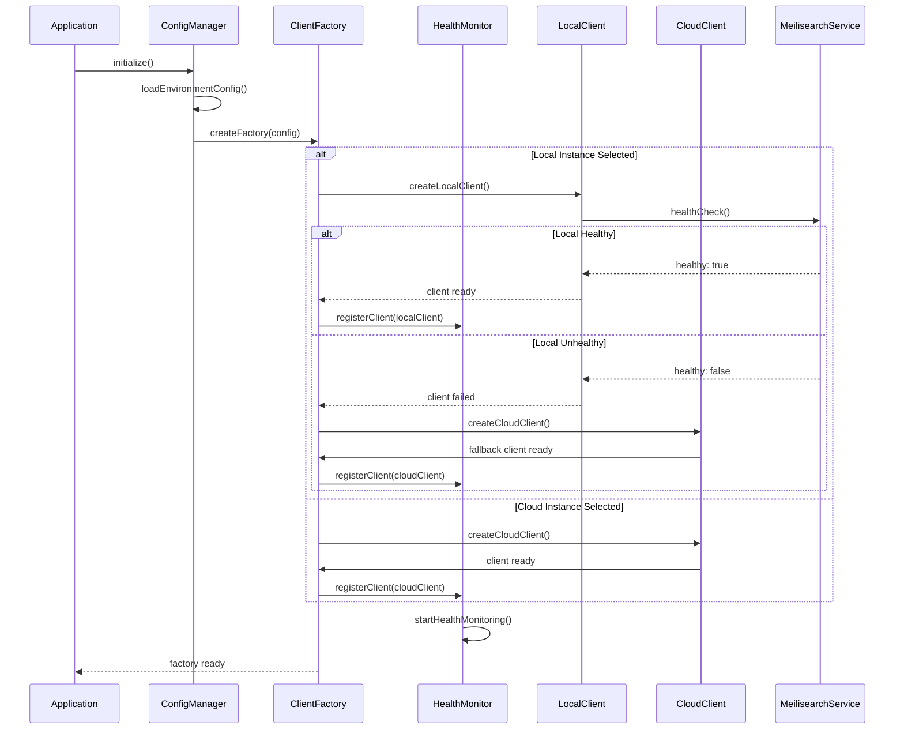
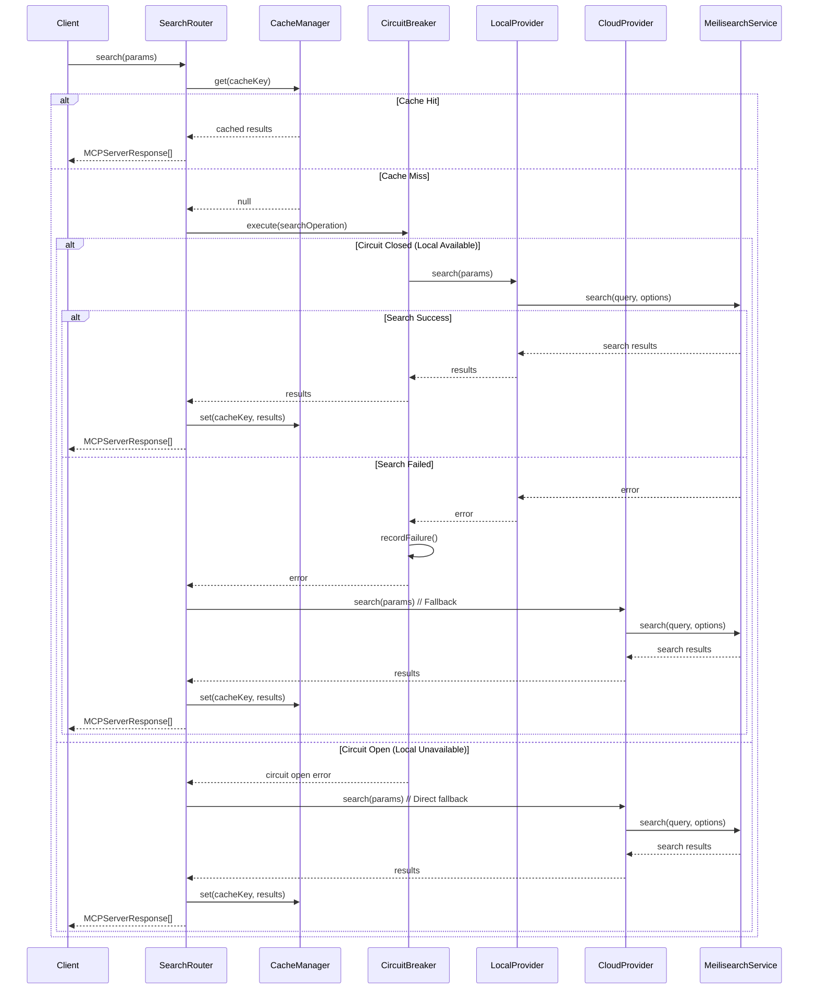
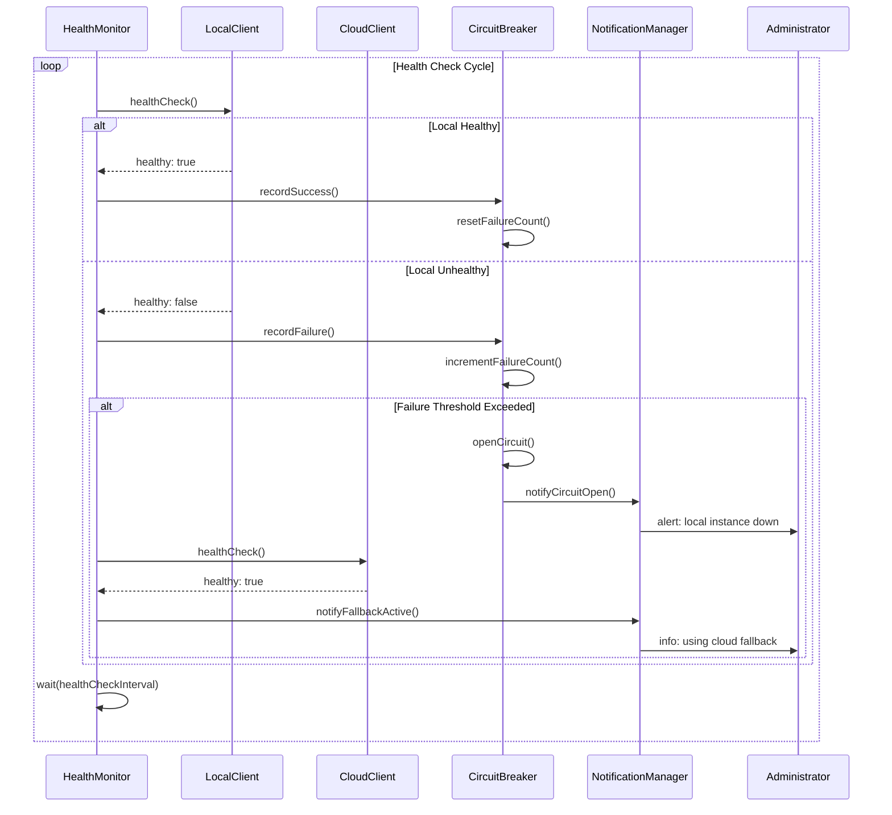
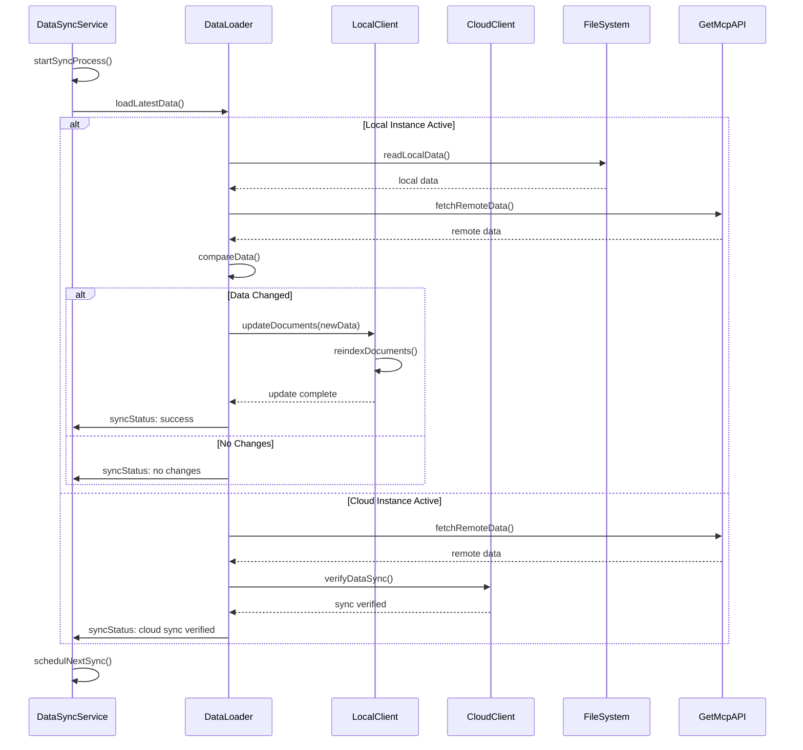
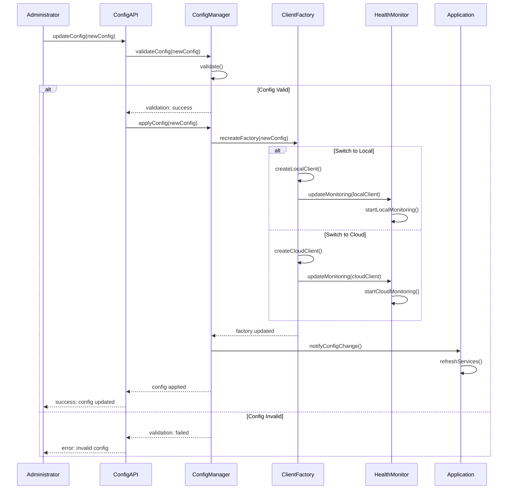
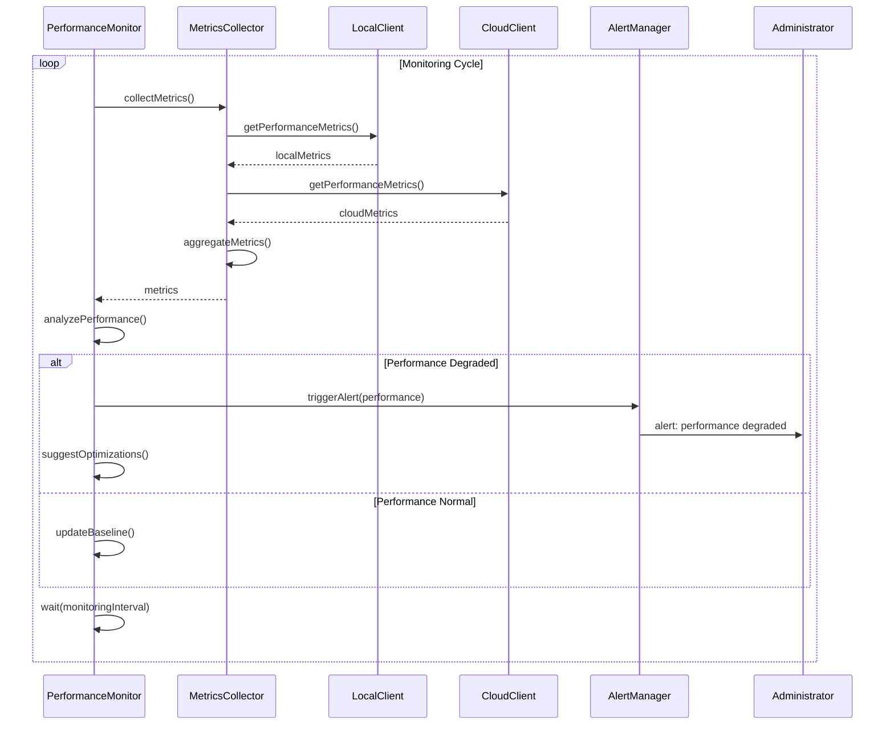
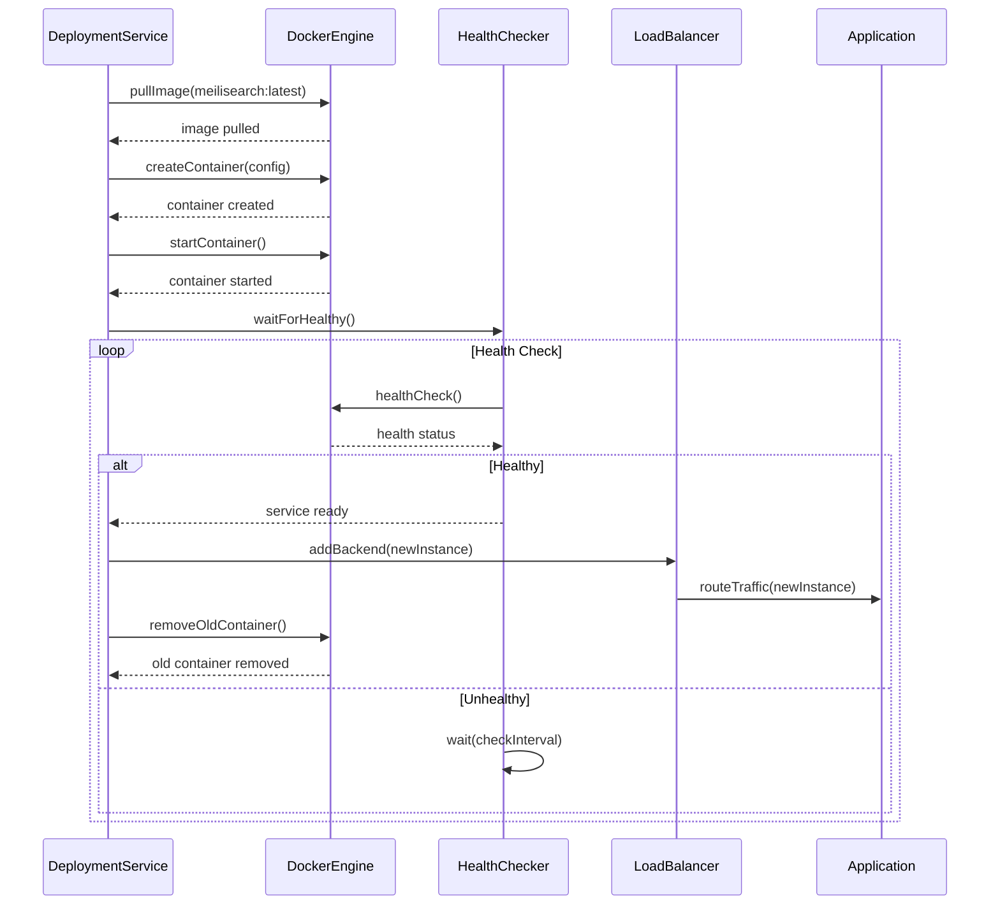
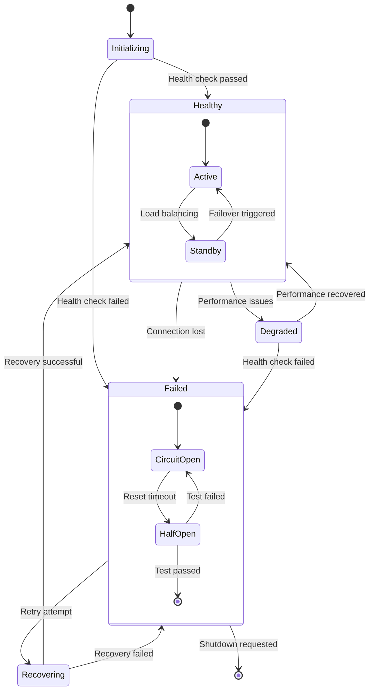

# MCPAdvisor Meilisearch 本地/云端切换时序图

## 1. 系统启动与初始化时序



## 2. 搜索请求处理时序



## 3. 健康检查与故障转移时序



## 4. 数据同步时序



## 5. 配置热更新时序



## 6. 错误处理与恢复时序

```mermaid
sequenceDiagram
    participant Client as Client
    participant Router as SearchRouter
    participant EM as ErrorManager
    parameter LC as LocalClient
    participant CC as CloudClient
    participant HM as HealthMonitor
    
    Client->>Router: search(params)
    Router->>LC: search(params)
    LC->>LC: performSearch()
    
    alt Connection Error
        LC-->>Router: ConnectionError
        Router->>EM: handleError(ConnectionError)
        EM->>HM: reportConnectionFailure()
        HM->>HM: updateHealthStatus(unhealthy)
        EM->>CC: initiateFailover()
        CC->>Router: search(params)
        Router-->>Client: results from cloud
    else Timeout Error
        LC-->>Router: TimeoutError
        Router->>EM: handleError(TimeoutError)
        EM->>LC: retryWithBackoff()
        LC->>LC: performSearch()
        
        alt Retry Success
            LC-->>Router: search results
            Router-->>Client: results
        else Retry Failed
            LC-->>Router: TimeoutError
            Router->>CC: search(params)
            CC-->>Router: search results
            Router-->>Client: results from cloud
        end
    else Index Error
        LC-->>Router: IndexError
        Router->>EM: handleError(IndexError)
        EM->>LC: reinitializeIndex()
        LC->>LC: recreateIndex()
        LC-->>EM: index recreated
        EM->>Router: retrySearch()
        Router->>LC: search(params)
        LC-->>Router: search results
        Router-->>Client: results
    end
```

## 7. 性能监控时序



## 8. 部署与升级时序



## 9. 状态图 - 实例状态管理



## 10. 时序图总结

这些时序图展示了 MCPAdvisor Meilisearch 集成的完整生命周期，包括：

1. **系统启动**: 配置加载、客户端创建、健康检查
2. **搜索处理**: 缓存策略、熔断机制、故障转移
3. **健康监控**: 定期检查、故障检测、自动切换
4. **数据同步**: 本地/云端数据一致性保证
5. **配置管理**: 热更新、验证、应用
6. **错误处理**: 多层次错误恢复机制
7. **性能监控**: 指标收集、性能分析、告警
8. **部署升级**: 滚动更新、健康检查、流量切换

这些时序图为开发和运维团队提供了清晰的系统行为指南，有助于理解系统的复杂交互过程和故障处理机制。